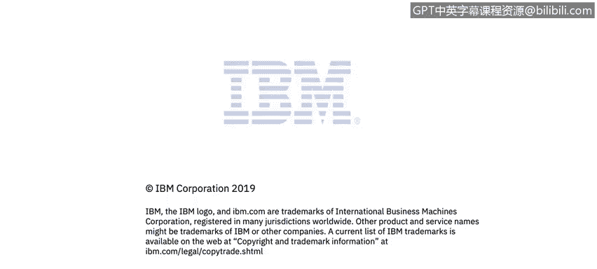

# 课程4：《网络安全与数据库漏洞》：57：SQL注入的预防


## 概述


在本节课程中，我们将学习如何有效预防SQL注入攻击。SQL注入是一种严重的安全威胁，但通过遵循一系列最佳实践，我们可以显著降低其风险。我们将探讨包括使用预编译语句、净化用户输入、限制数据库权限在内的多种核心防御策略。

## 预防SQL注入的核心策略

上一节我们介绍了SQL注入的原理与危害，本节中我们来看看如何构建坚固的防御。以下是预防SQL注入的几种关键方法。

### 1. 使用预编译语句

这是预防SQL注入最首要且最有效的推荐方法。预编译语句通过将SQL逻辑与数据参数分离来工作。

**原易受攻击的代码示例：**
```sql
SELECT * FROM users WHERE username = '$user_input';
```
攻击者可以通过`$user_input`注入恶意代码来改变查询结构。

**使用预编译语句的代码示例：**
```sql
SELECT * FROM users WHERE username = ?;
```
在这个模式中，参数被问号`?`占位符替代。预编译过程会将SQL语句编译成一个内部表示，其结构就此固定。无论后续传入什么参数值，它们都只会被当作数据来处理，而不会被解释为SQL代码的一部分。这从根本上阻止了攻击者注入额外`WHERE`子句或`UNION`查询。

**重要注意事项：**
需要确保预编译语句本身是常量，不应在准备阶段掺入任何用户输入。错误的做法示例如下：
```sql
-- 错误示例：在预编译语句中拼接了用户输入
PREPARE stmt FROM CONCAT('SELECT * FROM users WHERE username = \'', user_input, '\'');
```
这样做等于将可能的恶意输入“烘焙”进了预编译语句，使其失去保护作用。

### 2. 净化用户输入

与防范操作系统命令注入等漏洞类似，对所有用户输入都应保持怀疑态度，默认其可能是恶性的。净化输入是基础的安全操作原则。

**操作建议：**
*   **采用白名单而非黑名单：** 只允许已知安全的字符或模式通过，而不是试图过滤掉所有已知的危险字符。黑名单很容易被绕过。
*   **使用映射表：** 考虑不直接让用户输入到达数据库。例如，可以使用一个映射表，将用户的选择（如数字ID）转换为数据库查询中实际使用的值，增加一层间接保护。

### 3. 避免向用户暴露原始数据库错误信息

攻击者经常利用应用程序返回的错误信息来获取后台系统的情报。

**示例错误信息：**
```
ERROR 1064 (42000): You have an error in your SQL syntax; check the manual that corresponds to your MySQL server version...
```
这样的错误会泄露关键信息：
1.  数据库类型（如MySQL），这大大缩小了攻击者需要尝试的攻击载荷范围。
2.  查询结构线索，帮助攻击者构思更精准的注入方式。

**正确做法：**
向最终用户展示尽可能少的底层技术细节。详细的错误信息应记录在仅供工程师查看的内部日志文件中。面向用户的错误提示应该是通用且友好的，例如“处理您的请求时出现错误”。

### 4. 限制数据库用户权限

遵循最小权限原则。应用程序连接数据库所使用的账户不应拥有过高权限。

**实施建议：**
*   如果业务逻辑允许，使用只读账户。
*   严格限制账户只能访问必要的特定表或视图，而非整个数据库。
*   这样即使发生SQL注入，攻击者能造成的破坏也被限制在低权限账户的能力范围内。

### 5. 使用存储过程

存储过程是预编译并存储在数据库中的SQL语句集。由于它们也是预先定义好的，通过SQL注入来滥用存储过程相对更困难。它们可以作为另一道防御层。

### 6. 正确使用对象关系映射库

对象关系映射库（如Java中的Hibernate）通过创建与数据库结构映射的内存对象集来操作数据，减少了手动拼接SQL语句的需要，从而有助于降低SQL注入风险。

**注意事项：**
ORM工具本身是安全的，但若使用不当，仍可能引入漏洞。例如，某些ORM允许开发者手动拼接部分SQL语句（即“原生查询”）。如果以不安全的方式拼接了用户输入，就会重回易受攻击的老路。因此，关键在于**正确使用ORM工具**，遵循其安全的数据绑定机制。

## 总结



本节课中我们一起学习了预防SQL注入的多层防御策略。核心要点包括：**首要且必须正确使用预编译语句**；对所有用户输入进行**净化**并采用白名单策略；**避免向用户暴露详细的数据库错误信息**；遵循最小权限原则，**严格限制数据库用户权限**；并可以考虑利用**存储过程**和**正确使用ORM库**来增强防护。通过综合运用这些措施，可以构建起有效抵御SQL注入攻击的坚固防线。