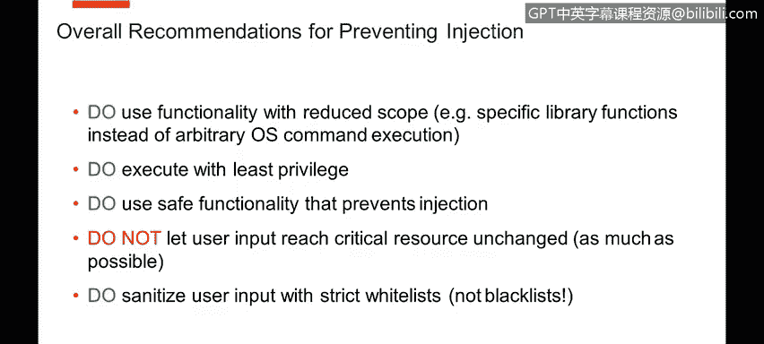

# 课程4：《网络安全与数据库漏洞》：58：其他类型的注入攻击 🎯


在本节课中，我们将要学习除了SQL注入之外的其他几种常见的注入攻击类型。虽然SQL注入最为流行，但攻击者同样会利用其他具有语法或脚本执行功能的技术进行攻击。了解这些攻击的原理，对于构建全面的防御策略至关重要。


上一节我们介绍了SQL注入，本节中我们来看看其他同样危险的注入攻击。

## NoSQL注入 🛢️

许多现代应用开始使用NoSQL数据库技术。你可能会认为这降低了注入攻击的风险，确实如此，但风险并未完全消除。在NoSQL数据库中，如果存在允许用户输入未经检查就到达表达式或脚本执行功能的地方，注入攻击依然可能发生。

以下是一个MongoDB的例子。应用可能使用类似 `{“userType”: 3}` 的表达式作为从用户界面提交的参数。如果攻击者能够控制这个表达式，就可能注入更危险的代码。

例如，攻击者可以注入一段JavaScript代码（MongoDB可以解释JavaScript或其变体）来发起拒绝服务攻击：

```javascript
// 恶意注入的代码示例
function() {
    for(var i = 0; i < 1000000; i++) {
        // 执行大量循环，延迟查询
    }
    return true;
}
```

这段代码会长时间循环，延迟查询执行，可能导致应用程序挂起。因此，不能因为使用了NoSQL技术就认为绝对安全，必须审查所有功能的使用方式。

## XPath注入 📄

XPath是一种用于在XML文档树中导航和查询的流行技术。有时，应用程序会使用XPath表达式在XML文档中搜索登录凭据等信息。如果处理不当，就可能暴露注入漏洞。

考虑以下XPath搜索语句，它用于验证用户名和密码：

```
//user[username=‘INPUT_USER’ and password=‘INPUT_PASS’]
```

如果输入是正常的用户名和密码，这个查询没有问题。然而，攻击者可以注入一种我们已从SQL注入中熟悉的模式，使查询找到任何用户和任何密码的组合，从而实现未授权登录。例如，攻击者可以输入：

```
‘ or ‘1’=‘1
```

这会导致XPath表达式逻辑被篡改，绕过身份验证。因此，必须对输入进行净化处理，防止此类情况发生。

## LDAP注入 🔐

LDAP（轻量级目录访问协议）在许多产品中广泛使用，它同样有自己的语法。任何具有语法、可以指定表达式的地方都可能被滥用，LDAP也不例外。

以下是一个LDAP表达式的例子，用于在目录中查找匹配的用户名和密码：

```
(&(username=INPUT_USER)(password=INPUT_PASS))
```

如果输入是良性的，它能正常工作。但是，如果攻击者注入恶意语法来操纵表达式，就可能实现未授权访问。例如，攻击者可以输入特定的字符来修改查询逻辑，使得密码验证条件失效。

如果应用程序依赖此类表达式进行用户登录，且未对输入进行保护和检查，攻击者就可能无需有效的用户名和密码即可登录系统。

## 其他注入类型与通用防御建议 🛡️

除了上述类型，应用程序还可能使用各种模板引擎，这些引擎有时也存在漏洞。防御注入攻击的建议在所有技术中大体相似。

以下是避免注入攻击的通用核心建议：

*   **使用功能范围受限的接口**：选择那些天生能防止或减少注入可能性的API或方法。
*   **为任务选择最合适的工具**：确保使用的技术或库本身安全性较高。
*   **以最小权限执行**：数据库查询、脚本执行等操作应使用尽可能低的权限账户。
*   **使用安全的、参数化的功能**：优先使用预编译语句、参数化查询等能区分代码和数据的机制。
*   **严格控制用户输入**：尽可能避免用户输入直接、未经改变地到达关键资源（如数据库、脚本引擎）。
*   **采用白名单进行输入净化**：定义明确的合法字符或模式列表（白名单），拒绝所有不在列表内的输入，这比试图列出所有非法模式（黑名单）更有效。




本节课中我们一起学习了NoSQL注入、XPath注入和LDAP注入等其他类型的注入攻击。我们了解到，任何允许用户输入影响命令、查询或脚本执行的技术都可能存在注入风险。关键在于始终对用户输入保持警惕，采用参数化查询、最小权限原则和白名单验证等最佳实践来构建强大的防御体系。