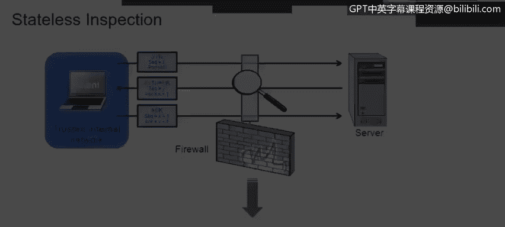

# 课程4：《网络安全与数据库漏洞》： 61：无状态检测 🔍

在本节课中，我们将学习数据包如何被无状态防火墙检测。我们将从网络基础和安全概念入手，逐步解析无状态检测的工作原理。

---

上一节我们介绍了课程背景，本节中我们来看看无状态检测的具体过程。首先，我们需要了解现代企业中防火墙和路由器的工作方式，以及入侵检测系统（IDS）与入侵防御系统（IPS）的区别。最后，我们会简要介绍网络地址转换路由器的基础知识。

常规的路由器和某些防火墙采用无状态方式过滤数据包。**无状态**意味着每个数据包都被单独检测，系统不记录之前数据包的任何信息。由于不维护会话表，每个数据包的检测都独立于其他所有数据包。

那么，数据包中哪些内容会被检测呢？
*   **源IP地址**：检查该地址是否被允许访问网络。这通常由访问控制列表规则决定。
*   **目标IP地址**：检查是否允许访问该目标地址。
*   **目标端口或服务**：检查是否允许该服务或端口流量进入网络。

这个过程基本上是逐个数据包进行的。无状态检测不了解任何会话信息，也没有记录已检测数据包详情的数据库。

---

以下是一个无状态检测事件的示例：

1.  **客户端发起请求**：源计算机上的客户端打开网页浏览器。浏览器工作在**网络应用层**，它能创建TCP或UDP流量，其中TCP是我们在网络中看到的最常见流量。
2.  **构建数据包**：由于数据包在网络第4层使用TCP，它将包含IP地址。数据包头部将包含**客户端机器的源IP地址**和**接收计算机（Web服务器）的目标IP地址**。
3.  **添加二层信息**：网络会添加关于本地网段的信息到数据包头，例如源和目标计算机的物理（MAC）地址以及网关的MAC地址。
4.  **封装与发送**：封装好的数据包被发送到物理层（可以是有线或无线以太网），然后抵达路由器。
5.  **路由器检测**：路由器评估该数据包。它会检查：
    *   源IP地址（本例中的客户端机器）是否被允许访问服务器。
    *   是否允许TCP或UDP协议。
    *   是否允许目标端口（即服务器是否正在监听来自外部或公司网络内部的该特定服务的流量）。
6.  **转发决策**：如果所有检查都通过，数据包将被转发给服务器。

---

了解了无状态检测的过程后，我们来看看它的一些优点：

*   **速度更快**：无状态检测通常比有状态检测速度更快。
*   **提供控制度**：它让我们能够在一定程度上控制网络中允许通过的内容。
*   **利于故障排查**：当我们需要对数据包进行分类时，无状态检测非常有用。
*   **支持虚拟化**：如果路由器支持虚拟化，我们可以识别来自特定源、前往特定目的地的流量，并将其引导至路由器内的特定虚拟实例。
*   **服务质量管理**：可以执行一些服务质量策略，从而优先处理特定流量。

---

本节课中我们一起学习了无状态防火墙检测数据包的核心机制。我们了解到，无状态检测逐个独立地分析数据包的源IP、目标IP及端口等信息，不依赖历史会话数据。这种方法速度快，利于基础流量控制和故障排查，并为网络流量管理和虚拟化提供了支持。下一节，我们将探讨与之对应的有状态检测，看看它如何通过维护会话信息来提供更深层次的网络安全防护。