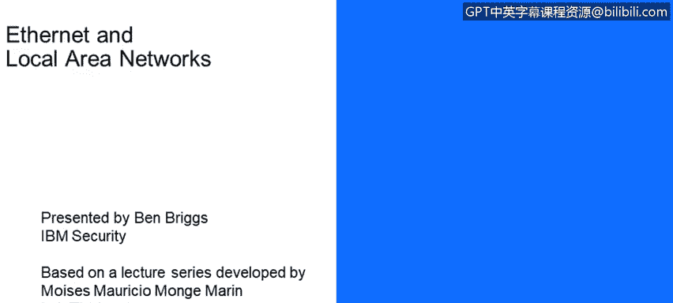
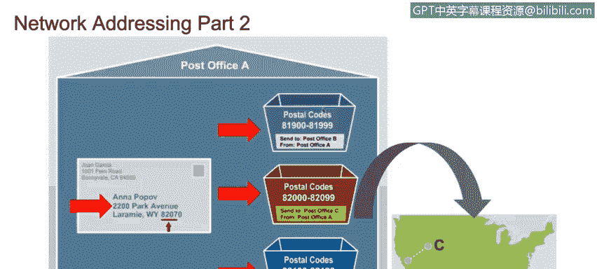

# 课程4：《网络安全与数据库漏洞》：66：局域网简介

在本节课中，我们将学习以太网网络的工作原理，并描述第2层与第3层寻址方案之间的区别。

## 课程概述 📚

本节课程由Moisesmong开发，由Ben Bririggs主讲。我们将讨论以太网和局域网。本课是局域网的入门介绍。

我们的学习目标是：
*   描述以太网网络的工作原理。
*   理解各种网络设备及其区别。
*   区分冲突域和广播域。
*   描述分割广播域的不同方法。
*   理解虚拟局域网的工作原理。
*   理解现代网络中使用的不同寻址方案。

## 网络寻址方案：第2层与第3层 🏷️

上一节我们介绍了课程目标，本节中我们来看看网络通信中两个核心的寻址方案。它们分别位于OSI模型的**第2层（数据链路层）**和**第3层（网络层）**。

*   **第2层（数据链路层）**使用**MAC地址**。
*   **第3层（网络层）**使用**IP地址**，其格式可以是IPv4或IPv6。

数据包从一台主机传送到另一台主机的方式，可以类比邮政系统投递邮件的过程。

## 数据封装与投递过程 📦

理解了寻址方案的区别后，我们来看看数据是如何被封装和投递的。这个过程就像寄信一样。

我们将信息放入信封，这类似于将数据封装在一个数据包头部中。然后，这个头部又被封装在另一个头部里。接着，IP数据包在数据链路层被封装进一个以太网帧（如果网络使用其他技术，则封装进其他类型的第2层帧）。最后，所有内容在第1层（物理层）被再次封装，并添加物理信息。

这就像我们把要发送的信息放入信封，并在信封上写下寄件人和收件人地址，包括城市、州、国家和邮政编码。邮局将你的信封放入一个运往指定邮政编码地区的板条箱，并在箱外清晰标记该代码。邮局会寻找最短、最高效的路线，将板条箱从当前位置运送到目标邮政编码指定的邮局。

这个过程类似于**第3层设备（路由器）**在网络或互联网上为你的信息寻找最高效发送路径的方式。一旦板条箱被运达你指定的国家、州和城市的邮局，你的信封会被取出，并投递到指定的街道、门牌号，放入邮箱。你的朋友收到信封，打开它，阅读信息。

可以看到，在发送端为封装信息所采取的每一步，在接收端都会以相反的顺序被一步步解开。

## 深入理解MAC地址与IP地址 🔍

上一节我们类比了数据投递过程，本节我们来详细看看第2层和第3层地址的具体区别。

**第2层地址**被称为**媒体访问控制地址**或**MAC地址**。MAC地址也被称为硬件地址、物理地址或烧录地址，因为它们被永久蚀刻在每一块网络接口卡上，并且对于该卡是唯一的。在已生产的数十亿块网络接口卡中，没有两块拥有相同的MAC地址。

MAC地址示例：`00:1A:2B:3C:4D:5E`（这是一个6字节、共48位的地址）。

每当数据包经过一个第3层设备（如路由器）并从一个网络传递到另一个网络时，数据包头中的第2层信息会被剥离，并替换为新的物理源地址和目的地址。

**第3层地址**是**IP地址**，也被称为逻辑地址。

IP地址示例（私有IPv4地址）：`192.168.1.10`（此地址不可在互联网上路由）。

第3层地址用于标识计算机或终端设备，并且不会随着数据包的路由而改变（当然，NAT路由器所做的替换除外）。

## 局域网内通信的工作原理 🖥️

了解了地址的基本概念后，我们来看看局域网内部是如何工作的，以便更好地理解设备间的连接以及控制它们通信以传递信息的规则。

为了在同一个局域网内将信息从一台主机传送到另一台主机，我们需要知道与目标设备IP地址相关联的MAC地址。

让我们登录服务器查看一下。假设我们想ping这个地址：`192.168.52.2`。**Ping**（Packet Internet Groper）是用于测量向另一台计算机发送数据包并接收响应所需时间的实用程序，也是快速测试你的计算机与另一系统之间是否存在开放通信路由的最简单方法。

可以看到ping成功送达，并且我们收到了响应。我们能够ping通一个IP地址，是因为**地址解析协议**能够在我们输入的IP地址和现在屏幕上看到的MAC地址之间建立关联。

这对于局域网内的通信工作良好。但是，当我们需要将数据包传送到局域网外部时，**默认网关**就是确保数据包被转发到局域网外的设备。

现在，让我们尝试ping一个位于我们局域网之外的地址：`4.2.2.2`。由于默认网关地址未在我们的ARP表中找到，因此ping没有成功。没有默认网关，就意味着没有数据包能被路由到我们的局域网之外。

## 课程总结 ✨

本节课中，我们一起学习了局域网和以太网的基础知识。

我们首先介绍了课程目标，然后深入探讨了第2层（MAC地址）与第3层（IP地址）寻址方案的核心区别。通过邮件投递的类比，我们理解了数据在网络中封装和传输的过程。最后，我们分析了局域网内通信的机制，特别是ARP协议如何解析地址，以及默认网关在连接不同网络中的关键作用。

总而言之，为了将消息传送到我们局域网内的任何计算机（无论数据包是源自局域网内的计算机，还是从外部网络路由到我们的局域网），我们都需要知道与目标IP地址相关联的MAC地址。