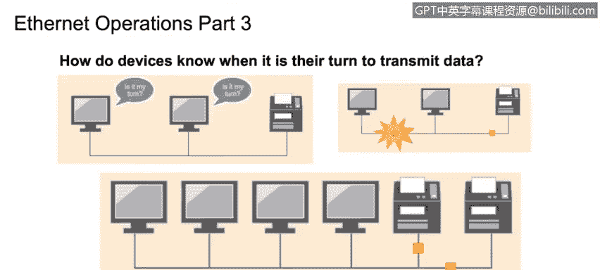
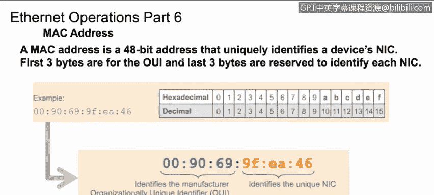

# 课程4：《网络安全与数据库漏洞》：67：以太网与局域网操作

在本节课程中，我们将学习冲突域与广播域的区别，并描述可用于分割广播域的不同方法。

为了连接到局域网，我们需要通过第1层（物理层）的介质进行连接。这可以是有线连接，例如使用以太网电缆，也可以是无线连接。

数据链路层（第2层）的帧或报头包含源和目的MAC地址、协议类型（例如我们使用的是IPv4还是IPv6）、数据本身以及校验和。

校验和是通过一种算法计算得出的数字，该算法查看封装后的帧所传输的数据。接收主机对接收到的数据包重新计算校验和，以确保数据包在传输过程中未被更改。如果数据包被更改，它将被丢弃，或者根据所使用的上层协议，发送重传请求。

所有现代网络都支持全双工通信，因此计算机可以同时发送和接收数据。一些较旧的网络不支持全双工，仅支持半双工，这限制了计算机在发送数据和接收数据之间来回切换。为了处理半双工，旧网络使用了一种称为**载波侦听多路访问/冲突检测**的协议。该协议会检测是否可以传输数据，并检测何时发生冲突。如果发生冲突，它会简单地等待一段随机时间后重试。由于当今网络都是全双工，我们可以同时发送和接收数据包而不会发生冲突，因此不再需要此协议。

那么，网卡如何知道一个数据包是否是发送给其所在计算机的呢？接收计算机接收数据，并逐层向上传递。

第1层将电子信号转换为数字比特，并将帧转发给第2层（数据链路层）。第2层检查目的MAC地址是否与其自身的MAC地址匹配。如果匹配，它会剥离第2层报头，并将数据作为数据包转发给第3层（网络层）。第3层检查目的IP地址是否与其自身的IP地址匹配。如果匹配，它会剥离第3层报头，并将数据包向上发送给第4层。

如果目的MAC地址或目的IP地址与接收计算机的MAC地址和IP地址不匹配，则该数据包将被丢弃，因为它并非发送给此系统。

接下来，我们简要介绍一下以太网帧前导码。

前导码是以太网帧的前8个字节。前7个字节是一系列交替的1和0。这用作缓冲区来分隔相邻的以太网帧，并帮助网络调节数据发送的速度。

前导码的最后一个字节称为帧起始定界符。SFD让接收计算机知道前导码已结束，接下来是实际的帧内容。

这是一个MAC地址的示例。MAC地址是一个48位地址，分为6个字节。前三个字节构成组织唯一标识符，它唯一标识网卡的制造商。剩余的三个字节由制造商分配，作为此特定网卡的唯一标识符。将这两部分组合起来，每个制造出的网卡都有一个唯一的MAC地址来标识它。

当计算机接收到一个帧时，它首先查看目的地址。如果目的地址与其自身的MAC地址匹配，它将把帧传递给下一个更高层的协议。如果不匹配，它将丢弃该帧。

网络中有几种通信类型。单播是仅在两台计算机之间进行的一对一通信。

广播是指一台计算机使用广播IP地址向网络上的所有计算机发送信息。

此外还有组播。这是一种一对多的配置，其中端点订阅服务以接收来自一台计算机发送的消息。当您希望向同一网络上不同组的计算机发送不同消息时，这非常有用。

在本节课中，我们一起学习了局域网连接的基础、数据链路层帧的结构、全双工与半双工通信的区别、计算机如何处理接收到的数据包、以太网帧前导码的作用、MAC地址的构成以及网络中的单播、广播和组播通信类型。理解这些概念是分析网络流量和识别潜在安全漏洞的基础。