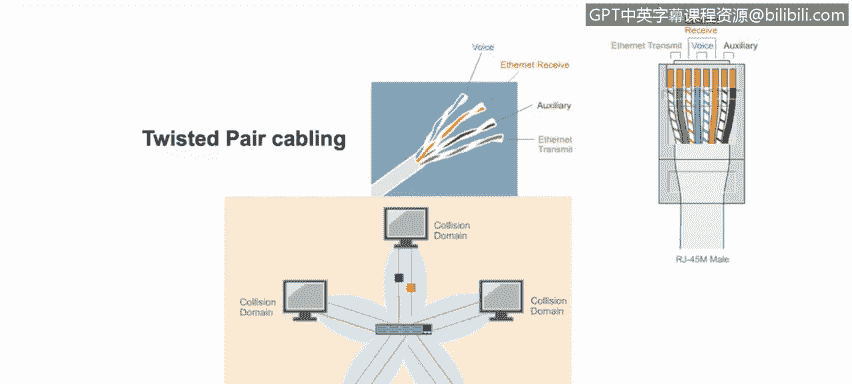
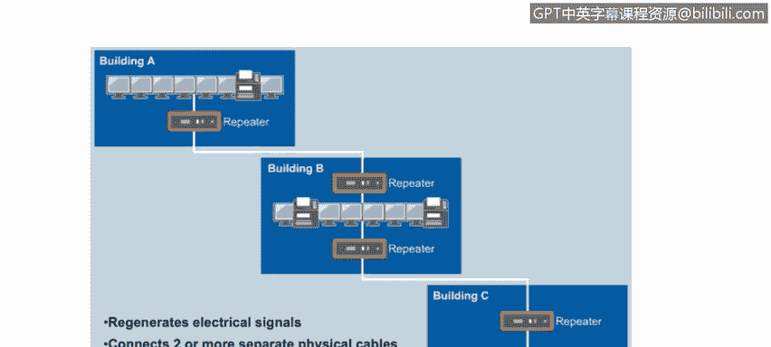
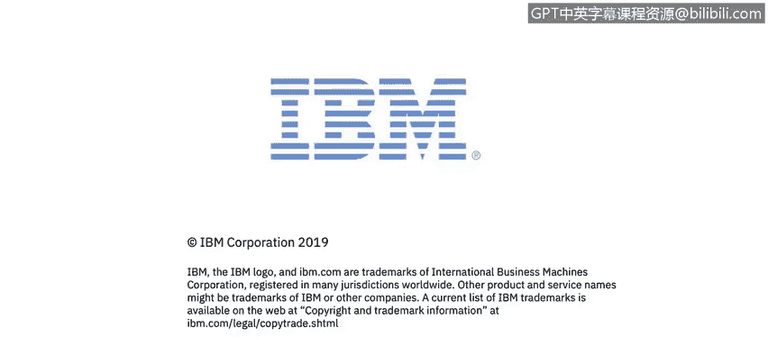

# 课程4：《网络安全与数据库漏洞》：68：以太网与局域网设备

在本节课程中，我们将学习如何区分和理解各种网络设备，并了解虚拟局域网在局域网中的工作原理。

## 网络连接线缆

首先，我们从连接网络设备的基础——线缆开始。

以下是两种在组网中常见的线缆类型：

*   **同轴电缆**：通常使用F型连接器。
*   **双绞线**：通常使用RJ-45连接器。

其中，带有RJ-45连接器的双绞线是局域网中最常用的线缆，适用于长度不超过100米的连接。

双绞线以太网电缆通过“Cat”评级系统来标定速度和长度。例如：

*   **Cat 5**：支持最高100 Mbps的传输速度，距离可达100米。
*   **Cat 6** 和 **Cat 6A**：分别支持最高1 Gbps和10 Gbps的网络速度，距离同样可达100米。

## 常见网络设备类型

上一节我们介绍了网络连接的基础——线缆，本节中我们来看看连接这些线缆的各种网络设备。

以下是几种常见的网络设备类型及其工作原理。

### 中继器（集线器）

中继器，也称为集线器，是一种“哑”设备。当它接收到一个数据帧时，会将该帧从其所有接口转发出去。因此，连接到该设备的所有终端都会收到这个帧。每个终端需要自行检查帧中的第二层MAC地址，以判断该帧是否是发送给自己的。

集线器在发送信号前会对其进行再生，因此发出的信号是干净且全强度的。但由于中继器没有智能，它无法检查在任意时间点发送信号是否安全，因此**冲突是不可避免的**。当检测到冲突时，接收方必须通知发送方重新发送数据包，这自然会降低整个网络的通信速度。在现代网络中，已经很少见到像中继器或集线器这样的“哑”设备了。

### 网桥

一种更先进的网络设备是网桥。网桥与集线器类似，但它不会将信号发送到所有连接的端口，而是通过维护一个**MAC地址表**，只将信号发送到目标计算机所连接的特定端口。

网桥通过查看传入帧的第二层目标MAC地址，并在MAC地址表中匹配该地址对应的连接端口，从而知道哪台机器连接在哪个端口上。MAC地址表与ARP表不同。

因此，网桥是一种可以为局域网增加一定智能的设备。总结来说，网桥维护一个称为MAC地址表的数据库，并使用该表将传入帧上的MAC地址与网桥上连接目标计算机的端口进行匹配。

所有连接到集线器的设备都处于同一个**冲突域**中。网桥通过分割冲突域为网络增加了智能，其**每个端口都创建一个独立的冲突域**。

### 交换机

网桥的现代版本称为交换机。网桥有一些局限性，例如，它是**半双工**设备，意味着数据一次只能在一个方向上传输。因此，连接到网桥的计算机一次只能接收或发送数据，不能同时进行。此外，连接到网桥端口的终端设备必须共享可用带宽。最后，网桥无法实现虚拟局域网。

**交换机是现代网络中最常见的网络设备**。与网桥相比，交换机具有以下优势：

*   **全双工通信**：交换机使用全双工通信，每个端口可以同时发送和接收数据。
*   **独占带宽**：每个端口专用于单个设备，因此不再需要共享带宽。
*   **支持VLAN**：交换机现在支持虚拟局域网，这意味着我们可以在同一台设备上实现广播域的逻辑隔离。

VLAN提供了一种在同一台交换机上分隔局域网的方法。一个VLAN中的设备不会接收到来自另一个VLAN设备的广播消息。VLAN本质上是逻辑上划分广播域的一种方式。

当然，交换机也有一些局限性。例如，当多台交换机作为同一网络的一部分连接在一起时，**网络环路**仍然是一个问题。在这种情况下，可以使用**生成树协议**等协议来帮助解决。此外，交换机可能无法改善多播/广播流量的性能，并且交换机无法连接地理上分散的网络。

## 总结

本节课中，我们一起学习了局域网的基础组件。我们从网络连接线缆开始，了解了双绞线和同轴电缆的区别。接着，我们深入探讨了三种关键的网络设备：功能简单的集线器、能分割冲突域的智能网桥，以及现代网络中主流的、支持全双工通信和VLAN的交换机。理解这些设备的工作原理和演进，是构建和分析安全网络的基础。