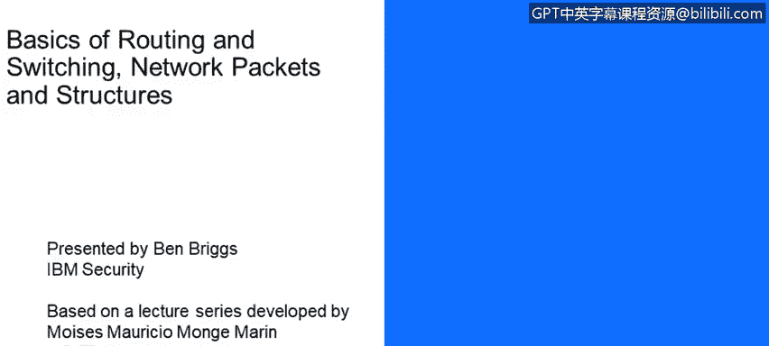
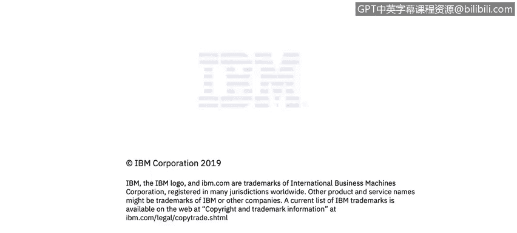

# 课程4：《网络安全与数据库漏洞》：69：10_01_网络路由基础介绍

在本节课中，我们将要学习网络路由的基础知识。我们将探讨数据包如何在本地网络或全球范围内从一台计算机传递到另一台计算机，并理解相关的核心概念与协议。

本节课由Ben Briggs主讲，内容基于Moisesmong开发的系列讲座。

上一节我们介绍了课程概述，本节中我们将更深入地探讨路由的基础原理。

本节课的学习目标如下：
*   理解第二层和第三层寻址。
*   理解使用第三层设备（即路由器和防火墙）实现广播域的互联。
*   描述地址解析协议（ARP）。
*   理解数据包在不同广播域间的转发过程。

本节课中，我们一起学习了网络路由的基础知识，包括二层与三层寻址的区别、路由器与防火墙在连接不同网络中的作用、ARP协议的工作原理以及数据包跨网络传输的基本流程。掌握这些概念是理解更复杂网络通信和安全机制的重要基础。