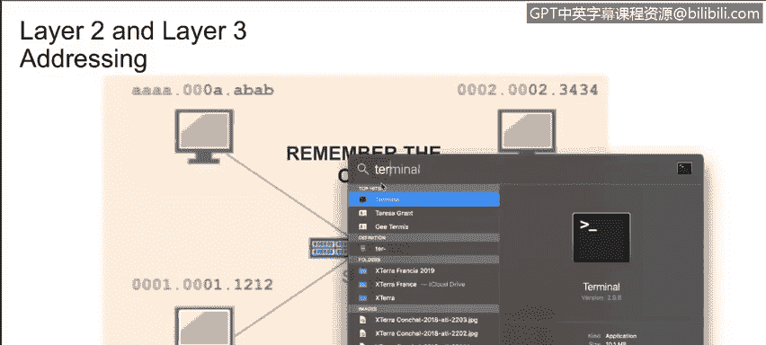
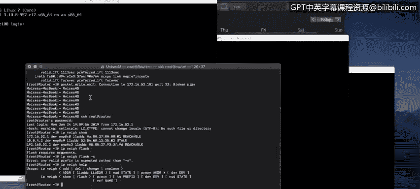
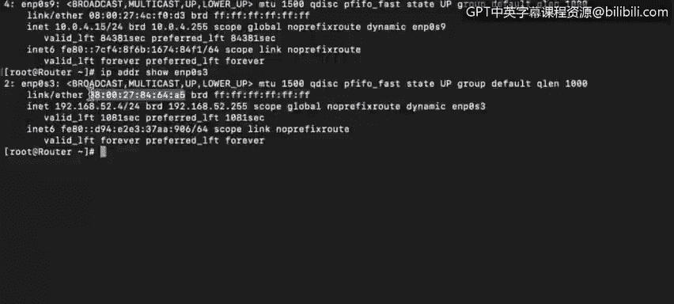

# 课程4：《网络安全与数据库漏洞》：70：11_02_layer-2-and-layer-3-network-addressing

## 📚 概述
在本节课中，我们将要学习TCP/IP协议栈中第二层（数据链路层）和第三层（网络层）的寻址工作原理。我们将了解IP地址与MAC地址的区别，并探讨广播域的概念及其在网络路由中的应用。

---

## 🖥️ 网络接口与MAC地址
如果你查看计算机内部，会看到某种网络接口。它可能是一个单独的芯片，也可能是一整块网络接口卡。你的网卡可能支持有线连接、无线连接，或两者都支持。

网卡总会有一个“烧录地址”，这通常被称为MAC地址或物理地址。MAC地址被物理地编码在网卡上，通常无法更改。

一位学生最近提到了MAC地址欺骗，并问我为何会说MAC地址是烧录的且无法更改。事实上，MAC地址确实被烧录在网络接口中，无法更改。然而，许多操作系统可以被欺骗或配置成使用不同的地址来代表其接口的MAC地址。这被称为MAC地址欺骗，可用于绕过防火墙上的MAC地址过滤。这种过滤通过限制仅允许预先授权的机器访问来保护资产。要成功实施，攻击者首先需要知道一个已通过防火墙授权的系统的MAC地址，然后配置自己的系统使用这个窃取的MAC地址进行通信。

MAC地址长度为48比特，即一串48个1和0。这个地址被分为6个八位组，即6组，每组8比特。前三个八位组用于标识网卡制造商，被称为组织唯一标识符。后三个八位组由制造商用来标识每一张唯一的网卡。

考虑到每月有超过3亿台新设备连接到互联网，我们可能会担心MAC地址是否会用尽。2的48次方大约是281万亿。以目前的消耗速度来看，在MAC地址出现问题之前，我们还有近一百万年时间。

要查看计算机的MAC地址，可以打开终端或命令提示符窗口。

---

## 🔍 如何查看MAC地址
以下是查看MAC地址的方法。

*   在Linux系统上，运行 `ifconfig` 命令。
*   在Windows系统上，运行 `ipconfig /all` 命令，物理地址会清晰地列在许多其他参数和地址之中。

在本示例中，我们使用SSH连接到路由器。输入密码后，我们可以看到所有接口的信息。请记住，无论单个设备中有多少个网络接口，每个独立的网络接口都有自己的地址。

仔细观察这个接口，我们可以看到第二层的MAC地址。这是我的系统的物理地址或MAC地址。这是广播地址，可用于向此网段中的所有设备发送消息。

请注意，MAC地址并非显示为六组每组8个1和0的二进制形式，而是通过用两个十六进制数表示每个二进制八位组进行了压缩，以便我们人类更容易处理。计算机看到的仍然是八个1和0，但为了我们的方便，只显示两个十六进制数字。

---

## 📦 数据包传输与地址验证
上一节我们介绍了如何查看MAC地址，本节中我们来看看数据包是如何传输的。

当一个数据包从一台计算机发送到另一台计算机时，数据包头部将同时包含第二层和第三层地址。数据包实际上被传送到第二层或MAC地址，然后计算机会验证头部中的第三层或IP地址是否与其自身分配的IP地址匹配。接着，系统会检查数据包头部的第二层MAC地址是否与系统的MAC地址匹配。如果匹配，它将开始处理该数据包。

当我们谈论广播域时，我们指的是计算机所在的网络段。

---

## 🌐 广播域与网络接口
观察我们登录的路由器，可以看到它有许多网络接口。我们有ENP0S3、ENP0S8和ENP0S9。这意味着该设备连接到了三个不同的网络，也就是三个不同的广播域。你将看到我的本地IP地址是什么，广播地址是什么。如果数据包被发送到广播地址，该广播地址范围内的所有终端都将接收到该数据包。广播域也可以被称为虚拟局域网。

---

## ✅ 总结
本节课中，我们一起学习了TCP/IP协议栈中第二层和第三层寻址的基础知识。我们明确了MAC地址作为物理地址、IP地址作为逻辑地址的区别，并理解了它们在数据包传输过程中的作用。我们还探讨了广播域的概念，它定义了网络中能够接收广播消息的设备范围，并了解到路由器可以分隔不同的广播域。掌握这些概念是理解网络通信和后续安全议题的重要基础。