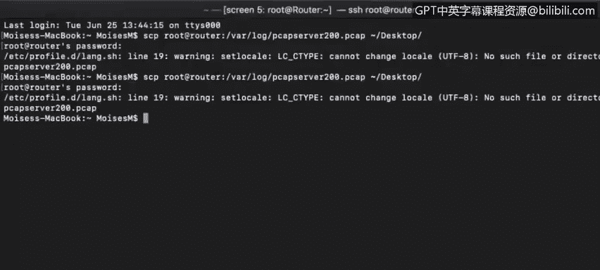
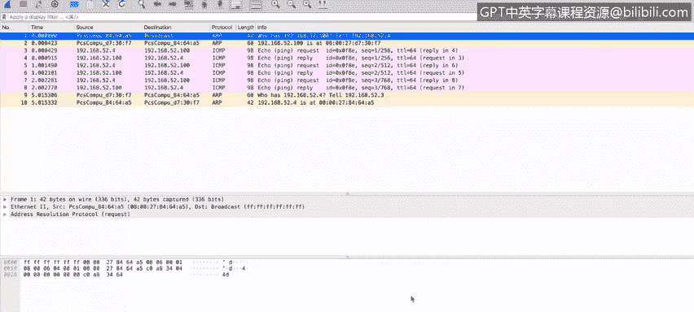
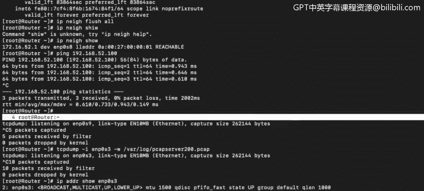
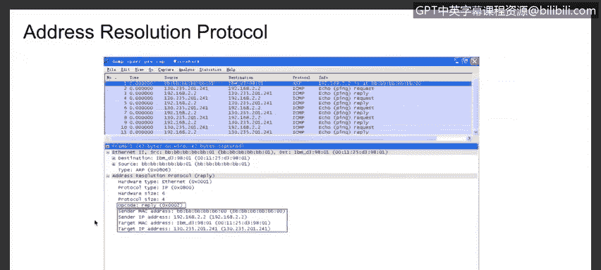
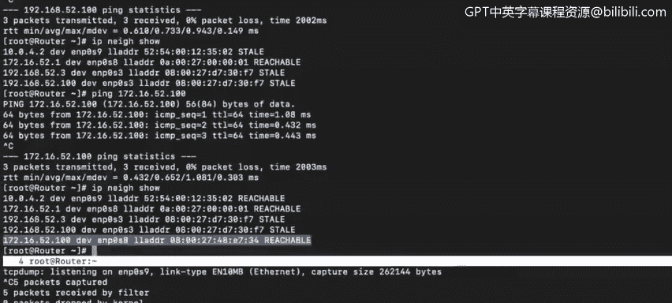

# 课程4：《网络安全与数据库漏洞》：71：地址解析协议


在本节课程中，我们将学习地址解析协议，并了解ARP表在网络路由中的具体应用。

## 概述

地址解析协议是一个相对简单的网络协议。它的核心功能是：当输入一个IP地址时，ARP能够返回该IP地址所对应的计算机的MAC地址。

## 深入解析ARP协议

上一节我们介绍了ARP的基本概念，本节中我们来看看它的具体工作过程。

ARP接收一个IP地址作为输入，并返回分配给该IP地址的计算机的MAC地址。

我们可以通过查看设备上的ARP表来了解这些映射关系。在Windows、Linux或Mac OS X系统上，你可以在终端或命令提示符窗口中运行 `arp -a` 命令来查看ARP表。

以下是在一个Linux路由器上查看ARP信息的命令示例：

```bash
ip neighbor show
```

这个命令会显示该设备上所有已知的IP地址与MAC地址的对应信息。例如，输出可能显示IP地址 `172.16.52.1` 连接到接口 `enp0s8`，并列出其对应的MAC地址。同时，我们可以看到 `enp0s8` 接口处于特定的广播域或本地网络中。



## ARP的实际工作过程

为了理解ARP如何工作，让我们进行一次实际测试。假设我们想ping一个网络内的设备，但ARP表中还没有该设备的IP到MAC地址的转换记录。

首先，我们在接口 `enp0s9` 上启动一个数据包捕获工具（如tcpdump），将流量信息保存到pcap文件中。

在开始ping之前，我们先快速检查一下当前的ARP表。然后，我们ping一个不在ARP表中的设备，例如 `192.168.52.100`。

可以看到ping操作成功了。现在，停止数据包捕获并分析捕获到的文件。



## 分析捕获的数据包

在捕获的数据中，第一件重要的事情是：在ping成功之前，计算机需要先获取目标IP地址的物理地址。因为数据包从不直接发送到IP地址，而是发送到物理MAC地址。



因此，当计算机尝试ping `192.168.52.100` 时，它首先会尝试查找其MAC地址。计算机会向本地网络上的所有其他计算机发送一个查询。这个查询帧的目的地是广播地址，因此会被发送到其广播域内的所有设备。

查询的内容本质上是：“谁拥有这个IP地址？” 在这个例子中，是IP地址为 `192.168.52.4` 的计算机发起了这个查询。

幸运的是，我们收到了一个回复。回复来自拥有目标IP地址的计算机，它包含了其MAC地址，并直接发送给查询者的MAC地址。回复信息表明：“`192.168.52.100` 的MAC地址是 [某个地址]。”

一旦我们的ARP表被这个新的转换记录更新，实际的ping请求（ICMP Echo请求）和回复（ICMP Echo回复）就可以成功传输了。

## 不同系统中的ARP

以下是查看ARP表的其他方式。

在Windows机器上，在命令提示符窗口中输入 `arp -a` 命令，你将看到ARP表。

我们也可以在Wireshark这类数据包嗅探器中看到相同的过程。在捕获的数据包中，我们可以选择一个ARP回复包，查看其详细信息。在数据包详情中，你可以看到“地址解析协议”部分，其中包含了源MAC地址、源IP地址、目的IP地址和目的MAC地址。

## ARP与路由

有一个重要的概念需要记住：目的地的MAC地址仅在**同一广播域**内传输数据时才需要。



当我们要将数据包发送到**不同的广播域**（例如互联网）时，我们唯一需要的MAC地址是我们**默认网关**（通常是路由器）的MAC地址。



因此，如果我们想ping `google.com`，我们不需要找到Google服务器的MAC地址，但我们**需要**获取我们默认网关（例如 `10.0.4.2`）的MAC地址。我们的ARP表中应该已经有这个记录。

## 总结


本节课中我们一起学习了地址解析协议。总而言之，ARP协议的主要工作是在**同一广播域**内查找机器的MAC地址。它通过查询和回复机制，将IP地址解析为通信所必需的物理地址，从而为局域网内的设备通信奠定了基础。