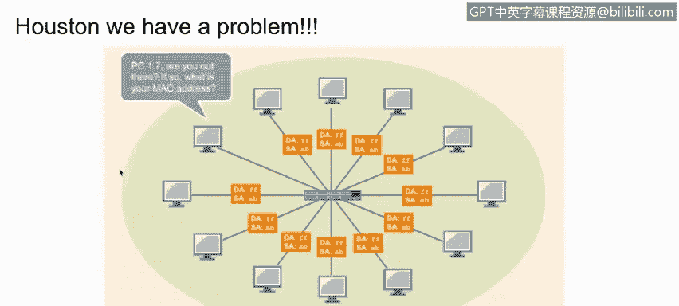
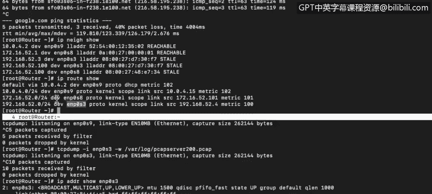

# 课程4：《网络安全与数据库漏洞》：72：13_04_路由器和路由表-第一部分


在本视频中，你将学习如何描述路由表在网络路由中的用途。


掌握网络基础知识的下一目标是更好地理解路由和路由表的用途。

当我们想到路由表时，很自然地会认为它们只用于路由器。然而实际上，连接到任何网络的每一台计算机，无论是终端还是服务器，都拥有自己的路由表。让我们来仔细看看。

这是一台用作路由器的虚拟机，用于本次演示。



你可以通过输入 `netstat -nr` 命令来查看你的路由表。该命令在 Mac OS X 或 Windows 系统的终端窗口中有效。这台路由器运行的是 Sanos 系统，因此我将输入 `ip route show` 命令。

这是目前表中所有的内容。如果我们想发送一个数据包到一个未在此列出的 IP 地址，那么我们会将其发送到默认网关，默认网关将确保数据包被传递到下一跳。

但如果我们想在此网络内发送一个数据包，ENP0S9 接口将处理存在于该广播域内的任何通信。

我们还有接口 ENP0S8 和 ENP0S3，它们各自的广播域也连接到此路由器。其中一个只是另一个终端，而另一个是我们的默认网关。在此示例中，这台设备只是一个连接所有这些计算机的交换机。




回想一下，交换机使用 MAC 地址表。因此，当交换机需要向一台计算机传递数据包时，它甚至不会查看第三层信息，而只是查看数据包头部中的第二层 MAC 地址，以检查其自身的 MAC 表中是否存在对应的条目。如果 MAC 地址存在，数据包就会被传递到相应的接口。


---

## 概述

在本节课程中，我们将学习网络路由的基础知识，特别是路由表的作用和工作原理。我们将了解路由表不仅存在于路由器中，也存在于网络中的每台计算机上，并探讨数据包如何根据路由表在网络中传输。

## 路由表的基本概念

上一节我们介绍了网络基础的重要性，本节中我们来看看路由表的具体作用。路由表是网络设备（包括计算机和路由器）用来决定数据包转发路径的核心工具。

以下是路由表的关键组成部分：

*   **目的网络**：数据包要到达的目标网络地址。
*   **网关**：数据包需要发送到的下一跳地址。
*   **接口**：数据包将从哪个网络接口发出。
*   **度量值**：到达目的地的路径成本，用于选择最佳路由。

## 查看路由表

在大多数操作系统中，你可以使用命令行工具查看当前设备的路由表。

例如，在 Windows 或 macOS 的终端中，可以使用：
```bash
netstat -nr
```
在 Linux 或类 Unix 系统（如演示中的 Sanos）中，通常使用：
```bash
ip route show
```
或
```bash
route -n
```

## 路由决策过程

当一台设备需要发送数据包时，它会查询自己的路由表以决定如何转发。这个过程遵循一个简单的逻辑：


1.  设备将数据包的目标 IP 地址与路由表中的条目进行匹配。
2.  如果找到精确匹配的网络条目，数据包将通过指定的接口发送到对应的网关。
3.  如果没有找到匹配项，数据包将被发送到**默认网关**（通常标记为 `0.0.0.0` 或 `default`）。
4.  默认网关（通常是路由器）接收数据包后，会重复此查询过程，将数据包向最终目的地推进。

在演示中，对于发送到本地网络（如 `192.168.1.0/24`）的数据包，设备会直接通过本地接口（如 `ENP0S9`）发送。而对于发送到外部网络（如互联网）的数据包，则会通过默认网关接口（如 `ENP0S8`）转发。

## 交换机与路由器的区别

这里需要区分交换机和路由器的不同角色，这对于理解网络流量如何流动至关重要。

*   **路由器**：工作在网络层（第三层），使用 **IP 地址** 和**路由表**来决定数据包的路径。它连接不同的网络。
*   **交换机**：工作在数据链路层（第二层），使用 **MAC 地址** 和 **MAC 地址表** 来在同一个网络内转发数据帧。它连接同一网络内的设备。

在示例拓扑中，连接多台计算机的设备被描述为交换机。因此，当它需要传递数据包时，它不关心 IP 地址，只查看数据帧头中的 MAC 地址，并在其 MAC 地址表中查找对应的端口进行转发。

## 总结


本节课中我们一起学习了路由表的核心知识。我们了解到路由表是指导数据包在网络中传输的“地图”，它存在于所有网络设备中。我们学会了如何查看路由表，理解了数据包如何根据路由表做出转发决策，并明确了路由器（基于IP和路由表）与交换机（基于MAC和MAC表）在网络中的不同职能。掌握这些概念是理解更复杂网络架构和安全漏洞的基础。