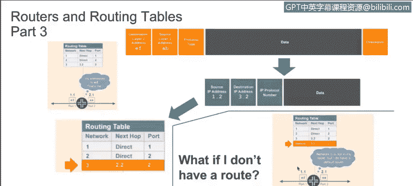
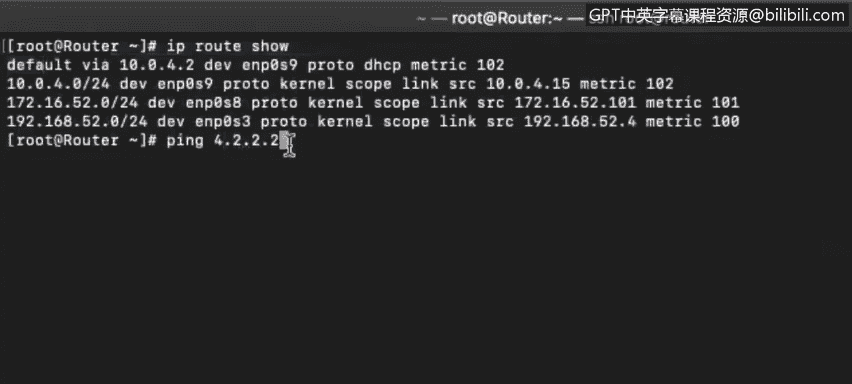
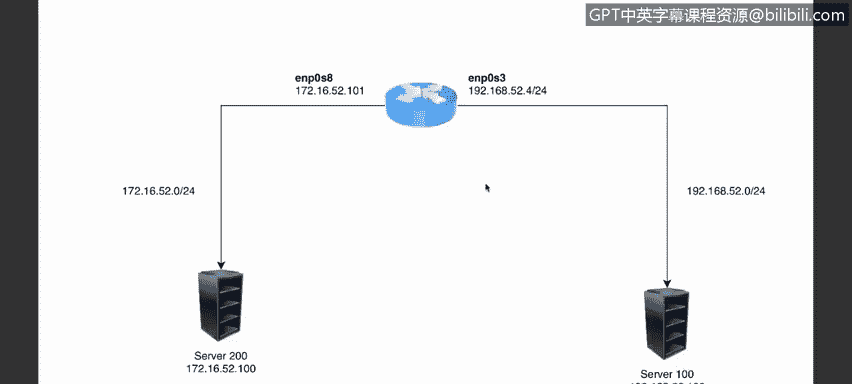
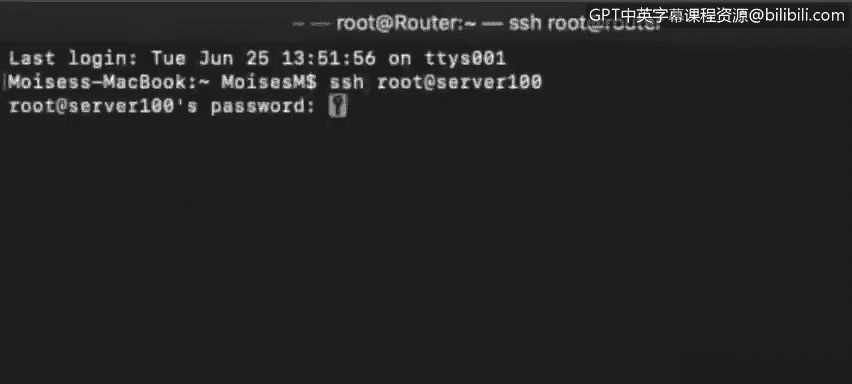
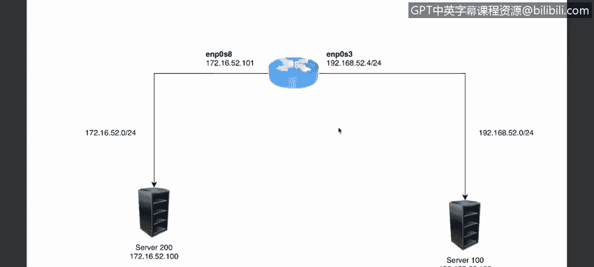
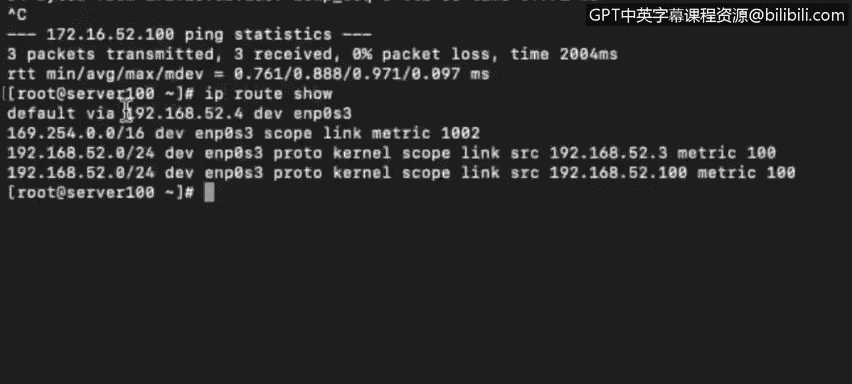

# 课程4：《网络安全与数据库漏洞》：74：路由与路由表（第三部分）🚦

在本节课中，我们将学习路由表中定义的不同路由类型，了解MAC地址如何出现在系统的ARP表中，并详细探讨网络如何精确地知道将数据包成功转发到何处。

---

上一节我们介绍了路由表的基本构成，本节中我们来看看路由表中定义的不同类型的路由。

在上一视频中，我们在一个终端和路由器上看到了三种不同的路由类型。现在让我们再次检查这些路由。

以下是路由表中常见的几种路由类型：

*   **默认路由**：用于将数据包发送到我们没有其他路由信息的地址。例如，如果我们向IP地址 `4.2.2.2` 发送数据包，我们不知道该网络的信息，数据包将被发送到默认网关。在本例中，子网的默认网关是 `10.0.4.2`。数据包被发送到那里，默认网关将负责将其路由到另一个网络。
*   **直连路由**：这些路由指向直接连接到我们服务器接口的网络。例如，路由表条目显示某个网络直接连接到此接口。这意味着该网络上的设备与我们处于同一物理或逻辑网段。
*   **动态路由**：除了上述两种，还有通过动态路由协议（如OSPF、RIPv1、RIPv2、EIGRP等）学习到的路由。EIGRP是思科的专有协议。

---

现在，让我们通过一个具体例子，详细看看网络如何精确地转发数据包。

再次查看我们尝试从网络1发送数据到网络3的例子。这是一个非常简单的网络，只包含一个路由器、服务器100和服务器200。

我们使用SSH以root用户身份登录到IP地址为 `192.168.52.100` 的服务器100。从服务器100，我们想要ping通服务器200。

“serv200 not known”意味着我们没有启用DNS解析，但我们知道服务器200的IP地址是 `172.16.52.100`，因此我们可以ping这个地址。可以看到ping是成功的。

现在，让我们检查路由表，看看路由器如何确保这个数据包被传递到服务器200。

我们可以看到路由器当前的操作。路由表中并没有直接指向 `172.16.52.0`（我们试图ping的网络）的路由。但我们有连接到接口 `ENP0S3` 的默认网关。所以，发生的情况是：数据包被发送到我们的默认网关，然后由默认网关确保数据包被送达。默认网关同样会确保回复被路由回我们。

我们可以运行 `traceroute` 命令来精确查看数据包是如何从本地主机通过网关路由的，网关如何确保数据包被送达其目的端点。

在这里可以看到，`172.16.52.0` 并没有直接连接到我们的接口。本例中，我们只有一个物理接口 `ENP0S3` 和一个逻辑环回接口。有两个IP地址分配给了同一个物理接口，这是完全有效的。这里也显示了我们的MAC地址。

---

接下来，我们探讨一下MAC地址在ARP表中的体现。

如果我们检查ARP表，会发现ARP表只填充了直接连接到我们接口的设备信息，即来自同一广播域的设备。在本例中，我们唯一处于 `192.168.52.3/24` 这个网段的接口，因此ARP表中只填充了该网段的地址。

尽管我们正在ping `172.16.52.100` 并且ping是成功的，但这个 `172.16.52.100` 地址**不会**被添加到这个ARP表中。重申一下，ARP表只解析我们本地广播域内的地址。

在向远程IP地址发送数据时，我们需要知道的是我们**默认网关的MAC地址**。在本例中，查看路由表，我们的默认网关IP地址是 `192.168.52.4`。我们可以在ARP表中查找该地址的转换记录。

该IP地址对应的条目就是物理地址（MAC地址）`08:00:27:84:64:a5`。至此应该很明显，每个IP地址都会有不同的MAC地址，因为MAC地址是烧录在该接口上的物理地址。

---

这就是我们如何跨不同网段发送数据包的方式。我们的默认网关将确保数据包被传递到最近的第3层设备，直到找到一个第3层设备，其某个接口直接连接着目标系统。

---

**本节课总结**

在本节课中，我们一起学习了：
1.  路由表中的不同路由类型：包括默认路由、直连路由和动态路由。
2.  MAC地址与ARP表的关系：ARP表仅缓存本地广播域内设备的IP-MAC映射，远程通信需要依赖默认网关的MAC地址。
3.  数据包转发原理：主机通过查询路由表决定下一跳，利用ARP表获取下一跳设备的MAC地址，从而将数据包成功转发至最终目的地。