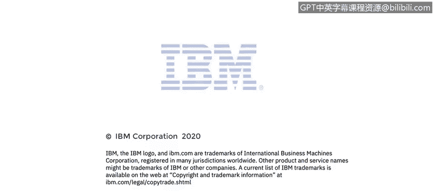

# 课程4：《网络安全与数据库漏洞》：76：17_02：IP寻址与二进制基础 🧮

在本节课中，我们将学习如何在二进制、八进制、十进制和十六进制数制之间进行数字转换。这些数制分别对应基数2、8、10和16。本课程由Ben Briggs主讲，基于Moisees Mong开发的系列讲座。

## 概述
本节将讨论网络基础，特别是IP寻址。我们将涵盖IPv4寻址的基础知识，并简要介绍IPv6。虽然大家在学校里可能都接触过二进制数，但考虑到时间久远，我们将快速回顾一下。

## 十进制与二进制系统

我们习惯于使用十进制系统进行思考、交流和计算。人类采用十进制系统，很可能是因为我们有十根手指和十根脚趾，因此可以推测早期的计数是在祖先的手指上完成的。

然而，计算机只知道两种不同的状态：开或关，高电压或低电压，门打开或关闭。我们逻辑上将其表示为1或0。计算机只能区分这两种状态。

以下是十进制系统的工作原理：
*   我们有代表个位、十位、百位、千位等的数位。
*   每个数位的值是前一个数位的10倍。
*   每个数位可以容纳10个不同的值，范围从0到9。
*   请记住，“decimal”一词意为“十”。

另一方面，在二进制系统中：
*   每个数位或占位符代表不同的值。有代表1、2、4、8、16等的占位符。
*   每个数位的值是前一个数位的2倍。
*   在二进制中，每个数位只能容纳两个不同的值：0或1。
*   请记住，“binary”一词意为“二”。

## 二进制转十进制

从二进制转换为十进制很简单。只需将所有包含1的数位的值相加，忽略那些包含0的数位。

**示例**：二进制数 `11011010` 转换为十进制。
*   这是一个8位二进制数，因此有8个占位符。
*   计算：`2 + 8 + 16 + 64 + 128 = 218`
*   所以，`11011010` 的十进制等价数是 **218**。

## 十进制转二进制

从十进制转换为二进制稍微复杂一些，可能会让你想起小学学的长除法。当然，有很多计算器和在线工具可以帮你完成转换，但以下是手动方法。

**示例**：将十进制数 **235** 转换为二进制。
1.  找出可以从你的十进制数中减去的最大二进制占位符值。256太大，但可以减去下一个较小的占位符128。所以在128的位置放一个1。然后从235中减去128，剩下107。
2.  检查能否从107中减去64。可以，所以在64的位置加一个1。然后从107中减去64，剩下43。
3.  检查下一个占位符。能从43中减去32吗？可以。所以在32的位置加一个1，并从43中减去它，剩下11。
4.  检查下一个占位符。能从11中减去16吗？不能。所以在16的位置放一个0。
5.  检查下一个占位符。能从11中减去8吗？可以。所以在8的位置放一个1，并从11中减去8，剩下3。
6.  检查下一个占位符。能从3中减去4吗？不能。所以在4的位置放一个0。
7.  检查下一个占位符。能从3中减去2吗？可以。所以在2的位置放一个1，并进行减法。现在剩下1。
8.  下一个占位符是最后一个，1。能从1中减去1吗？可以。所以在1的位置放一个1，并进行减法。1-1=0。完成。

因此，235的二进制表示是 **11101011**。

## 其他数制系统

上一节我们介绍了二进制和十进制之间的转换。但不幸的是，在处理计算机时，二进制和十进制并不是你唯一会遇到的数据系统。

以下是常见的数制系统：
*   **二进制（基数2）**：每个数位可以有两个可能的值：0或1。
*   **八进制（基数8）**：不如二进制常见，但偶尔会遇到。每个数位可以有8个可能的值，范围从0到7。
*   **十进制（基数10）**：每个数位可以有10个可能的值，范围从0到9。
*   **十六进制（基数16）**：简称Hex。每个数位可以有16个可能的值，范围从0到F。当我们用完数字后，开始使用字母。因此，10到15分别用A、B、C、D、E和F表示。

对于任何数制系统，不仅仅是这四种，计算给定位数可以表示多少个不同数字的方法很简单：只需将你正在使用的基数提高到可用位数的幂次方。

**示例**：假设我们有4个可用数位。
*   在二进制中：`2^4 = 16` 个不同的数字（范围：0 到 1111，即十进制0到15）。
*   在八进制中：`8^4 = 4096` 个不同的数字（范围：0 到 7777，即十进制0到4095）。
*   在十进制中：`10^4 = 10000` 个不同的数字（范围：0 到 9999）。
*   在十六进制中：`16^4 = 65536` 个不同的数字（范围：0 到 FFFF，即十进制0到65535）。

很容易看出，使用更大的基数可以更紧凑地表示大数字。例如，十六进制中的3位数 `FFF` 在二进制中需要12位数 `111111111111`。

## 数制转换原理

计算机硬件和软件在机器代码级别是基于二进制的。因此，使用2的幂次方作为基数的数制系统，可以更容易地在这些系统之间进行转换。
*   3个二进制数位可以直接转换为1个八进制数位。
*   4个二进制数位可以直接由1个十六进制数位表示。
*   在十进制中，则没有这种精确的数位到数位的转换。

要从任何基数系统转换为十进制，你可以绘制一个像我们之前使用的表格，但将右侧列标题的值替换为你正在使用的基数的幂次方。
*   对于二进制：1, 2, 4, 8, ...
*   对于八进制：1, 8, 64, 512, ...
*   对于十进制：1, 10, 100, 1000, ...
*   对于十六进制：1, 16, 256, 4096, ...

请注意，所有这些列标题都是基数分别提高到0、1、2、3……次幂。这适用于你需要处理的任何基数。

## 总结
本节课中，我们一起学习了不同数制系统（二进制、八进制、十进制、十六进制）的基础知识，以及它们之间相互转换的基本方法。理解这些概念对于后续学习IP地址（特别是IPv6使用十六进制表示）至关重要。你可能需要在学习本课最后一个关于IPv6寻址的视频时，回头参考本节内容。