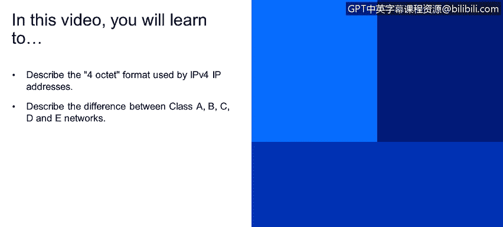
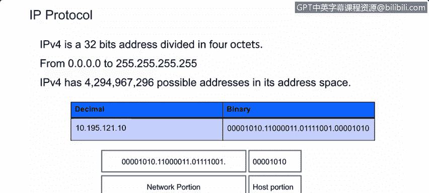
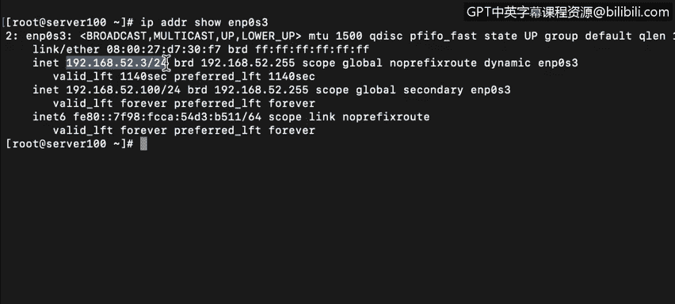
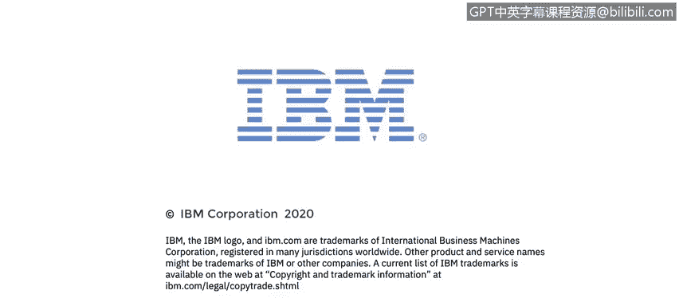

# 课程4：《网络安全与数据库漏洞》：77：IPv4地址结构与网络类别


在本节课中，我们将要学习IPv4地址的基本结构，包括其点分十进制格式，以及早期网络分类（A、B、C、D、E类）的定义和区别。核心概念将通过**公式**和**代码**进行描述。



---

## IPv4地址格式

上一节我们介绍了网络通信的基础，本节中我们来看看互联网协议版本4（IPv4）的地址是如何构成的。

IPv4使用一个32位的寻址方案，该方案被划分为4个8位的部分，每个部分称为一个“八位组”。

你应该还记得，8位二进制数（由1和0组成）在十进制表示法中的取值范围是0到255。这可以用公式 **2^8 = 256** 来表示。因此，每个八位组的十进制值范围是0到255。

一个完整的IPv4地址范围从 `0.0.0.0`（所有位为0）到 `255.255.255.255`（所有位为1）。这为IPv4提供了 **2^32 = 4,294,967,296** 个可能的地址。虽然这个数字看起来很大，但IPv4地址实际上已经面临短缺。

如果我们将一个IP地址转换为二进制（计算机看待它的方式），可以使用上一节视频中的方法。例如，将十进制数 `10` 转换为二进制：

```python
# 十进制10转换为二进制
# 检查位值：128(0), 64(0), 32(0), 16(0), 8(1), 4(0), 2(1), 1(0)
# 结果为：00001010
```

每个八位组包含8个比特，这正是它被称为“八位组”的原因。

---

## 网络部分与主机部分



一个IP地址被分为网络部分和主机部分。这可以在你自己的计算机上进行配置，但如今大多数计算机都设置为使用DHCP（动态主机配置协议）来自动分配IP地址。

让我们通过登录到服务器 `Ser100` 来查看实际操作。以下是查看接口IP地址的命令输出示例：

```
IP地址：192.168.52.3/24
```



这个地址由4个八位组（`192.168.52.3`）和一个CIDR范围（`/24`）组成。`/24` 定义了IP地址中有多少位专用于网络部分。

---

## 网络类别

在IPv4的早期，网络使用“分类寻址”方案，该方案只允许五种不同的地址范围。

以下是各类网络的地址范围及其用途：

*   **A类网络**：`0.0.0.0` 到 `127.255.255.255`，用于特殊用途和单播。默认子网掩码是 `255.0.0.0`。
*   **B类网络**：`128.0.0.0` 到 `191.255.255.255`。默认子网掩码是 `255.255.0.0`。
*   **C类网络**：`192.0.0.0` 到 `223.255.255.255`。默认子网掩码是 `255.255.255.0`。
*   **D类网络**：`224.0.0.0` 到 `239.255.255.255`，保留给多播组使用。
*   **E类网络**：`240.0.0.0` 到 `255.255.255.255`，保留用于研究、开发和未来用途。

在分类寻址中：
*   在A类网络中，**第一个八位组**用于网络部分，后三个八位组用于主机部分。
*   在B类网络中，**前两个八位组**用于网络部分，后两个用于主机部分。
*   在C类网络中，**前三个八位组**用于网络部分，只有最后一个八位组用于主机部分。

网络部分的大小决定了该网段可以容纳多少台主机或终端。例如，一个 `/24`（C类）的网络，主机部分有8位，可以支持 **2^8 - 2 = 254** 台主机（减去网络地址和广播地址）。

---



本节课中我们一起学习了IPv4地址的点分十进制格式，理解了IP地址由网络部分和主机部分组成，并掌握了A、B、C、D、E五类网络的历史定义、地址范围及其基本结构。这些知识是理解现代网络寻址和子网划分的基础。