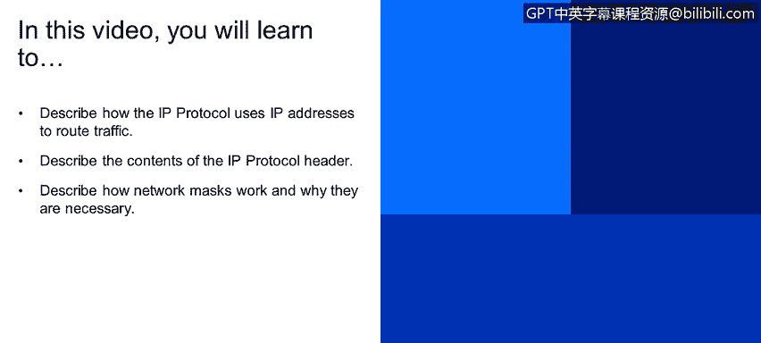
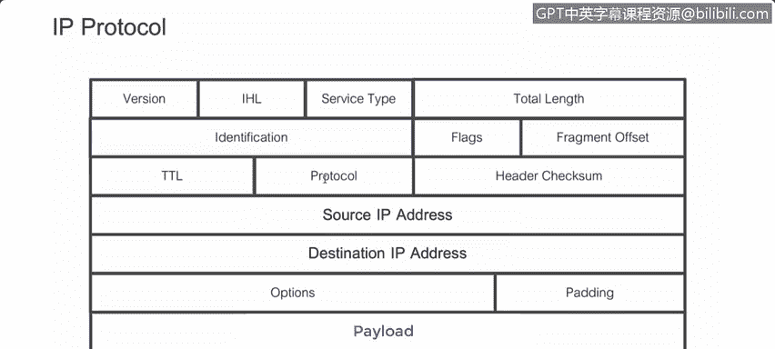
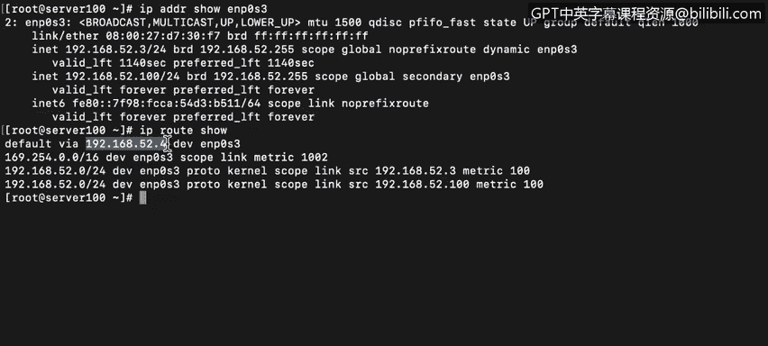
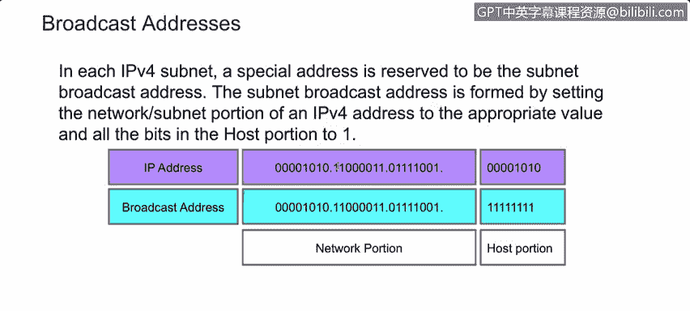

# 课程4：《网络安全与数据库漏洞》：78：19_04：IP协议与流量路由 🚦


在本节课中，我们将要学习互联网协议（IP协议）如何利用IP地址来路由网络流量。我们将详细解析IP协议头的内容，并解释子网掩码的工作原理及其必要性。



---

上一节我们介绍了网络通信的基本层次，本节中我们来看看IP协议的具体工作机制。

IP协议与第三层（网络层）设备协同工作，这些设备利用IP头来识别和处理流量。所有路由器都会检查每个数据包的目的地址，而有状态防火墙还会检查源地址，以便识别流量的来源。

正如我们在上一视频所见，IP地址通常以点分十进制表示法呈现，即由点分隔的四个数字组成的字符串。例如：`10.195.210.10`。可以看到，这里有四个八位组（octet），即四组八位二进制数。在十进制形式下，一个8位二进制数的取值范围是`0`到`255`，始终为正整数。其二进制范围则是从`00000000`到`11111111`。

可路由协议是指可以在其起源网络之外（通常是互联网）被路由的协议。IP是一种可路由协议，但并非所有IP地址都是可路由的。因此，熟练掌握IP地址的工作原理，包括子网掩码和默认网关的作用，至关重要。

以下是IP协议头的一个示例：
```
+-------------------+-------------------+
| 版本 (4位)        | 首部长度 (4位)    |
+-------------------+-------------------+
| 服务类型 (8位)    | 总长度 (16位)     |
+-------------------+-------------------+
| 标识 (16位)       | 标志 (3位) | 片偏移 (13位) |
+-------------------+-------------------+
| 生存时间 (8位)    | 协议 (8位)        | 首部校验和 (16位) |
+-------------------+-------------------+
| 源IP地址 (32位)                       |
+---------------------------------------+
| 目的IP地址 (32位)                      |
+---------------------------------------+
| 选项 (如果有)                         |
+---------------------------------------+
| 数据 (有效载荷)                        |
+---------------------------------------+
```

协议版本（IPv4或IPv6）是头部声明的第一项。这很合理，因为IPv4和IPv6的头部结构不同，检查设备必须先知道如何解析头部才能理解其内容。

TTL（生存时间）字段用于限制数据包在被丢弃前可以经过的跳数。数据包发送时设置一个TTL值，每经过一个第三层设备检查，TTL值减1。当TTL值减至0时，路由器将丢弃该数据包而不是转发它。这是为了防止具有错误IP地址的数据包在互联网上无限循环，导致无法管理的网络拥塞。这是一个8位字段，因此其值范围为`0`到`255`。互联网标准委员会建议大多数正常流量的TTL值设为`64`。请注意，在IP协议中TTL以跳数计量，但在某些协议（如DNS）中则以秒计量。

另一个重要字段是“协议”。每个协议都有一个ID。例如：
*   ICMP（Ping）的协议ID是 `1`
*   TCP的协议ID是 `6`
*   UDP的协议ID是 `17`

两个非常重要的字段是源IP地址和目的IP地址。源IP地址标识发送此数据包的端点，而目的IP地址则是数据包要发送到的位置。最后，有效载荷是正在发送的消息内容。

---

了解了IP协议头的结构后，我们来看看它在实际数据包中的体现。

使用Wireshark捕获数据包时，首先看到的是帧，然后是第二层数据（MAC地址位于此层），接着是第三层。在本例中，第三层是互联网协议版本4（IPv4）。这里显示了源IP地址和目的IP地址。协议字段显示为ICMP。例如，IP地址以`.104`结尾的计算机正在尝试ping一个以`.1`结尾的地址。



---

现在我们来讨论网络掩码。子网掩码的作用是分配比特位，供主机和路由器确定如何从IP地址中划分出网络/子网部分和主机部分。

回想上一视频，IP地址末尾的`/24`表示该特定IP地址的前24位（即前3个八位组）是网络部分，最后8位（1个八位组）是主机地址。网络掩码正是实现将IP地址划分为网络段和主机段的工具。

这种复杂性是必要的，因为不同的网络被配置为使用IP地址中不同数量的位来表示网络和主机。这让人回想起A类、B类、C类和D类网络方案的讨论。

在截图中，我们看到一个前缀为`/24`的IP地址。`/24`意味着前24位（3个八位组）用于网络部分，最后一个八位组用于主机部分。当我们需要创建一个要发送到本地网络之外的数据包时，它将被发送到默认网关。

因此，在这种情况下，我们需要与网络外部的主机通信，数据包将被发送到此地址（默认网关地址）。这个作为我们默认网关的路由器，会将数据包转发到我们的网段之外。

所以，每当我们需要与自身网段之外的系统通信时，我们只需要与网关对话，由它来管理进出我们网络的流量。如果我们需要与自身网络内部的主机通信，任何交换机或集线器都可以完成这项工作。

---

但是，数据包不会发送给默认网关。我们的系统会查看MAC地址表，将IP地址转换为MAC地址，这样数据包就可以直接转发给本地接收者。

广播IP地址在某种意义上与网络掩码相反。在这种情况下，广播IP地址将保留原始IP地址中网络部分的所有八位组，而将主机部分的所有位设置为`1`。



对于IP地址为`192.168.52.3`的计算机，其广播地址将是`192.168.52.255`。如图所示，地址主机部分的所有位都被置为`1`。

---

**本节课总结**



本节课中，我们一起学习了：
1.  **IP协议与路由**：IP协议如何利用源和目的IP地址在第三层设备上路由流量。
2.  **IP协议头解析**：详细了解了IP协议头各个字段的含义，特别是版本、TTL、协议类型、源/目的IP地址。
3.  **子网掩码的作用**：子网掩码如何划分IP地址的网络部分和主机部分，这对于确定流量是发送到本地网络还是通过默认网关发送到外部网络至关重要。
4.  **广播地址**：广播地址的构成及其在网络中的作用。


掌握这些基础知识是理解更复杂的网络通信、安全策略和漏洞分析的关键第一步。