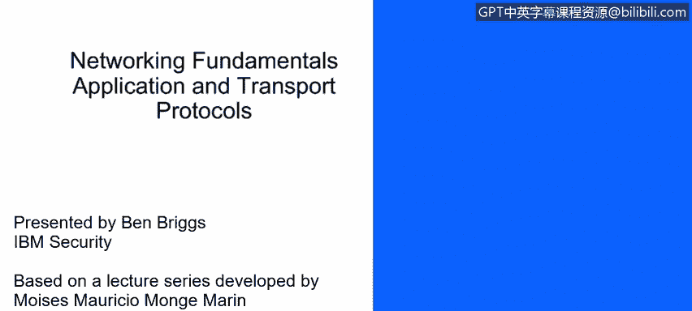
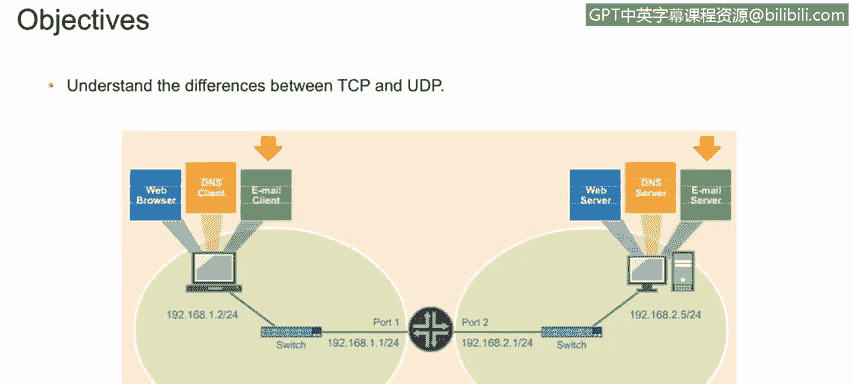
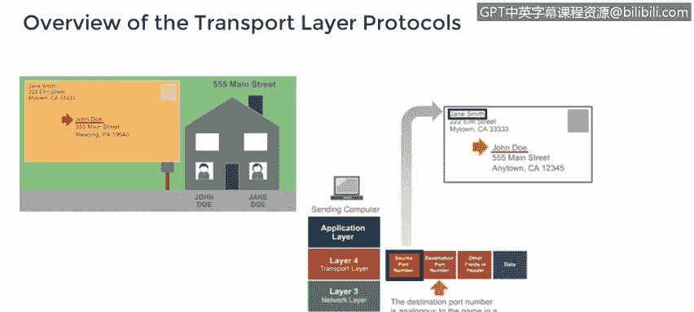
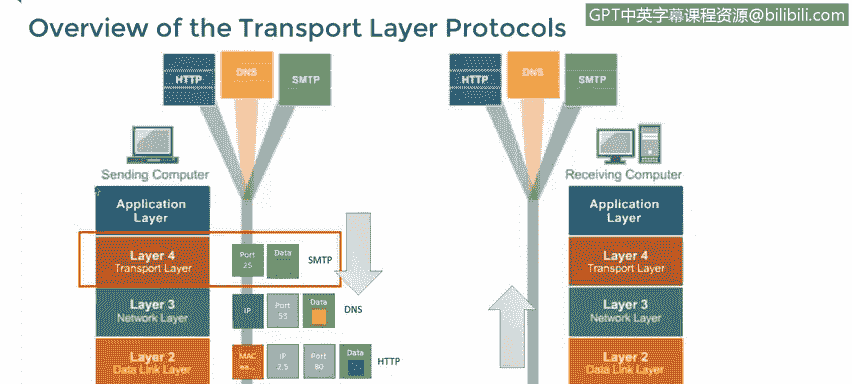
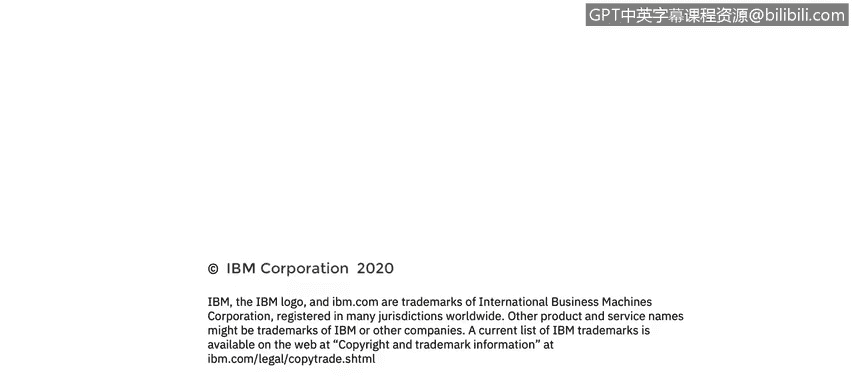

# 课程4：《网络安全与数据库漏洞》：80：应用层与传输层协议：UDP与TCP（第一部分）🚀

在本节课中，我们将要学习传输层的两个核心协议：TCP和UDP。我们将了解它们之间的关键区别，并探讨哪些常见的网络应用和工具会选择使用UDP协议。

---

上一节我们介绍了传输层协议的基本概念。本节中，我们来看看TCP和UDP这两个具体协议是如何工作的。

传输层协议就像是寄信时使用的信封。信封的正面如同数据包的头部，上面写有发送方地址、目的地地址等信息。

为了更形象地理解，我们可以打个比方：TCP协议类似于使用**挂号信**服务。你有一个追踪号码，并且需要收件人签收，因此你可以确信信件已送达正确的收件人。而UDP协议则更像是**批量平邮**。它速度快、成本低，绝大多数信件都能到达目的地，但你无法确切知道每一封信是否都成功送达。

---

一些应用程序偏爱使用TCP，另一些则偏爱UDP。还有些应用可以配置为使用其中任何一种，甚至有少数应用会根据不同功能同时使用两者。

TCP会建立一个连接。发送方和接收方计算机都知道哪些数据包已被发送和接收，以及正确的顺序是什么。对于许多应用来说，确保没有数据包丢失（除非重传）以及所有数据包顺序正确是至关重要的。但所有这些“握手”确认过程需要大量开销，因此速度并不快。

另一方面，UDP不会像TCP那样建立连接。发送方不知道每个数据包是否已被接收，接收方也只能按照数据包到达的顺序来重组数据流，即使有些包的顺序与发送时不同。这只需要极少的开销，因此它是一个非常快速的协议，非常适合流媒体视频和音乐等应用，在这些场景中，丢失或乱序几个数据包影响不大。

---

在第四层（传输层），数据被分割成块并添加头部。源端口号标识了发起网络调用的进程，因此它会被添加到数据包头部。目标端口号代表了我们试图连接的远程服务，同样也会被添加到头部。

例如，源端口是**25**，意味着我们正尝试与一个SMTP（简单邮件传输协议）服务器通信。

以下是UDP数据包封装的主要字段，可以看到源端口和目标端口，对于使用UDP的协议，这两个端口号通常是相同的：
*   **源端口**
*   **目标端口**
*   **UDP消息长度**
*   **校验和**

---

以下是常见的使用UDP协议的应用：
*   **TFTP（简单文件传输协议）**：使用端口**69**。它与FTP非常相似，但使用UDP而非TCP，以避免为传输非常小的文件而建立和维护连接的所有开销。
*   **DNS（域名系统）**：使用端口**53**。DNS使用UDP进行名称查询，但也可以使用TCP执行一些不常见的任务。DNS通常用于将域名转换为IP地址。
*   **SNMP（简单网络管理协议）**：使用端口**161**和**162**。虽然不常见，但SNMP也可以使用TCP。SNMP用于监控和管理网络设备。
*   **DHCP（动态主机配置协议）**：使用端口**67**。DHCP自动为订阅它的系统分配和管理一个IP地址池。
*   **VoIP（网络电话）**：使用端口**5060**。它也可以使用TCP实现，用于通过互联网传输语音，并随着基于互联网的电话服务而日益普及。
*   **IPTV（网络协议电视）**：流式传输电视信号。IPTV同时使用UDP和TCP，并根据所使用的服务以及流量是传入还是传出，使用端口**80**、**5004**和**12000**。

所有这些协议都利用了UDP速度快的优势，因为在这些场景中，偶尔丢失一两个数据包并不会造成严重问题。

---

本节课中，我们一起学习了TCP和UDP这两种传输层协议的核心区别。TCP提供可靠、有序的数据传输，但开销较大；UDP提供快速、无连接的数据传输，但不保证可靠性。我们还了解了DNS、DHCP、VoIP等常见应用为何选择使用UDP协议。理解这些协议的特性是分析网络流量和识别潜在安全风险的基础。