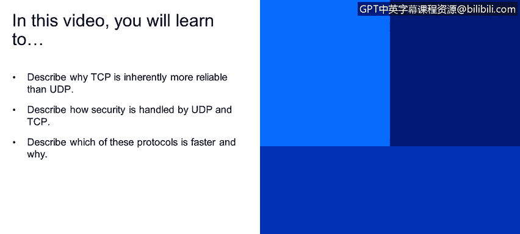
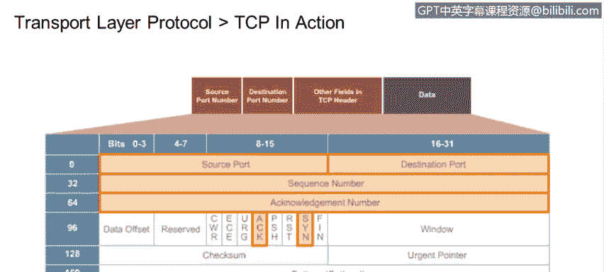
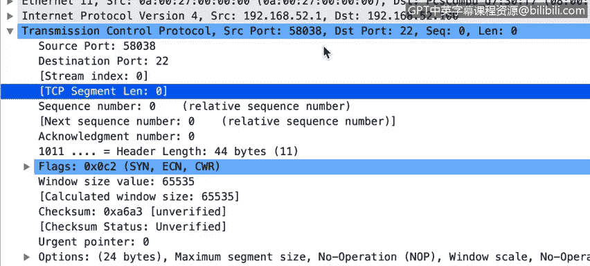
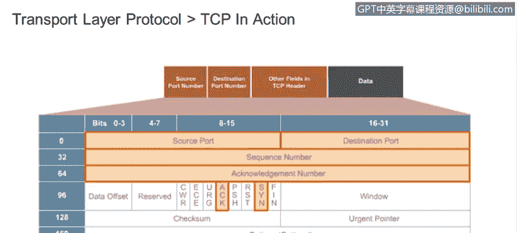
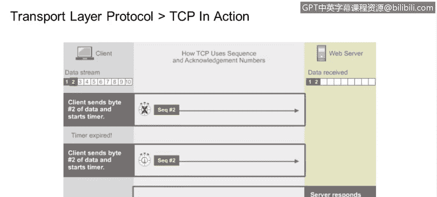
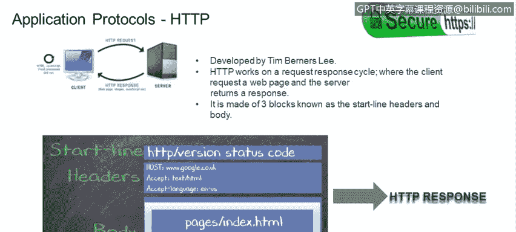
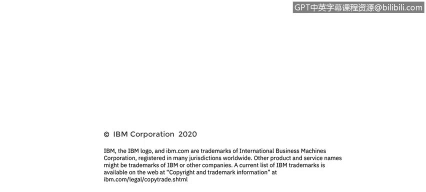

# 课程4：《网络安全与数据库漏洞》：81：应用层与传输层协议：UDP与TCP（第二部分）

## 概述

在本节课程中，我们将深入探讨传输层协议TCP和UDP的核心特性。我们将重点学习TCP为何比UDP更可靠、两种协议如何处理安全性、以及它们之间的速度差异及其原因。通过对比分析和实例讲解，你将能够清晰地理解这两种关键网络协议的工作原理。

## TCP与UDP的可靠性对比

上一节我们介绍了UDP和TCP的基本概念，本节中我们来看看它们在可靠性方面的根本区别。

**TCP（传输控制协议）** 被设计为一种可靠的、面向连接的协议。其可靠性源于它要求接收方对每个成功接收的数据段进行确认。如果发送方在预定时间内未收到确认，它会自动重新发送数据包。这个过程确保了数据的完整交付。

**UDP（用户数据报协议）** 则是一种无连接的协议。它发送数据包后，不要求也不接收来自目的地的任何确认。数据包要么到达，要么丢失，发送方无从知晓。因此，UDP被认为是“不可靠”的。

一个简单的类比是传统邮件：UDP如同寄出一封普通信件，寄出后便不再过问；而TCP则像寄出一封需要签收回执的挂号信，寄件人必须确认收件人已收到。

## 连接建立：TCP的三次握手

TCP在开始传输任何数据之前，首先需要与接收方建立一个连接。这是通过一个称为“三次握手”的过程完成的。

以下是建立TCP连接的三次握手步骤：

1.  **SYN**： 试图建立连接的发送方向接收方系统发送一个SYN（同步序列号）请求。
2.  **SYN-ACK**： 接收方系统响应一个SYN-ACK包，即SYN加上一个ACK（确认），以指示通信将开始的序列号。
3.  **ACK**： 发送方最后发送一个ACK包来确认接收方的SYN-ACK。

一旦三次握手成功，TCP连接便正式建立，双方可以开始传输数据。

## 数据包结构：TCP头部解析

让我们具体查看一个TCP数据包的头部结构，以理解其包含的信息。

以下是一个TCP数据包头部的关键字段示例：

*   **源端口**： 发送方应用程序使用的端口号。
*   **目的端口**： 接收方应用程序监听的端口号（例如，22端口用于SSH）。
*   **序列号**： 用于标识数据段顺序的编号。
*   **确认号**： 期望收到的下一个数据段的序列号。
*   **标志位**： 包括SYN、ACK、FIN等控制位，用于管理连接状态。
*   **校验和**： 用于错误检测，确保数据在传输过程中未被篡改。

## 流量控制与数据传输

TCP具备UDP所没有的“流量控制”机制。这意味着发送方不会以超过接收系统处理能力的速度发送数据包，从而防止接收方被数据淹没。

在实际传输中，TCP并非为每个数据包都等待确认后才发送下一个。相反，它通常会发送一系列数据包。接收方计算机通过检查序列号来判断系列中是否有数据包丢失，并可以通知发送方仅重传丢失的包。这通过**序列号**和**确认号**的协同工作来实现。

## 应用层协议示例：HTTP与HTTPS

传输层协议为应用层协议提供服务。以最常见的Web协议为例：

**HTTP**工作在请求-响应周期中。客户端请求一个网页，服务器返回该页面作为响应。一个HTTP数据包由三部分组成：起始行、头部和正文。需要明确的是，HTTP协议本身并不安全，所有数据都以明文传输。

**HTTPS**（安全HTTP）的开发正是为了解决互联网上对隐私和安全的需求。HTTPS在HTTP之下加入了SSL/TLS加密层。更准确地说，SSL/TLS作为最外层的协议层运作，在初始握手之后的所有通信内容都被加密，不会暴露或明文发送。

## 核心协议对比总结

以下是UDP与TCP核心特性的对比列表：

*   **连接性**： UDP无连接；TCP面向连接。
*   **可靠性**： UDP不可靠，不保证交付；TCP可靠，通过确认和重传保证交付。
*   **数据传输单元**： UDP传输的是**数据报**；TCP传输的是**数据段**。
*   **速度**： UDP通常更快，因为开销小，无需建立连接和确认；TCP较慢，但更可靠。
*   **流量控制**： UDP无流量控制；TCP有流量控制。
*   **典型应用**： UDP用于DNS、视频流、在线游戏；TCP用于HTTP/HTTPS、FTP、电子邮件。

## 总结

本节课中，我们一起深入学习了传输层两大协议——TCP和UDP。我们明确了TCP通过面向连接、三次握手、确认重传和流量控制机制实现了高可靠性，而UDP则以其无连接、低开销的特性追求传输速度。我们还了解了它们如何支持上层应用，例如不安全的HTTP和安全的HTTPS。理解这些协议的差异和原理，是分析网络流量、识别潜在安全漏洞的重要基础。