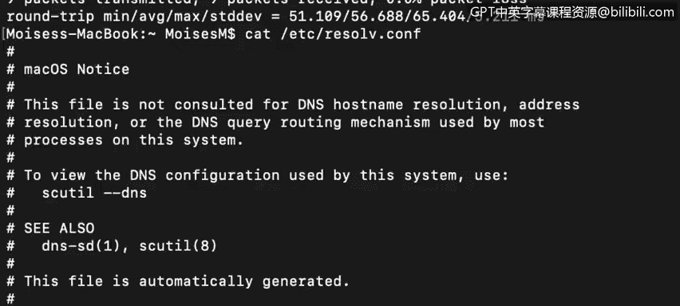

# 课程4：《网络安全与数据库漏洞》：82：23_01_dns-and-dhcp｜DNS与DHCP协议详解

在本节课中，我们将学习两个关键的应用层协议：域名系统（DNS）和动态主机配置协议（DHCP）。我们将了解它们各自提供的服务、工作原理以及它们在网络通信中的重要性。

---

## DNS：域名系统

上一节我们介绍了课程概述，本节中我们来看看DNS。DNS服务运行在我们的本地机器上。

DNS服务将URL中的域名翻译成IP地址。其核心功能就是如此简单。

例如，当你访问 `google.com` 时，DNS会将该域名解析为谷歌网络服务器的实际IP地址。

当我们尝试使用 `ping` 命令连接 `google.com` 时，DNS会获取该服务器的实际IP地址以用于Ping请求。

我们可以查看DNS服务器的位置。在本例中，它是我们的默认网关 `192.168.0.1`，该设备运行着DNS服务。

---

## DHCP：动态主机配置协议

了解了DNS后，我们接下来探讨DHCP。DHCP允许计算机在连接到本地网络时，自动从DHCP服务器配置管理的可用IP地址池中获取一个IP地址。

DHCP握手过程由请求系统和DHCP服务器之间交换的四个数据包组成。它们被称为 **DORA** 消息：发现（Discover）、提供（Offer）、请求（Request）和确认（Acknowledgement）。

以下是DHCP工作流程的详细步骤：

当一个配置为DHCP的终端连接到网络时，系统会立即尝试发现DHCP服务器。它会向网络段上的所有终端发送一个广播消息。如果该终端在之前启动时获得过一个IP地址，它可能会在请求中询问是否可以续租该地址，而不是获取一个新地址。

如果网络段上存在DHCP服务器（如果存在配置为DHCP的终端，就应该有），DHCP服务器将向请求终端发送一个提供（Offer）消息。该消息包含请求终端的MAC地址、提供的IP地址、子网掩码、租用期限以及发出此提供的DHCP服务器的IP地址。

一个网络可能配置了多个DHCP服务器，因此请求终端可能会收到多个提供。收到提供后，终端会回复一个请求（Request）消息，表明它接受了哪个提供。

获胜的DHCP服务器向终端发送最终的确认（Acknowledgement）消息，确认终端可以使用提供的IP地址，并将该IP地址标记为已租借给该终端的MAC地址。其他DHCP服务则将其提供的地址返回到它们的可用地址池中。

这是一个DHCP发现（Discover）数据包的Wireshark捕获截图。

最初，你的计算机不知道DHCP服务器的IP地址或MAC地址。因此，在第二层（数据链路层），请求计算机使用广播MAC地址，以便其广播域中的所有设备都能接收到该帧。在第三层（网络层），我们看到使用了广播IP地址。在第四层（传输层），我们看到使用了引导协议客户端（BOOTP），即DHCP，它使用UDP协议，运行在源端口68和目标端口67上。DHCP服务器监听端口67。

一旦收到DHCP请求，服务器会检查其IP地址池，看是否有可用的地址。如果有可租借的地址，它将用一个DHCP提供（Offer）回复请求终端，其中包含提议的IP地址及相关信息，如DHCP服务器地址、默认网关地址、子网掩码和租用期限。

即使终端现在知道了DHCP服务器的地址，它也会以广播而非直接发送的方式，回复一个请求（Request）消息来接受提供。这是为了让其他响应的DHCP服务器知道，一个提供已被接受，它们可以将提供的IP地址返回到各自的地址池中。

这是DHCP请求（Request）数据包。你可以看到它重复了在提供消息中发送给终端的相同IP数据。

最后，DHCP服务器向终端发送确认（Acknowledgement）消息，确认之前发送的IP地址已被租借。

---

本节课中我们一起学习了DNS和DHCP这两个核心网络协议。DNS负责将人类可读的域名转换为机器可识别的IP地址，而DHCP则自动化了网络终端的IP地址配置和管理过程。理解它们的工作原理对于分析网络流量、排查连接问题以及识别潜在的网络攻击至关重要。