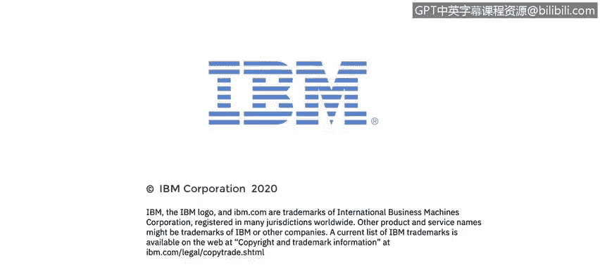

# 课程4：《网络安全与数据库漏洞》：83：Syslog消息日志协议

在本节课程中，我们将学习Syslog协议及其提供的功能，并描述Syslog的三个层次：内容层、应用层和传输层。

## Syslog协议概述

上一节我们介绍了日志记录的重要性，本节中我们来看看一个标准化的日志管理协议——Syslog。

Syslog是一种用于消息传递和日志记录的标准协议。计算机或网络设备上的每一个事件都会生成一条消息，并存储在本地日志文件中。Syslog协议提供了一种标准格式和机制，可以将所有这些消息转发到一个集中的Syslog服务器，以便进行系统管理和系统审计。同时，Syslog数据也可用于调试和取证调查中的通用信息分析。

## Syslog的三层架构

Syslog协议包含三个层次：**内容层**、**应用层**和**传输层**。

*   **内容层**：包含实际的Syslog消息本身。
*   **应用层**：负责对Syslog消息进行路由、分析和存储。
*   **传输层**：处理Syslog消息在网络上的发送。

## Syslog协议中的五个角色

以下是Syslog消息传递过程中涉及的五个主要角色：

1.  **发起者**：指发生事件并生成原始消息的实体，例如您的本地计算机。
2.  **收集器**：指收集消息的Syslog服务器。
3.  **中继服务器**：位于发起者和收集器之间，仅负责转发消息。
4.  **传输发送方**：通常是发起者本身，负责使用UDP协议（或需要更高可靠性时使用TCP协议）准备消息以便传输。
5.  **传输接收方**：通常是中继服务器或收集器，负责从底层传输协议（如UDP/TCP）接收消息，并将其解包后交付给Syslog服务器应用。

## Syslog消息的构成

生成消息的进程始终会在消息中包含**进程ID**和**严重性级别**。但在将消息转发给Syslog服务器之前，Syslog客户端会在消息头中添加三条信息：

1.  发起者进程ID。
2.  时间戳。
3.  发起消息的设备的主机名或IP地址。

## 设施代码详解

设施代码用于标识生成消息的进程。由于Syslog最初在BSD Unix上实现，因此设施名称反映了伯克利软件发行版中的进程和守护程序名称。

Syslog识别23种设施代码。如果您从Unix系统接收消息，建议首先考虑使用“user”设施代码。请注意，代码16至23（名为local0至local7）未被Unix系统使用，传统上由思科路由器等网络设备使用，它们通常使用local6或local7。

## 严重性级别配置

Syslog有8个严重性级别，范围从最严重的0级（紧急）到最不严重的7级（调试）。计算机和网络设备每分钟可能生成数百万条日志消息。您肯定不希望用海量的常规消息淹没您的Syslog服务器，这会使分析所有传入数据并发现可操作的异常变得困难。

因此，在发起者上设置适当的严重性级别至关重要。设置后，只有达到该级别或更严重的消息才会被发送。例如，如果将严重性级别设置为3，则严重性级别为0、1、2或3的所有消息都会被发送，但级别为4至7的消息则不会被发送。

## Syslog数据包示例

这是一个Syslog消息的数据包捕获示例。图中标识了**发起者**和**收集器**（在此例中为最终收集器，而非中继）。这部分标识了**设施**，而这里显示了**严重性级别**。最后是Syslog消息的**实际内容**，其中包括时间戳。

## 课程总结

本节课中，我们一起学习了Syslog协议。我们了解了Syslog作为标准化日志转发协议的功能，剖析了其内容层、应用层和传输层的三层架构，认识了消息传递过程中的五个关键角色，并详细说明了消息的构成部分，特别是设施代码和严重性级别的含义与配置方法。理解Syslog是进行有效的集中化日志管理和安全事件分析的基础。