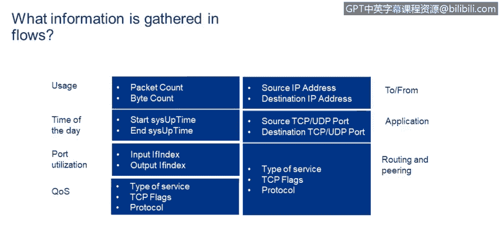

# 课程4：《网络安全与数据库漏洞》：84：25_03_流与网络分析

在本节课程中，我们将学习如何描述NetFlow等流工具，它们如何帮助你在路由设备上收集和可视化网络流量统计信息。

上一节我们介绍了流工具的基本概念，本节中我们来看看流数据中具体包含哪些使用信息。

NetFlow会对流经某个接口的流量进行采样。如果我们检查一条采样记录，可以看到以下关键信息：

以下是NetFlow采样记录中包含的核心数据字段：

*   **数据包数量**：此流中使用的数据包总数。
*   **字节数**：此流中发送的总字节数。
*   **时间戳**：记录流开始的时间以及采样的时间。
*   **接口标识**：流入和流出接口的身份信息。
*   **服务质量信息**：例如服务类型。
*   **协议信息**：使用的协议，例如：
    *   协议 `1` 代表 **ICMP**
    *   协议 `17` 代表 **UDP**
    *   协议 `6` 代表 **TCP**
*   **地址与端口**：源和目的IP地址，以及TCP/UDP的源和目的端口号。

这些数据由NetFlow服务器收集，并由服务器负责以易于理解的方式（如图表）展示所有收集到的信息。

在收集到NetFlow数据后，我们可以轻松分析接口的使用情况。接下来，我们看看如何利用这些数据进行可视化分析。

例如，可以清晰地看到该接口上使用最多的协议。在所示案例中，超过84%的流量是TCP或万维网流量。需要记住，这些数据是每次针对一个接口进行收集和显示的。

同样，可以按使用接口的应用程序来查看流量。不出所料，HTTP位列第一。我们还能看到进入接口的字节数和离开接口的字节数。

当然，我们也可以查看通过该接口每个方向发送的数据包数量。

本节课中我们一起学习了NetFlow如何工作，以及它收集的关键网络流量数据，包括协议类型、数据量、接口信息和通信端点。通过可视化这些流数据，网络安全分析师能够有效监控网络活动，识别异常模式，为分析潜在威胁提供重要依据。