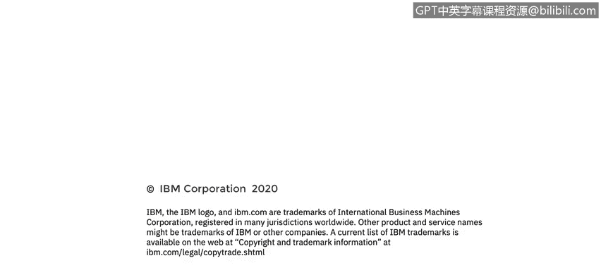

# 课程4：《网络安全与数据库漏洞》：85：端口镜像与混杂模式

在本节课中，我们将学习端口镜像和混杂模式这两个核心概念。你将了解端口镜像的定义及其应用场景，同时掌握混杂模式的概念，并区分其合法与非法的用途。

## 端口镜像概述

上一节我们讨论了网络监控的基础，本节中我们来看看端口镜像这一具体技术。

端口镜像，简单来说，是指将交换机上一个或多个端口的所有流量复制一份，并发送到指定的单一目标端口的过程。

以下是关于端口镜像的一些关键点：

*   **厂商术语差异**：不同网络设备厂商对端口镜像的称呼不同。例如，在思科交换机上，它通常被称为**SPAN**或**RSPAN**。RSPAN允许目标端口位于远程或另一台交换机上。而像3Com这样的厂商，则可能使用**Roving Analysis Port**这样的术语。
*   **合法用途**：复制并分析流经交换机的所有网络流量，对于网络故障排查和性能分析具有明显益处。
*   **安全风险**：这项技术也可能被滥用。试想，如果攻击者能够访问组织内部的核心交换机并设置端口镜像，将所有网络流量的副本悄无声息地发送到自己的服务器进行利用，将造成严重后果。

## 端口镜像与入侵检测系统

通常情况下，镜像的流量数据包会被发送到连接在目标端口上的**IDS**进行分析。

IDS会被配置为实时监控所有流量，并在检测到任何异常时发出警报。需要记住的是，IDS工作在网络数据的**副本**上。这意味着IDS不会拖慢实际网络的速度，但也意味着它无法直接对发现的问题采取行动（例如拦截数据包），而只能发出警报。

## 混杂模式的作用

接收镜像数据的目标端点或服务器，其**NIC**必须运行在**混杂模式**下，才能读取收到的所有数据帧。

这是因为这些数据帧的目的地MAC地址都指向其他系统。如果NIC不在混杂模式下，它会简单地忽略这些不属于自己的数据帧。

因此，为了让IDS或其他网络分析工具正常工作，其NIC必须配置为混杂模式，以读取发送到其入口端口的所有帧。否则，它将无法读取帧并执行分析。

当你使用像**Wireshark**这样的端口嗅探器时，Wireshark会自动将你的NIC置于混杂模式，以便捕获流经其接口的所有流量。

## 课程总结

本节课中，我们一起学习了端口镜像和混杂模式。我们明确了端口镜像是一种将交换机端口流量复制到监控端口的技术，既可用于合法的网络分析，也可能带来安全风险。同时，我们了解到混杂模式是网络接口卡能够读取所有流经数据帧的必要条件，这是网络监控和分析工具（如IDS和Wireshark）能够正常工作的基础。理解这两者对于从事网络安全监控和分析至关重要。