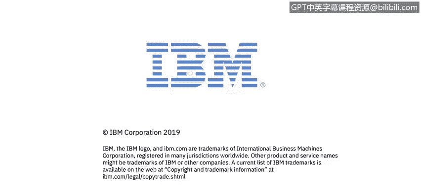

# 课程4：《网络安全与数据库漏洞》：86：27_01_下一代防火墙概述

在本视频中，你将学习如何描述网络设备过滤功能的加入，如何将下一代防火墙与传统防火墙区分开来。你将学习描述下一代防火墙如何区分商业应用程序、非商业应用程序以及攻击。

大家好，欢迎来到本课程。我是Fiano Fao，来自IBM安全团队。今天我们将讨论下一代防火墙。

## 下一代防火墙概述 🧱

下一代防火墙是防火墙技术的第三代产品。我们已经看到技术如何从传统防火墙发展到应用层或深度包检测防火墙，这将在本课中描述。

传统防火墙与下一代防火墙的主要区别在于“会话”这个概念。我们将理解会话如何工作，以及拥有会话机制的优势。

在后续课程中，我们将看到下一代防火墙基于IP地址和第四层（传输层）端口来执行阻塞决策，即允许或拒绝流量通过网络。而下一代防火墙能够更进一步地检查数据包，它将检查到应用层，以执行阻塞决策。

当检查流量时，下一代防火墙还能提供其他服务，例如入侵防御系统。它们甚至能够检查使用SSL加密的流量，例如通过SSL检测。我们将在本节稍后部分对此进行描述和讨论。

## 会话机制的核心作用 🔄

下一代防火墙与传统防火墙的主要区别在于会话。会话基本上允许防火墙放行属于先前已建立会话的返回流量。

例如，如果我的PC需要连接到Web服务器。当数据包从我的PC流向Web服务器时，防火墙将检查所有流量，并确定是否允许该流量通过网络或应被拒绝。如果允许流量通过网络并穿过防火墙，一个安全会话或防火墙会话将被创建，并记录在会话表中。

当服务器响应并将流量发送回我的计算机时，如果存在先前建立的会话，并且此流量属于我们创建的会话的一部分，它将自动被允许，而无需检查所有返回流量。

这就是下一代防火墙与传统防火墙的主要区别。对于传统防火墙，我们需要配置一条规则以允许流量从我的PC流向服务器，并配置另一条规则以允许流量从服务器返回我的PC，即使它是先前建立的TCP会话的一部分。

## 总结 📝

本节课中，我们一起学习了下一代防火墙的基本概念。我们了解到，下一代防火墙通过引入“会话”机制，能够基于应用层信息进行更精细的流量控制，并能自动处理已建立会话的返回流量，这比传统防火墙基于IP和端口的静态规则更为高效和智能。我们还简要提及了下一代防火墙集成的其他高级功能，如入侵防御和SSL流量检测。