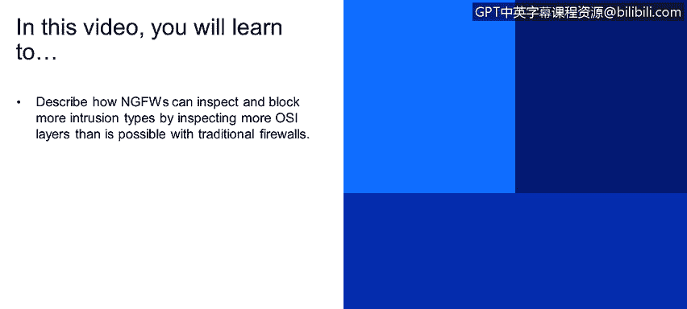
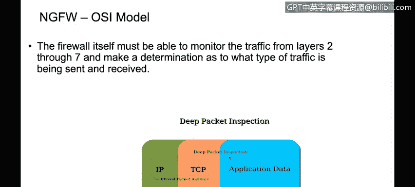
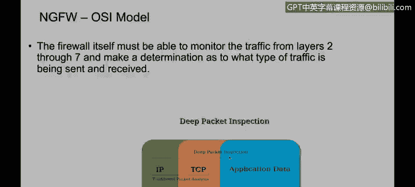
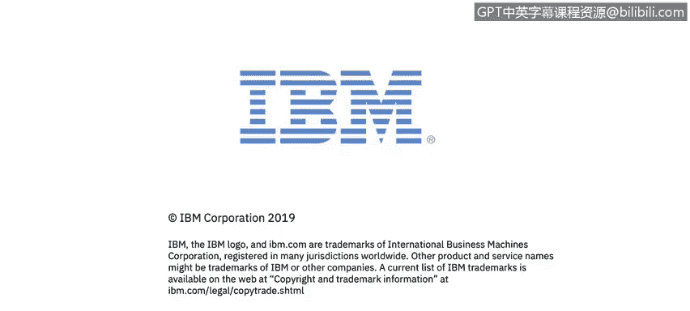

# 课程4：《网络安全与数据库漏洞》：87：下一代防火墙与OSI模型

在本节课程中，我们将学习描述下一代防火墙如何通过检查比传统防火墙更多的OSI模型层，来检查和阻止更多类型的入侵。

## 传统防火墙的局限性 🔍

上一节我们介绍了防火墙的基本概念。本节中我们来看看传统防火墙的工作方式及其局限性。

传统防火墙主要依据OSI模型的第3层（网络层）和第4层（传输层）信息来做出决策。这些决策包括允许或阻止数据包。

其决策逻辑通常基于以下信息：
*   **源/目的IP地址**（第3层）
*   **协议类型**（如TCP/UDP，第4层）
*   **源/目的端口号**（第4层）

## 下一代防火墙的深度包检测能力 🛡️

与传统防火墙不同，具备深度包检测能力的下一代防火墙能够检查数据包直到OSI模型的**应用层**（第7层）。

这意味着防火墙不仅能看数据包“从哪里来、到哪里去”（IP和端口），还能分析数据包内部承载的“具体内容是什么”（应用信息）。

## 应用识别示例：HTTP流量管理 🌐

以下是传统防火墙与下一代防火墙在处理复杂网络流量时的关键区别。

假设网络中存在以下情况：
*   有一条规则允许所有HTTP流量（通常使用TCP 80端口）。
*   我们需要阻止一个使用HTTP端口进行通信的特定应用程序（例如Skype的某个版本或一个伪装成Web流量的恶意软件）。

**传统防火墙的困境：**
由于传统防火墙只能看到“目的地IP的80端口有HTTP流量”，而无法识别流量内部的实际应用，因此它无法单独阻止那个伪装成HTTP的特定应用。规则一旦允许HTTP，所有使用80端口的流量都将被放行。

**下一代防火墙的解决方案：**
下一代防火墙能够深入检查数据包载荷，识别出流量的真实应用身份。因此，它可以配置更精细的规则，例如：
*   **允许** 标准的Web浏览（HTTP）流量。
*   **同时阻止** 通过HTTP端口传输的特定应用程序（如Skype或恶意软件）。

## 更精细的访问控制实例 📱

让我们通过一个更常见的例子来理解下一代防火墙的精细控制能力。

假设您的策略是：
*   允许员工访问Facebook进行工作交流。
*   但禁止在工作时间访问YouTube观看视频。

然而，Facebook和YouTube都使用HTTPS（基于HTTP的安全版本）协议，传统上使用相同的端口（如443）。

以下是传统与下一代防火墙的应对方式：
*   **传统防火墙：** 如果创建一条规则允许HTTPS流量到外部网络，则Facebook和YouTube的访问将同时被允许，无法实现差异化控制。
*   **下一代防火墙：** 它可以识别出经过加密通道的实际应用。因此，您可以创建如下规则：
    1.  允许 **应用：Facebook** 的流量。
    2.  拒绝 **应用：YouTube** 的流量。

这样，即使两者都使用相同的底层协议和端口，防火墙也能基于应用身份执行精确的允许或阻止操作。

## 总结 📝

本节课中我们一起学习了下一代防火墙的核心优势。关键在于其**深度包检测**能力，通过检查OSI模型**高达应用层（第7层）** 的信息，下一代防火墙能够识别网络流量的真实应用身份。这使得网络安全管理员可以制定**极其精细的访问控制策略**，实现基于具体应用程序而不仅仅是IP地址和端口的流量管理，从而更有效地防御复杂威胁和规范网络使用行为。