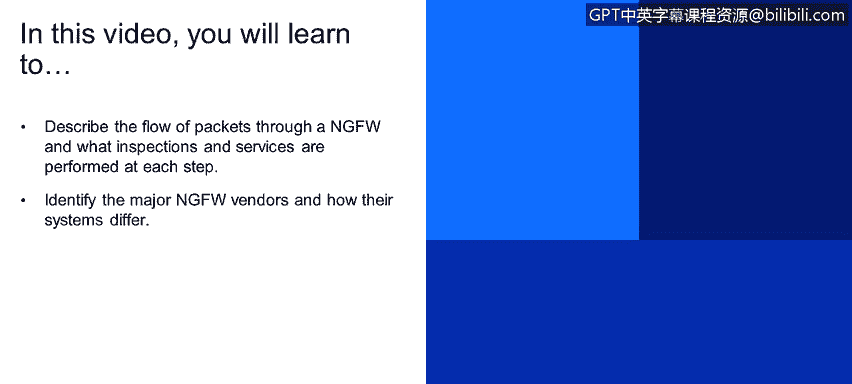
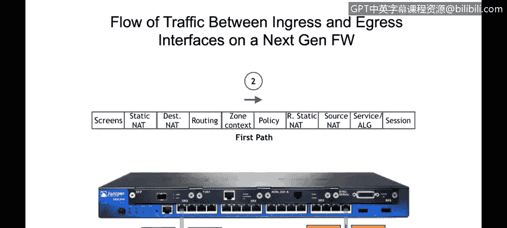
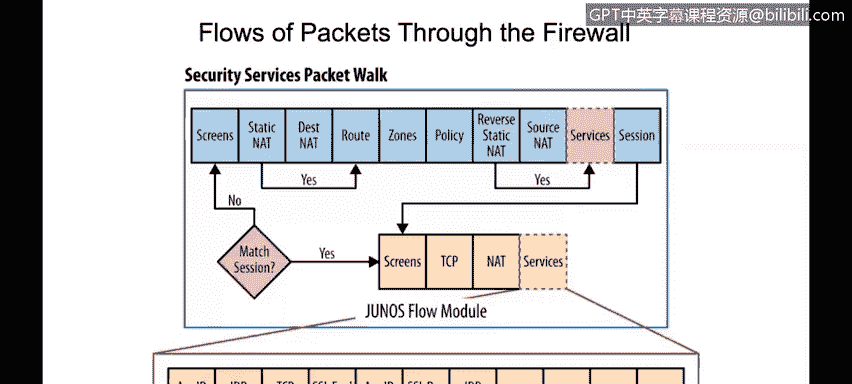
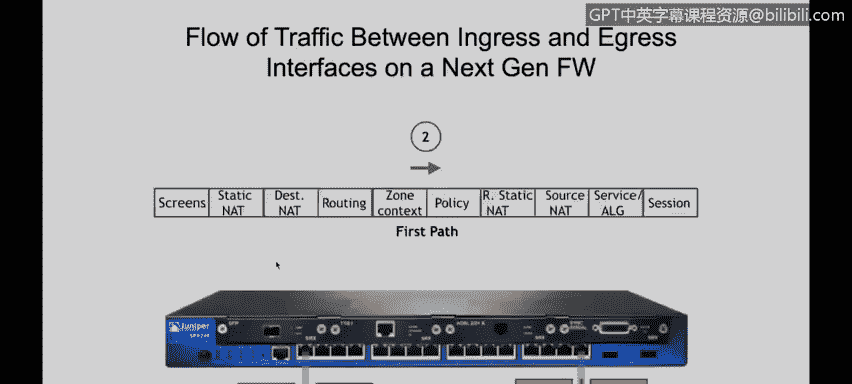
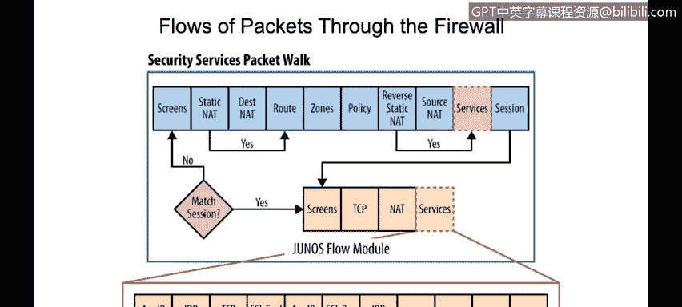
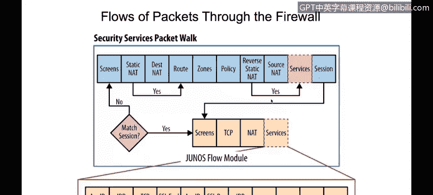
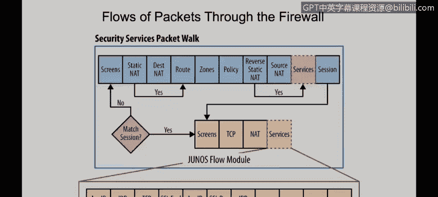
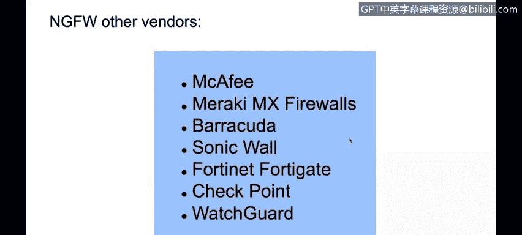
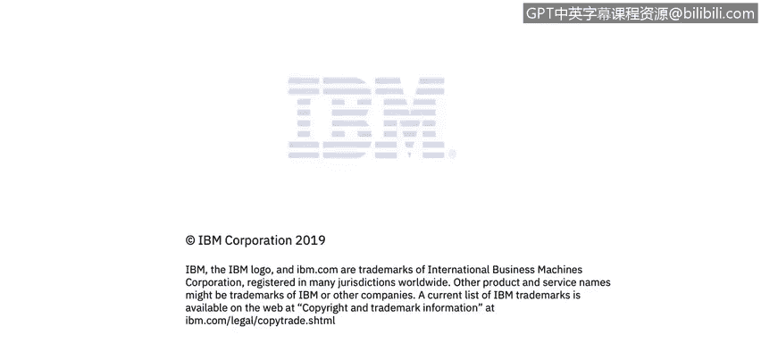

# 课程4：《网络安全与数据库漏洞》：88：下一代防火墙数据包流示例与厂商比较

在本视频中，你将学习描述数据包通过下一代防火墙的流程，以及每个步骤中执行了哪些检查和服务。

你将识别主要的下一代防火墙厂商，并了解他们的系统有何不同。

这只是一个示例，用于说明下一代防火墙的工作原理。

我们将使用Juniper SRX 240防火墙作为示例。假设我们的流量从接口1进入，出口接口将是接口3。

其基本工作原理是，我们将在接口1接收流量。在接口级别，我们可以配置传统的防火墙规则，这些规则主要检查OSI模型的第3层和第4层。

防火墙随后拥有流D模块，该模块能够提供下一代防火墙功能。

我们将在本课程稍后部分描述这些模块或步骤各自如何工作。

在确定流量是否能够通过防火墙之后，我们将通过出口接口将其发送出去。本节将介绍这一过程。

那么，

假设我们的入口接口是接口1。我们将检查是否已为该流量建立了会话。如果没有会话，我们将使用此处的模块处理数据包。

我们首先要检查的是屏幕保护。这主要是针对最常见攻击（如拒绝服务攻击）的防护。

在屏幕保护部分确定这不是攻击后，我们将使用静态NAT规则或目标NAT规则来更改目标IP地址。如果存在任何需要转换数据包目标IP的NAT规则，我们需要在做出路由决策之前完成此操作，因为我们将使用目标IP地址进行路由决策。

因此，当我们执行目标NAT转换或转换目标IP时（如果有规则要求这样做），我们将检查路由表，并确定出口接口是什么。

一旦完成，我们现在就知道了入口接口（本例中为接口1）和出口接口（本例中为接口3）。在我们的下一代防火墙（特别是这款Juniper设备）上，每个接口都应属于一个安全区域。

假设接口1位于“信任”区域，接口3位于“非信任”区域。

我们现在有了入口和出口区域，这将在检查安全策略时使用。安全策略将包含上下文，例如从“信任”区域到“非信任”区域。

一旦我们确定了入口和出口区域，并知道应该处理流量的策略规则，我们将判断流量是否能够通过防火墙。因为策略将包含匹配条件以及对该数据包要采取的操作。

例如，策略可能规定：如果数据包从“信任”区域到“非信任”区域，源IP为1.1.1.1，目标IP为2.2.2.2，则防火墙允许或阻止该流量。

假设我们的流量被允许并通过防火墙，我们将使用源NAT规则或源NAT规则来转换源IP（如果有规则要求这样做）。但假设我们不转换任何源IP，我们将进行下一代防火墙能够提供的检查。

这些附加服务可能包括应用识别，以识别真实的应用，例如Facebook、Skype或YouTube。我们还将拥有入侵检测防御系统，它基本上会根据签名分析流量，以发现病毒或其他威胁。如果防火墙配置了提供任何这些服务，它们将在此处的服务部分完成。

一旦一切就绪，数据包准备发送，我们将创建一个会话，并将该会话写入会话表。

当来自服务器的返回流量或响应发送回我的电脑时，它从接口3作为我的入口接口进入。

接口1作为我的出口接口。下一代防火墙将能够理解这是现有会话的一部分，因此所有这些处理都不会再次执行，因为它知道这是响应的一部分。

这是下一代防火墙与传统防火墙的主要区别。

如前所述，下一代防火墙与传统防火墙的一些比较在于，下一代防火墙能够检查到应用层，能够提供更多服务，并且在做出阻止决策时能够更加精细。

以下是一些下一代防火墙的示例。我们有思科ASA设备。

我们有Palo Alto Networks，Juniper Networks SRX（即我们之前举例说明的那款）。

我们还有其他厂商，例如McAfee、Meraki、Barracuda、SonicWall、Fortinet、Check Point和WatchGuard。

如果我们想使用开源的下一代防火墙，这里也有一些选择。例如，我们可以配置PF Sense。

我们还有其他一些选择，例如ClearOS和IPCop，后者是一个开源的Linux防火墙。

## 总结

本节课中，我们一起学习了下一代防火墙处理数据包的完整流程，从入口检查、安全策略匹配到应用层服务检测。我们还比较了下一代防火墙与传统防火墙的关键区别，并列举了市场上主流的下一代防火墙厂商及开源选项。理解这些流程和差异，对于设计和实施有效的网络安全策略至关重要。