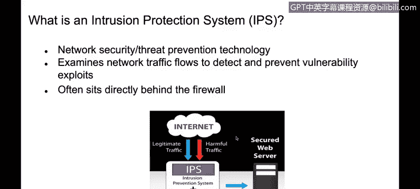

# 课程4：《网络安全与数据库漏洞》：89：30_04：入侵检测与入侵防御系统 🛡️

在本节课中，我们将学习入侵检测系统与入侵防御系统的工作原理，并明确两者之间的核心区别。

---

## 概述

入侵检测系统与入侵防御系统是网络安全架构中的重要组成部分。它们负责监控网络流量，识别潜在威胁，并采取相应措施。本节将详细解析IDS与IPS的功能、类型及部署方式。

---

## 入侵检测系统的工作原理

上一节我们介绍了网络安全服务的基本概念，本节中我们来看看入侵检测系统的具体工作机制。

入侵检测系统是一种能够分析每个数据包内容直至应用层的设备。其核心功能是将网络流量与一个已知威胁特征的签名数据库进行比对，从而识别网络威胁或病毒等恶意活动。IDS的主要任务是**检测**这些威胁，并在发现病毒等异常时向管理员发送警报。

IDS主要分为两种类型：基于签名的检测和基于异常的检测。

以下是两种检测类型的简要说明：

*   **基于签名的检测**：如前所述，该系统通过将数据包内容与一组预定义的威胁签名进行比对来工作。
*   **基于异常的检测**：该系统监控网络流量，并建立一个正常的流量基线。当检测到流量偏离此基线时，它会向管理员发出警报，提示可能存在异常情况，以便进一步检查。

此外，IDS可以根据部署位置分为两类：

*   **基于主机的IDS**：安装在终端主机上。
*   **基于网络的IDS**：部署在网络中，用于分析网络流量。

例如，IBM Real Secure Server Sensor 和 Cisco IDS 4200系列就是基于网络的入侵检测系统实例。

要在网络中部署IDS，需要一个关键条件：交换机上的**镜像端口**。该端口用于将流经交换机的所有流量副本发送到IDS设备。例如，可以配置交换机，将所有流经接口的流量复制一份并发送到连接了基于网络的IDS系统的第二个端口。

**混合IDS部署**是指同时结合使用基于主机的入侵检测系统和基于网络的入侵检测系统。

---

## 入侵防御系统与核心区别

了解了入侵检测系统后，我们来看看功能更进一步的入侵防御系统。

入侵防御系统不仅能够检测网络威胁，还能够**阻止**恶意流量进入网络。IPS是一个**内联设备**，这意味着所有流量都必须经过它。与仅负责检测和报警的IDS不同，IPS能够主动做出决定，允许或拒绝流量通过网络。这是IPS与IDS最主要的区别。

IPS使用与IDS相同的检测技术，即基于签名和基于异常的检测。

以下是IPS的两种工作方式：

*   **基于签名的检测**：IPS检查所有数据包的内容，并与预定义的签名数据库进行匹配。如果内容匹配到数据库中的某个威胁条目，IPS将**阻止**该流量，不允许其通过防火墙或IPS本身。
*   **基于统计异常的检测**：与IDS类似，IPS可以建立正常的网络流量基线。当IPS判定流量偏离此基线时，它不仅会检测并报告此异常，还可以**阻断**偏离基线的流量。

具备这种深度检测和主动防御能力的设备，通常被称为**下一代防火墙**或**入侵防御系统**。

---

## 总结

本节课中我们一起学习了入侵检测系统与入侵防御系统。IDS的核心功能是监控和报警，而IPS则在检测的基础上增加了主动阻断威胁的能力。理解两者的区别对于构建有效的纵深防御体系至关重要。

感谢您的学习。