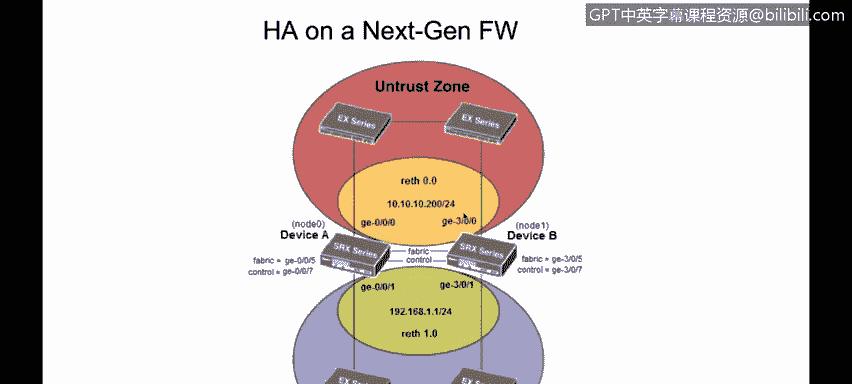

# 课程4：《网络安全与数据库漏洞》：90：31_01_高可用性与集群技术 🔄

在本节课中，我们将学习信息技术中“高可用性”的概念，以及如何通过集群技术来实现它。我们将探讨冗余、监控和故障转移在构建高可用性系统中的重要性，并介绍网卡绑定技术及其在下一代防火墙中的应用。

---

## 高可用性与集群概述

信息安全的基石在于确保信息的机密性、完整性和可用性。其中，可用性意味着当我们需要访问信息时，它必须随时可访问和使用。这正是高可用性与集群技术出现的原因。

高可用性是指一个系统或组件能够持续运行，达到100%的在线时间。例如，下一代防火墙或路由器处理流量时，我们可以部署两台设备协同工作。通常，一台作为主用设备，另一台作为备用设备。当主用设备发生故障时，备用设备将接管其工作，确保网络流量继续被处理或安全策略继续被执行。这保证了我们的数据和网络服务始终在线。

---

## 实现高可用性集群的要求

要创建一个集群，需要满足以下技术要求：

*   **共享存储**：集群中的所有主机或虚拟服务器必须能够访问相同的共享存储。
*   **一致的网络配置**：所有设备必须具有相同的网络配置，例如DNS设置。配置不一致将无法启用高可用性设置。
*   **相同的操作系统版本**：在某些技术中，如机箱集群，所有设备必须运行相同版本的操作系统。
*   **相同的硬件与软件级别**：对于下一代防火墙等设备，通常要求硬件和软件版本完全一致。
*   **节点间连接**：必须在主节点和备用节点之间建立专用的连接。

---

## 高可用性系统的三大特征

要构建一个真正的高可用性系统，必须具备以下三个关键特征：

*   **冗余**：这意味着拥有多个能够执行相同功能的组件。例如，一台主用设备和一台备用设备。这消除了单点故障。
*   **监控**：备用设备需要持续监控主用设备的状态。它必须能够检测到主用设备是否停止工作。
*   **故障转移**：当监控系统检测到主用设备故障时，会自动触发故障转移过程，使备用设备接管主用角色，继续提供服务。

---

## 网卡绑定技术

网卡绑定是一种网络技术，它允许将多个物理网络接口卡组合起来，作为一个逻辑接口协同工作。这样做的主要目的是消除网络连接的单点故障风险。

通过网卡绑定，可以同时使用两个或多个网卡。如果其中一个网卡出现故障或断开连接，另一个网卡可以继续工作，确保网络连通性不受影响。

---

## 下一代防火墙上的高可用性部署示例

接下来，我们通过一个下一代防火墙的机箱集群配置示例，来看看高可用性是如何具体实现的。

下图展示了一个典型的SRX设备高可用性部署。其中包含一台主用设备和一台备用设备，它们之间通过两种特殊链路连接：

*   **控制链路**：用于同步配置数据和重要的会话状态信息。例如，当主用设备允许流量通过并创建了一个会话时，这个会话信息会通过控制链路同步到备用设备。这样，当备用设备需要接管时，它已经拥有了相同的会话表。
*   **数据链路**：在“主用-主用”部署模式中，用于在设备间转发流量。

在接口配置层面，高可用性通过“冗余以太网接口”来实现。例如，主设备上的接口 `ge-0/0/1` 和备用设备上的接口 `ge-3/0/1` 可以被绑定成一个虚拟的 `reth0` 接口。这个 `reth` 接口会被分配到一个“冗余组”中。

以下是其工作流程：
1.  假设 `reth0` 属于冗余组1，并初始运行在主设备的 `ge-0/0/1` 上。
2.  如果主设备的 `ge-0/0/1` 接口发生故障，冗余组1会触发故障转移。
3.  随后，`reth0` 接口的功能将由备用设备上的 `ge-3/0/1` 接口接管，继续转发流量。

这正体现了之前提到的监控机制：备用设备持续监控主设备接口的状态，并在需要时接管其角色。其他区域（Zone）的接口也遵循相同的原理，配置不同的 `reth` 接口并分配到相应的冗余组中。

---

## 课程总结

本节课中，我们一起学习了高可用性的核心概念及其在保障系统持续运行中的关键作用。我们了解到，通过部署具有冗余、监控和故障转移能力的集群，可以极大提升信息系统的可用性。我们还探讨了网卡绑定技术如何消除网络层面的单点故障，并通过一个下一代防火墙的配置示例，具体了解了高可用性在实际环境中是如何部署和工作的。掌握这些知识，对于设计和维护稳健、可靠的网络与安全架构至关重要。