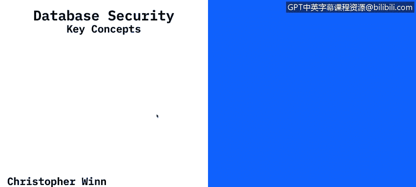
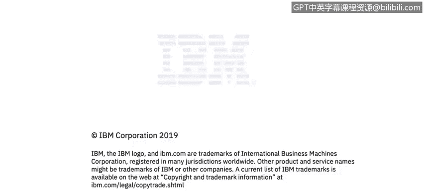

# 课程4：《网络安全与数据库漏洞》：第33章：数据源类型（第一部分）🔍

## 概述
在本节课程中，我们将学习不同类型的数据源。我们将介绍分布式数据库、数据仓库、大数据平台以及文件共享等概念，并了解它们在组织中的角色和相关的安全考量。

---

## 数据源类型简介
每个组织，无论是公共还是私营实体，都拥有多种不同类型的数据源。

以下是组织常见的数据源类型：
*   **分布式数据库**：例如 Microsoft SQL Server、Oracle、MySQL、SQLite、PostgreSQL。这可能是世界上最常见的数据库类型。
*   **数据仓库**：例如 Amazon Redshift、Hadoop Hive、Netezza 或 Exadata。这些都是为特定目的构建的环境。
*   **大数据/NoSQL数据库**：例如 Google BigTable、Hadoop 或 MongoDB。
*   **文件共享**：涵盖从 Amazon S3、Google Drive、Dropbox、Box.com 到您笔记本电脑上的下载文件夹等一切。文件共享本质上就是一个目录。

所有组织的一个共同点是，它们都在以多种组合方式大量使用数据。它们可能使用全部或仅使用其中几种数据源。

---

## 组织基础设施与数据存储
组织通常拥有许多不同的办公地点。无论是一家零售店、银行、医院，甚至是一栋公共建筑，像亚马逊、IBM、谷歌这样的公司都在全球设有分支机构。

所有不同实体（公共和私营）的一个共同点是，它们都拥有大量的后端基础设施来支持日常运营。无论是为组织提供电子邮件服务、聊天客户端，还是管理组织内正在进行的各种项目、项目文件夹、团队协作方式，所有正在开发的后端系统都是所有组织的共性。

所有这些后端基础设施都存储在**数据中心**中。

---

## 安全观念的演变
在21世纪初，人们主要将安全视为**边界防御**。边界防御主要指防火墙和VPN，旨在阻止任何人进入组织内部。

然而，一次又一次的事实证明，仅靠边界防御已经不够了，甚至在当今时代也是如此。因为攻击者进入组织的方式多种多样，他们不仅试图穿透您的防火墙或VPN，还可能利用员工的凭证、通过有数据中心访问权限的业务伙伴或其他实体进入。

所有这些进入数据中心的不同方式都是潜在的**威胁向量**，即进入您组织的途径。这本质上就像一个拥有许多窗户和门的保险库，每一处都需要某种安全控制措施。

这就是为什么在过去十年中，数据安全受到了如此多的关注。您反复听到的众多数据泄露事件，都是因为有人破坏了组织的数据安全控制措施，或者仅仅是因为缺乏控制措施而直接访问了数据。

---

## 总结
本节课我们一起学习了各种数据源类型，包括分布式数据库、数据仓库、大数据平台和文件共享。我们了解了这些数据源如何构成组织后端基础设施的核心，并存储在数据中心。更重要的是，我们探讨了安全观念从单纯的边界防御向全面数据安全控制的演变，认识到保护每一个数据访问点（威胁向量）的重要性。理解这些数据源的类型和存储环境，是评估和保护它们免受威胁的第一步。