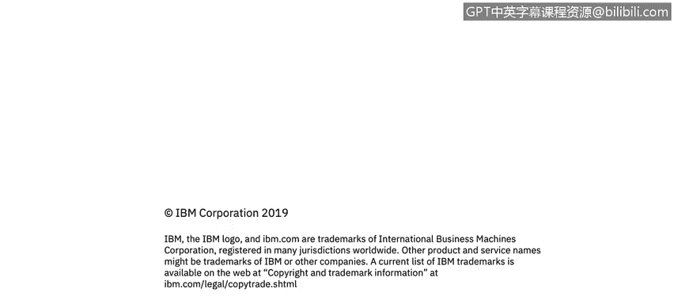

# 课程4：《网络安全与数据库漏洞》： 第34章：数据源类型（第二部分）🔍

在本节课程中，我们将学习识别一个典型组织中存在的多种数据源，并了解每种数据源通常包含的数据类型。

---

上一节我们介绍了数据源的基本概念，本节中我们来看看一个典型组织中可能存在的具体数据源类型。以下是一个示例列表，它并非详尽无遗，但涵盖了与组织数据相关的多种途径和访问方式。

一个组织的数据环境通常非常复杂。它不仅仅是一个供数据库管理员（DBA）连接的单一数据库，而是包含了许多连接到后端数据库的应用程序。例如，人力资源系统用于员工入职和离职管理，SAP等系统处理客户订单和全球物流配送，以确保准时交付。所有这些业务流程的数据都存储在数据库中，供全体员工日常登录和使用。

数据仓库通常用于处理和分析海量数据。它们常常包含极其庞大的数据集，例如Hadoop Hive、Amazon Redshift，甚至是像Oracle Exadata这样专为高效、快速进行数据计算而设计的专用硬件系统。你可以将Exadata理解为专门用于“数字运算”的工具。

大数据环境在组织中也很常见，它通常涉及海量的数据。很多时候，组织可能并不完全清楚这些数据的具体内容或未来用途。例如，一些已停用的遗留数据库中的数据可能被归档存储。组织可能会决定将这些数据存入大数据平台，以期在未来通过分析和挖掘，获得关于客户、产品、业务流程等方面的深入洞察，从而创造价值。

云环境提供了另一种数据托管方式，与本地部署（on-prem）的数据中心形成对比。本地部署意味着组织拥有并完全控制自己的数据中心。

数据库工具是用于与数据库交互的各种软件，通常由DBA使用，但也可能有其他用途。

内容管理器，如SharePoint或Confluence，种类繁多。企业内容管理器甚至可以是一个项目管理工具，比如Basecamp。

文件存储可能是大家最熟悉的数据源。即使是你的“下载”文件夹，也是一个文件共享目录。Linux、Unix、Windows系统中的各种文件，以及通过FTP连接访问的文件，都属于文件共享的范畴，这些数据通常是非结构化的。

---

以下是不同类型数据源的具体例子：

*   **分布式数据库示例**：Oracle RAC、Microsoft SQL Server、MySQL、PostgreSQL等。
*   **大数据数据库示例**：Hadoop、MongoDB、HBase等。
*   **数据仓库示例**：Teradata、Exadata、Amazon Redshift、Apache Hive等。
*   **文件共享示例**：网络附加存储（NAS）、网络文件共享（如EMC或NetApp）、以及云存储服务（如Google Drive、Dropbox、Box.com和Amazon S3）。

---

现在，我们来思考一下这些数据源的类型。分布式数据库和数据仓库通常被视为**结构化数据**。大数据数据库的例子则通常是**半结构化数据**，这主要是因为大数据平台常常汇集了多种不同结构的原始数据，而这些数据在整合时可能缺乏一个统一的、全局性的视图。文件共享的例子则纯粹是**非结构化数据**。试想你的“下载”文件夹：你下载每个文件都有具体原因（如工作项目或家庭视频），但这些文件本身并没有统一的组织格式或结构。

---

本节课中，我们一起学习了典型组织中的多种数据源及其常见数据类型。我们了解到，数据不仅存在于核心数据库中，还遍布于应用程序、数据仓库、大数据平台、文件系统及云环境中。理解这些数据源的分类（结构化、半结构化、非结构化）是后续进行有效安全分析和漏洞评估的重要基础。