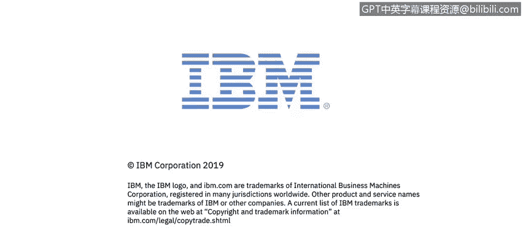

# 课程4：《网络安全与数据库漏洞》：94：35_04_数据模型类型

在本视频中，你将学习如何描述**结构化数据**、**半结构化数据**和**非结构化数据**。

## 📊 概述

本节课我们将探讨三种主要的数据类型：结构化数据、半结构化数据和非结构化数据。理解这些数据类型的区别对于有效管理和保护数据至关重要。我们将从最易于组织和查询的结构化数据开始，逐步过渡到最灵活但也最复杂的非结构化数据。

## 🗂️ 结构化数据

结构化数据是指已被组织成特定格式或存储库（通常是数据库）的数据。它具有可寻址的元素，以便进行更有效的处理和分析。

简单来说，结构化数据是一种数据存储库，它拥有组织所有不同数据的方法。这意味着我不仅可以定位到特定的数据片段，还可以根据数据结构和存储库轻松地进行搜索。即使我之前从未见过这些数据，也能理解其数据结构和数据模型，并立即找到所需的任何数据。

结构化数据通常拥有数据库查询语言，例如 **SQL（结构化查询语言）**。这允许数据库管理员或连接到数据库的应用程序与数据库进行交互。

需要指出的是，结构化数据与非结构化和半结构化数据形成对比。这三者可以被视为存在于一个连续体上，其中非结构化数据格式最弱，而结构化数据格式最强。

另一种说法是，它们存在于一个连续体上。结构化数据最易于理解、组织性最强；而非结构化数据则组织性最弱，最难理解和查找所需内容。

以下是结构化数据的关键特征：
*   数据被组织在预定义的模式或模型中（如关系数据库表）。
*   使用如 **SQL** 等查询语言可以高效地访问和操作数据。
*   数据元素之间的关系清晰明确。

## 🔄 半结构化数据

半结构化数据介于结构化数据和非结构化数据之间。它与非结构化数据的区别在于，非结构化数据尚未被组织成便于访问和处理的格式。

半结构化数据是尚未被组织到专门存储库（如数据库）中的数据，但它仍然附有相关信息（如元数据），使其比原始数据更易于处理。

本质上，半结构化数据是非结构化数据的对立面。它经过了重新格式化，其元素被组织成一种数据结构，使得元素可以被寻址、组织和访问，以各种组合方式更好地利用信息。

然而，结构化数据也可能转变为非结构化数据。例如，如果我将来自多个不同数据库的结构化数据扔到一个新位置，而没有花时间将其重新格式化并组织成一种我能理解的数据结构（例如理解不同数据库的用途以及客户、产品等不同共性），那么理解数据库中的数据、寻找共性并真正理解数据就会变得困难得多。

上一节我们介绍了结构化数据及其向半结构化甚至非结构化转化的可能性，接下来我们看看连续体的另一端。

## 📄 非结构化数据

非结构化数据是指以多种不同形式存在、不遵循传统数据模型的信息，因此通常不适合主流的**关系型数据库**。

最常见的非结构化数据类型之一就是纯文本。非结构化文本以多种形式生成和收集，包括 Word 文档、电子邮件、短信、PowerPoint 文件、调查回复、文字记录、呼叫中心交互记录、博客帖子、社交媒体网站帖子等。

其他类型的非结构化数据包括图像、音频和视频文件。尽管所有这些不同类型的数据差异很大，但它们都被归类为非结构化数据。

以下是非结构化数据的常见形式：
*   **文本文件**：如 `.docx`, `.txt`, `.pdf`。
*   **多媒体文件**：如 `.jpg`, `.mp3`, `.mp4`。
*   **通信记录**：电子邮件、聊天日志。
*   **社交媒体内容**：帖子、评论。

## 🎯 总结

本节课我们一起学习了三种核心数据类型。**结构化数据**组织严密，易于用 **SQL** 等工具查询；**半结构化数据**（如带有元数据的文件）有一定组织性但灵活性更高；而**非结构化数据**（如文本、图像、视频）缺乏固定模式，处理起来更复杂。理解这些类型有助于我们选择正确的工具和方法来存储、分析和保护数据，这是网络安全和数据库管理中的重要基础。