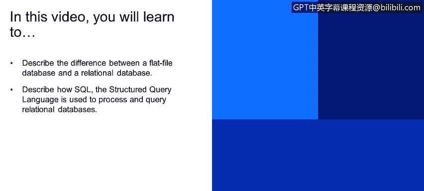
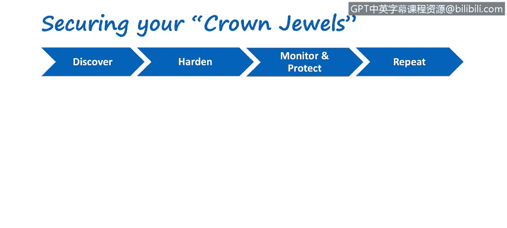

# 网络安全与数据库漏洞：95：结构化数据与SQL基础


在本节课程中，我们将学习结构化数据的基本概念，包括平面文件数据库与关系型数据库的区别，并了解结构化查询语言（SQL）如何用于处理和查询关系型数据库中的数据。



---

## 平面文件数据库 📄

平面文件数据库将所有记录的信息存储在一个单一的表格中。这个表格由行和列组成，类似于常见的电子表格。例如，一个学生信息表可能包含学生ID、名、姓和电话号码等列。

然而，平面文件数据库的一个主要缺点是存在大量数据冗余。例如，如果多位学生选修同一门课程，那么课程名称和讲师信息会在每一行学生记录中重复出现。这不仅增加了存储需求，也使得数据更新和维护变得繁琐。

---

## 关系型数据库 🔗

上一节我们看到了平面文件数据库的局限性，本节中我们来看看关系型数据库如何解决这个问题。

关系型数据库通过将大量信息分割到多个相互关联的表中来组织数据。每个表应专注于一个主题，例如学生信息、课程信息或讲师信息。

这种设计的核心优势在于减少数据冗余。例如，学生表只存储学生信息，课程表只存储课程信息，两者通过一个共享的“键”（如课程ID）进行关联，从而避免了信息的重复存储。

设计关系型数据库是一门艺术，需要在表的数量（过多会导致查询复杂）和数据冗余度之间找到平衡。

---

## 表、键与关联 🔑

在关系型数据库中，表之间通过“键”来建立联系。

以下是关于键的核心概念：
*   **主键**：表中唯一标识每条记录的列。例如，学生表中的“学生ID”。
*   **外键**：一个表中的列，它引用了另一个表的主键。例如，在选课表中，“学生ID”和“课程ID”都是外键，它们分别指向学生表和课程表的主键。

这种关联的价值在信息查询时尤为明显。例如，要查询“讲师Charles Hill教授的所有学生”，数据库系统可以通过讲师ID找到相关课程，再通过课程ID找到选修这些课程的学生ID，最后从学生表中提取出学生的详细信息。整个过程通过键的关联高效完成。

---

## 结构化查询语言（SQL）💬

前面我们了解了关系型数据库的结构，现在来看看如何与它对话——这就是SQL的用武之地。

SQL是一种专门用于管理和操作关系型数据库的领域特定语言。它特别擅长处理具有实体间关系的结构化数据。

SQL通过编写查询语句来检索、更新或管理数据。一个查询语句通常包含要选择的数据、数据来源以及筛选条件。

以下是一个SQL查询示例，用于从“电影”表中筛选出长度大于120分钟且置换成本高于29.50的电影，并按片名降序排列：

```sql
SELECT title, release_year, length, replacement_cost
FROM film
WHERE length > 120 AND replacement_cost > 29.50
ORDER BY title DESC;
```

在这个例子中：
*   `SELECT` 指定要检索的列。
*   `FROM` 指定数据来源的表。
*   `WHERE` 定义了筛选数据的条件（业务逻辑）。
*   `ORDER BY` 指定结果的排序方式。

这就是SQL如何将业务需求转化为数据库操作，并为企业提供有价值信息的方式。

---

## 数据安全控制 🛡️

无论是平面文件还是关系型数据库，所有类型的数据源都需要制定相应的安全控制策略。

安全控制指的是保护数据及其数据源的各种方法。在后续课程中，我们将深入探讨如何为不同的数据存储形式设计和实施这些安全措施。

---



## 总结 📝


本节课中我们一起学习了结构化数据的基础知识。我们比较了平面文件数据库和关系型数据库的优缺点，理解了关系型数据库通过多表和键关联来减少冗余的原理。我们还初步认识了SQL语言，看到了它如何通过简洁的语句查询和管理关系型数据库中的数据。最后，我们明确了为所有数据源建立安全控制策略的重要性。这些概念是理解后续数据库漏洞与安全内容的基础。