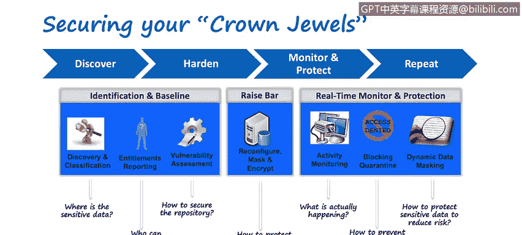
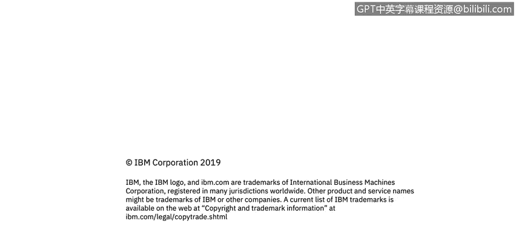

# 课程4：《网络安全与数据库漏洞》：96：37_01_数据安全之旅

在本节课程中，我们将学习数据安全之旅的四个核心阶段：**发现、加固、监控和保护**，并了解每个阶段包含的典型活动。这是一个持续循环的过程，旨在帮助组织有效保护其关键数据资产。

---

### **数据安全之旅：一个持续循环的过程**

上一节我们介绍了数据安全的重要性，本节中我们来看看如何系统性地实施数据安全。IBM观察到全球客户反复经历一个数据安全旅程。这个过程由四个关键步骤组成：**发现、加固、监控、保护**，并且需要**不断重复**。

实际上，信息技术环境始终处于变化之中。新的数据库版本、新的操作系统、新的漏洞、新部署或淘汰的应用程序层出不穷。因此，即使你完成了某个步骤，也必须反复执行，以持续了解组织数据资产的动态变化，而不仅仅是某个时间点的静态快照。

我个人倾向于将这个旅程分为三个主要阶段：
1.  **识别与基线建立**：对应“发现”阶段，旨在摸清家底。
2.  **提升安全基准**：对应“加固”阶段，旨在提高防护水平。
3.  **应用安全控制**：对应“监控”和“保护”阶段，旨在实施持续防护。

接下来，让我们详细探讨每个步骤。

---

### **第一步：发现与分类**

安全的基本原则之一是：**你无法有效保护你不知道其存在的东西**。

发现过程的目标是识别环境中所有的数据源，包括结构化、半结构化和非结构化数据等。分类过程则是在此基础上，深入理解每个数据源中存储的**敏感数据类型**。

以下是发现与分类阶段的核心活动：

*   **数据源发现**：识别组织内所有不同类型的数据存储位置。
*   **数据分类**：分析这些数据源，确定其中包含的敏感数据类型，例如：
    *   社会保障号信息
    *   支付卡行业数据
    *   个人身份信息
    *   受保护的健康信息
    *   受《通用数据保护条例》管辖的数据

不同的数据类型因其合规性要求和法规（如PCI DSS对加密的要求）不同，需要采取不同的安全控制措施。

---

### **第二步：加固**

在完成了全面的发现与分类后，我们就进入了提升安全基准的“加固”阶段。此阶段的核心活动包括访问报告和漏洞评估。

**访问报告**不仅涉及谁有权访问数据，还可以更深入，例如：
*   谁有权访问敏感数据（如PII、PHI、PCI数据）？
*   谁有权访问数据源本身？
*   谁有权重新配置数据源？

一个典型例子是数据库管理员。他可能无权访问系统中的敏感数据（例如其他同事的薪资信息），但他拥有创建具有任意权限的新数据库用户账户的能力。对此，一个经典的控制措施是将账户创建流程与工单系统集成，确保每次操作都有迹可循、经过审批。

**漏洞评估**则是将组织内的操作系统、数据库等数据源与行业最佳实践基准进行比对。许多组织会制定比基准更严格的要求，特别是对于包含核心知识产权或“皇冠上的明珠”类关键数据的系统，它们需要更彻底的测试和更严格的加固标准。

---

### **第三步：监控与保护**

基于“识别”和“基线”阶段收集的信息，组织开始实施具体的控制措施，这就是“监控与保护”阶段。

**加固实施**活动包括：
*   根据漏洞评估结果，重新配置数据源以增强其安全性。
*   实施数据掩码、编辑、加密等技术。
*   部署日志监控、告警系统，并与事件管理团队的工作流程集成。

例如，安全信息与事件管理系统可以检测异常行为：假设某员工正在休假，但其账户突然出现异常活动（如从通常一次访问一条记录变为访问上百条）。系统不仅可以立即**阻止**该账户，还可以将其**隔离**以便调查，因为这触发了多个危险信号。

**活动监控**是此阶段的基石。它意味着捕获所有数据源中发生的一切事件，为组织提供在任何时间点了解“发生了什么”的能力。这相当于建立了一个**单一事实来源**或记录系统。最佳实践是将这些监控日志本身存储在一个经过加固、加密且防篡改的环境中，因为这些安全日志本身也是高度敏感的数据。

---

### **总结**

本节课中，我们一起学习了数据安全之旅的四个循环阶段：**发现、加固、监控、保护**。
*   **发现**阶段关乎认知，即识别和分类所有数据资产。
*   **加固**阶段关乎提升，即通过访问控制和漏洞管理来缩小攻击面。
*   **监控与保护**阶段关乎执行，即通过持续监控、告警和响应控制来防御威胁。

重要的是要记住，这是一个**持续循环、而非一次性**的过程。由于IT环境不断变化，组织必须反复执行这些步骤，才能构建并维持一个有效、动态的数据安全防护体系。