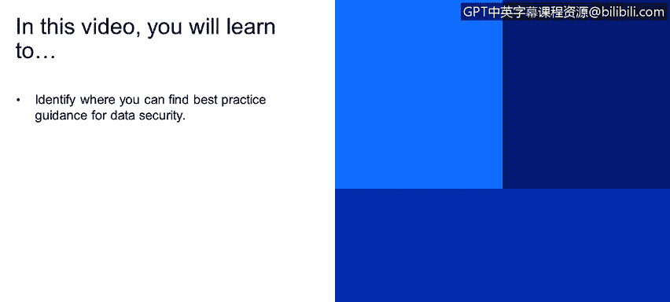
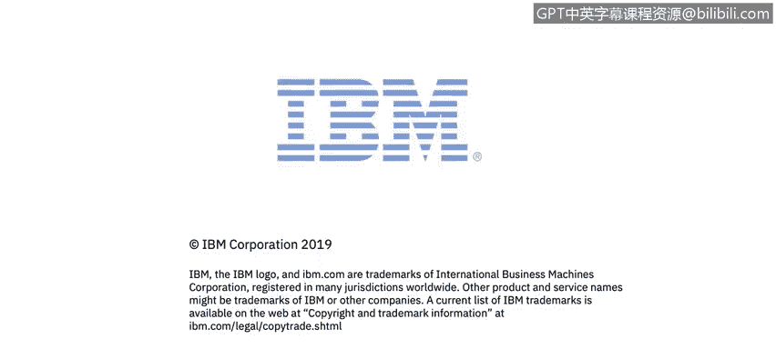

# 课程4：《网络安全与数据库漏洞》：97：38_02 利用安全行业最佳实践

在本视频中，你将学习如何找到数据安全方面的最佳实践指导。

以下是行业中的一些最佳实践来源。

上一节我们介绍了寻找最佳实践指导的重要性，本节中我们来看看具体有哪些权威来源。这些来源提供了关于权限配置、安全补丁等方面的标准建议。

以下是几个关键的安全基准与指南：

*   **CIS基准**：来自互联网安全中心。
*   **CVE**：即通用漏洞披露。
*   **STIGs**：由美国国防部发布的安全技术实施指南。

所有这些指南都涵盖了以下核心安全领域：

*   **权限与配置设置**
*   **安全补丁管理**
*   **密码策略**
*   **操作系统级文件权限**

关于密码策略，这里有一个反面例子：**没有设置账户登录失败尝试次数限制**。这意味着攻击者可以无限次地尝试猜测用户密码，直到成功为止，这显然是一个严重的安全隐患。

这些最佳实践旨在为组织的所有行业应用程序建立一个安全基线。总而言之，上述提到的各个方面，都是数据库和操作系统可能存在的漏洞点。

本节课中，我们一起学习了如何利用CIS基准、CVE和STIGs等行业最佳实践来识别和加固数据库与操作系统的安全配置，特别是通过建立严格的安全策略（如密码策略）来防范常见漏洞。