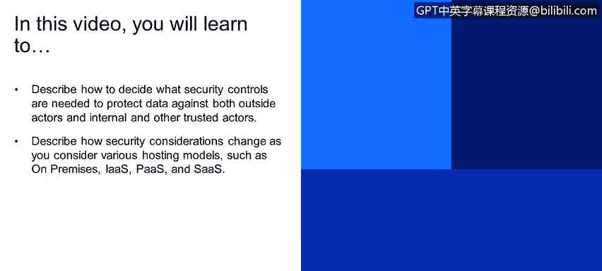
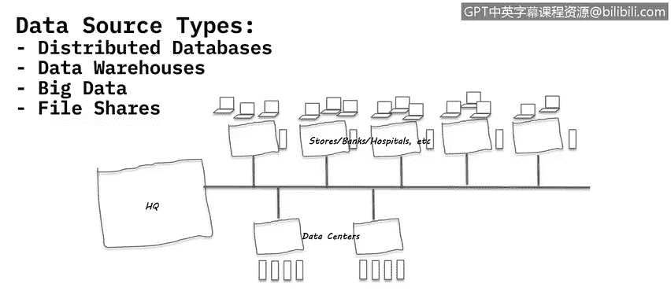
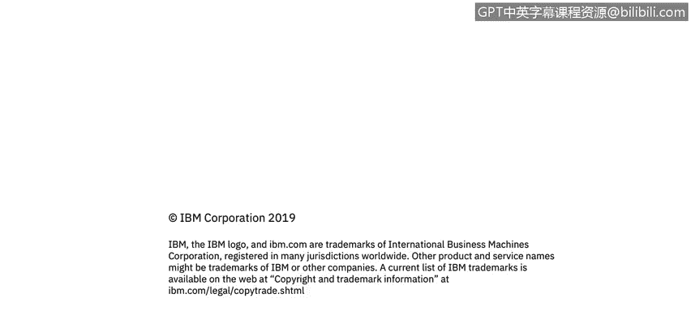

# 课程4：《网络安全与数据库漏洞》：100：41_05_securing-data-sources-by-type

在本节课程中，我们将学习如何根据不同的数据源类型来决定所需的安全控制措施，以保护数据免受外部攻击者以及内部和其他可信参与者的威胁。我们还将探讨安全考量如何随着不同的托管模型（如本地部署、基础设施即服务、平台即服务和软件即服务）而变化。

## 🔐 数据安全控制的核心考量

上一节我们讨论了边界防御和VPN。然而，一个重要考量是，连接到数据源和数据中心的不仅仅是用户和员工。业务合作伙伴和其他与您有业务往来的实体也常常能直接访问数据中心和各种数据源。

因此，为这些数据源设置和需要设置的控制措施，必须根据您的组织如何在环境中利用这些数据源来仔细思考和考量。这就像我之前举的金条和车钥匙的例子：**不同的数据需要不同级别的控制**。

对操作系统和数据库的加固程度也不同。此外，您不仅要考虑监控，还要考虑对数据进行加密或令牌化。保护数据的方法多种多样，例如静态加密、传输中加密等。

## ☁️ 托管模型与安全责任

我们讨论了各种数据中心、数据类型以及运行其上的不同应用程序。接下来，我们需要探讨数据源实际托管在何处。

**本地部署**是大多数人认为的组织数据中心。在这种模式下，您运营数据中心并对其中发生的一切拥有完全控制权。无论是应用程序、数据本身、运行时环境（如Java运行时）、中间件软件，还是其下的操作系统、服务器虚拟化、网络和存储，您都有能力接触和操作所有层面。您可以完全访问、更新、更改和重新配置所有内容。

**基础设施即服务**以及后续的模型被称为云服务，它们以不同方式定义：IaaS、PaaS和SaaS。组织通常会使用由其他组织（如IBM、Google、Amazon等云提供商）拥有、运营和更新的服务器。他们负责维护机器、确保其运行，并确保能访问一定数量的服务器、处理能力和磁盘空间等。

在IaaS模型中，提供商管理底层基础设施，用户则需负责操作系统更新、中间件、运行时、数据和应用程序。用户拥有对操作系统的完全访问和更新权限，但对底层基础设施没有访问权，甚至可能没有可见性。

**平台即服务**模型中，用户只能修改和上传应用程序或数据本身，这通常是托管在云系统上的自定义应用程序。用户无法访问或配置底层操作系统或中间件。

**软件即服务**模型可能更为人熟知，即使您没有意识到它是这样定义的。例如，Gmail就是一种SaaS，因为您无法重新配置Gmail运行所在的数据库或操作系统。Salesforce和Dropbox也是如此。您只是与软件交互，没有任何权限来重新配置应用程序、更新应用程序或更新其运行的操作系统，一切都由提供商处理。

## 🛡️ 不同模型下的安全策略

随着托管模型的变化，安全和数据安全方面也带来了许多额外的考量。

例如，在本地部署模型中，如果需要在服务器上安装代理来监控应用程序活动或用户登录行为（例如，记录Chris、Sam、Sarah登录后执行了哪些操作），可以直接安装。

在IaaS模型中，虽然也可以安装此类代理，但根据具体设置，您可能无法看到底层虚拟化层和运行虚拟化系统的服务器。如果您没有权限在基础设施层安装所需工具，可能就无法监控谁登录了系统以及他们在做什么。

对于PaaS和SaaS模型，情况则加倍复杂。您甚至无法在操作系统上安装任何东西。因此，需要找到其他方法来保护平台即服务及其中的数据，以及软件即服务及其中的数据。

一个例子是**令牌化**。我可以在PaaS环境中实施令牌化，让令牌化后的数据存储在提供商运行的服务器上。即使提供商的员工恶意复制了整个系统，这些令牌化的数据无论被复制到哪里，都仍然是令牌化的。除非他们拥有我的解令牌化或解密手段，否则这些信息对他们来说毫无意义，只是一堆乱码。或者，您可以使用格式保留令牌化，这样数据虽然看起来像“John Smith”，但仍可用于测试，但对寻找真实敏感数据的人来说仍然无用。

对于SaaS，同样需要采用不同的方法。如果SaaS通过API连接到您的系统，您可以考虑使用令牌化等技术。总之，对于每种托管模型，都需要有不同的方法和考量，这纯粹是因为它们的性质不同，以及组织无法访问底层系统。

## 📝 总结

本节课中，我们一起学习了如何根据数据源类型决定安全控制措施。我们探讨了数据安全的核心考量，并详细分析了四种主要的托管模型：本地部署、基础设施即服务、平台即服务和软件即服务。每种模型的安全责任和可实施的控制策略各不相同，理解这些差异对于制定有效的整体数据安全策略至关重要。关键在于认识到，**没有一种通用的安全方案，必须根据数据的价值、访问方式以及基础设施的控制级别来量身定制保护措施**。