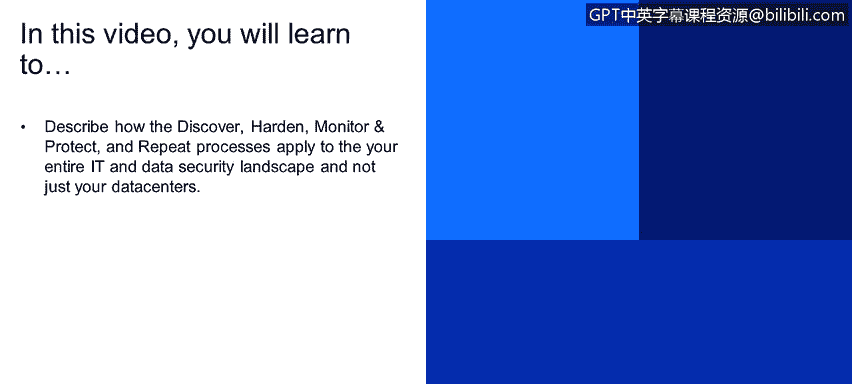
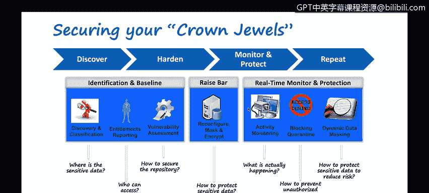
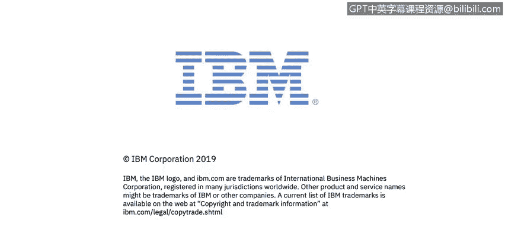

# 课程4：《网络安全与数据库漏洞》：101：数据库安全总结

在本视频中，你将学习如何描述在整个IT和数据安全环境中应用**发现、加固、监控、保护**以及**重复**这些流程的方法，而不仅仅是针对数据中心。

正如我们之前讨论的，这个流程包括发现、加固、监控、保护以及重复执行。这一点对于你的整个IT环境尤为重要。

我使用“IT环境”而非仅仅是“数据中心”，是因为当今的IT环境通常是混合式的。它可能包含多个云服务提供商、许多不同的软件即服务产品，例如Dropbox、Box等。如果这些系统连接没有高度规范化或未被完全掌握，有时它们被称为“影子IT”。

你的员工和不同的IT组织连接着各种系统。你需要发现并理解所有这些不同的数据源，以及所有敏感数据的位置。

无论数据是在你的数据中心，还是在任何你使用的不同云服务提供商、SaaS供应商或PaaS供应商等处，这一点都适用。权限报告也同样重要。

你需要了解谁有权访问数据，谁有权重新配置数据源并更改数据源的数据模式本身。例如，简单地理解谁有权删除数据库，以及如果有人删除了数据库，要理解他们为何这样做，这就需要与变更管理等流程关联起来。

漏洞评估也是如此。同样，评估范围不应仅限于数据中心，还应包括云服务提供商，以及从基础设施即服务到平台即服务，再到软件即服务的所有层面。显然，针对每个层面都需要考虑并应用不同的控制措施。

---

## 概述

在本节课程中，我们将总结数据库安全的核心流程，并探讨如何将这些流程扩展到整个现代混合IT环境中，以确保全面的数据保护。

## 核心安全流程

上一节我们介绍了数据库安全的基本概念，本节中我们来看看如何系统化地应用安全流程。这个流程可以概括为四个关键步骤的循环：**发现、加固、监控、保护**，并需要**重复**执行。

以下是这四个步骤的详细说明：

1.  **发现**
    识别并清点你整个IT环境中的所有数据源和敏感数据。这包括数据中心、多个云服务提供商以及各类SaaS应用。

2.  **加固**
    根据发现的结果，实施安全配置和最佳实践来强化你的数据库和系统，减少攻击面。

3.  **监控**
    持续观察系统和数据库的活动，检测异常行为、未授权访问或潜在的攻击迹象。

4.  **保护**
    采取主动和被动的安全措施，如访问控制、加密和入侵防御系统，来保护数据免受威胁。

这个过程需要不断重复，以适应新的威胁和变化的环境。

## 扩展到整个IT环境

这个安全流程不仅适用于传统数据中心，更需要应用于整个混合IT环境。

现代企业的IT环境通常是混合的，可能包含私有数据中心、公有云（如AWS, Azure, GCP）以及各种SaaS应用（如Dropbox, Box）。未被IT部门正式管理或知晓的系统连接，常被称为“影子IT”，它们也是安全风险的一部分。

因此，发现阶段必须涵盖所有这些数据存储位置。同样，权限管理（谁可以访问和修改数据）和漏洞评估也必须覆盖从IaaS到PaaS再到SaaS的整个技术栈，并为每一层实施相应的安全控制。

## 总结

本节课中我们一起学习了数据库安全的系统化流程：**发现、加固、监控、保护**及**重复**。我们强调了必须将此流程应用于整个混合IT环境，包括数据中心、云服务和SaaS应用，并要特别关注权限管理和全面的漏洞评估，才能实现有效的全方位数据安全防护。