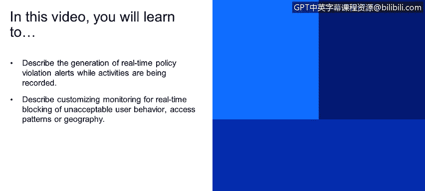
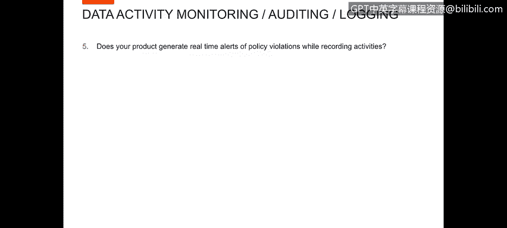
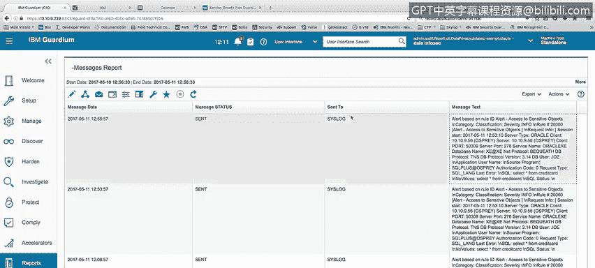
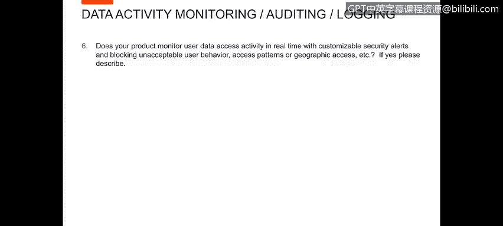
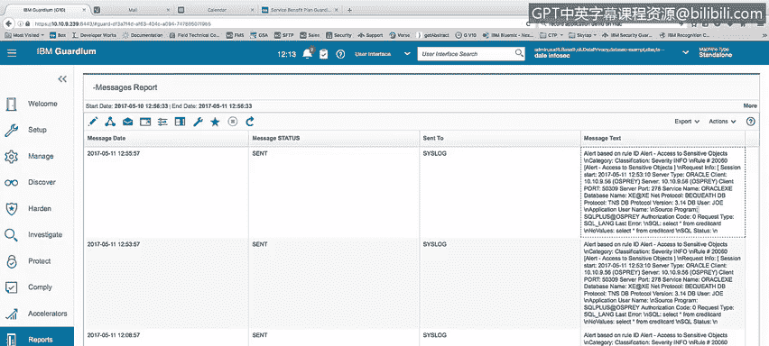
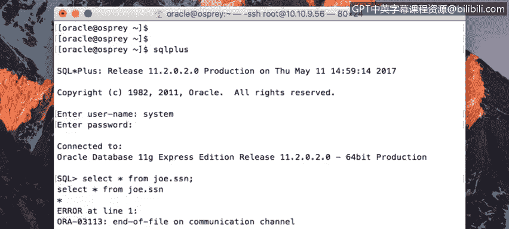
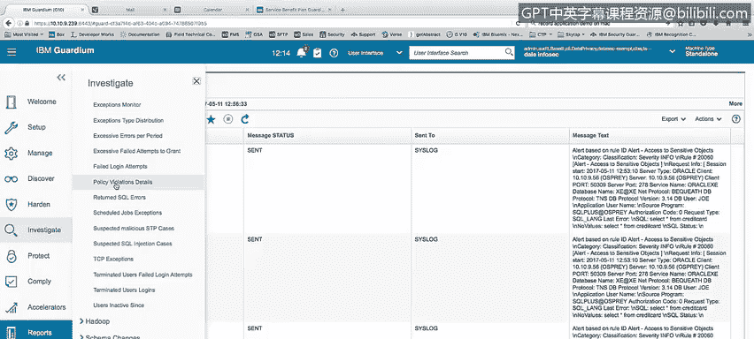
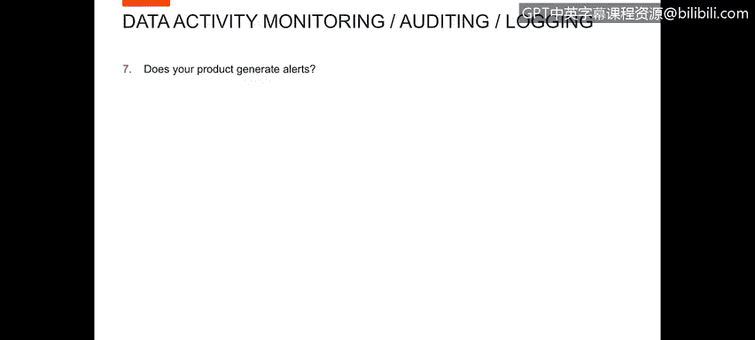
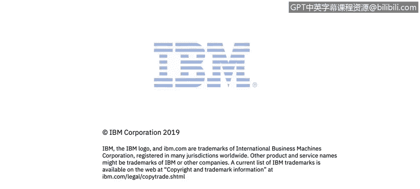

# 课程4：《网络安全与数据库漏洞》：103：44_02_数据警报


在本节课程中，我们将学习如何描述在记录活动时实时生成策略违规警报，以及如何自定义监控以实时阻止不可接受的用户行为、访问模式或地理位置访问。

## 实时策略违规警报生成 🚨



上一节我们介绍了数据库活动监控的基本概念，本节中我们来看看如何在实际操作中生成实时警报。

当用户活动被记录时，系统能够实时检测策略违规并生成警报。为了演示此功能，我们将执行一个查询操作。




现在，让我们探讨一个问题：您的产品是否能在记录活动时生成策略违规的实时警报？

以下是演示步骤：
1.  执行一个敏感数据查询，例如 `SELECT * FROM credit_card;`。
2.  此操作将触发策略警报。

如果进入调查屏幕下的“策略违规详情报告”，可以看到最新的警报。例如，用户“Joe”访问了敏感对象，并执行了 `SELECT * FROM credit_card` 查询，系统基于此信息生成了警报。

此外，可以查看一个自定义报告（例如“我的报告”），该报告显示当该活动发生时，警报消息实际上已发送到系统日志中。这是一个基于“访问敏感对象”的实时警报，内容正是 `SELECT * FROM credit_card`。在报告中，可以找到触发警报的用户“Joe”。这证明了系统确实会生成警报循环。


## 自定义实时监控与行为阻止 🔒

了解了警报生成后，我们进一步探讨产品的实时监控与主动阻止能力。



下一个问题是：您的产品是否能实时监控用户数据访问活动，并可通过自定义安全警报来阻止不可接受的用户行为、访问模式或地理位置访问等？答案是肯定的。

以下将通过演示来具体说明。我们将进入Guardium环境并执行操作。


在Guardium环境中，我们已经展示了警报流程。现在，我将实时以“SYSTEM”用户身份登录，并执行一个会被Guardium阻止的查询，因为我试图查询社会保险号（SSN）数据。




可以看到，我已使用用户“SYSTEM”登录到SQL*Plus。现在，我将执行查询：

```sql
SELECT * FROM joe.ssn;
```



我预期Guardium会阻止对此表的访问。确实，当我运行查询时，收到了一个错误：“在文件通信通道上，用户会话被终止”。如果我尝试在此进行其他活动也会失败，因此唯一的选择是重新连接或退出。


现在，让我回到Guardium，在调查中心的“策略违规详情”中展示结果。我们将看到一条关于“SYSTEM用户访问SSN被终止”的记录。



因此，当我执行 `SELECT * FROM joe.ssn` 时，不仅生成了“访问敏感对象”的警报，还终止了“SYSTEM”用户的会话，并且不允许我查看任何SSN信息。


## 警报格式与报告查看 📊

最后，我们来确认产品是否生成警报，并查看其具体格式。



我们已经在前面几个案例中看到了警报的生成。这里是“策略违规详情报告”。同样，我可以在“消息报告”中展示发送出去的警报格式。


以下就是针对最后一次警报（即执行 `SELECT * FROM joe.ssn` 时）发送出去的警报格式示例。




## 课程总结

在本节课中，我们一起学习了：
1.  **实时警报生成**：数据库安全产品能够在记录用户活动的同时，实时检测并生成策略违规警报。
2.  **自定义监控与阻止**：产品支持对用户行为、访问模式和地理位置等进行实时监控，并可通过自定义策略主动阻止不可接受的访问，例如终止会话。
3.  **警报查看与验证**：生成的警报会记录在策略违规报告中，并可以特定的格式（如发送到系统日志）进行查看和验证，确保了安全事件的可知性与可追溯性。



通过结合实时警报和主动阻止机制，可以构建一个更加强大和主动的数据库安全防御体系。