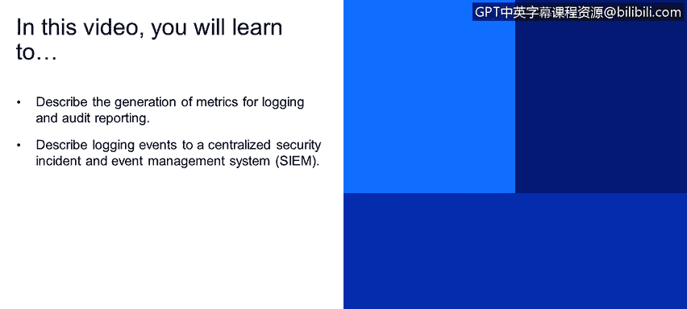
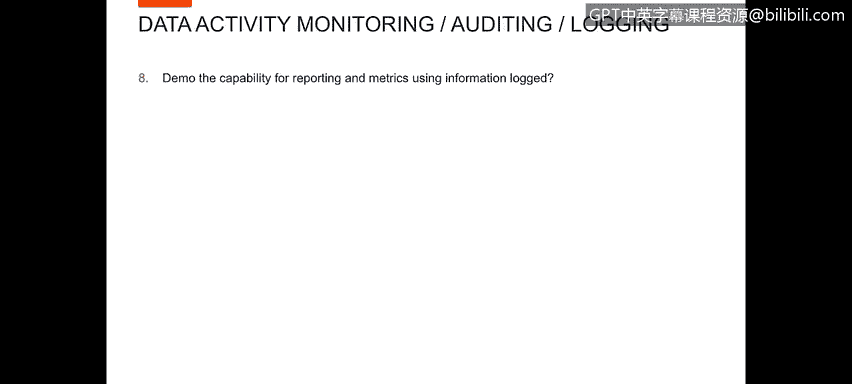
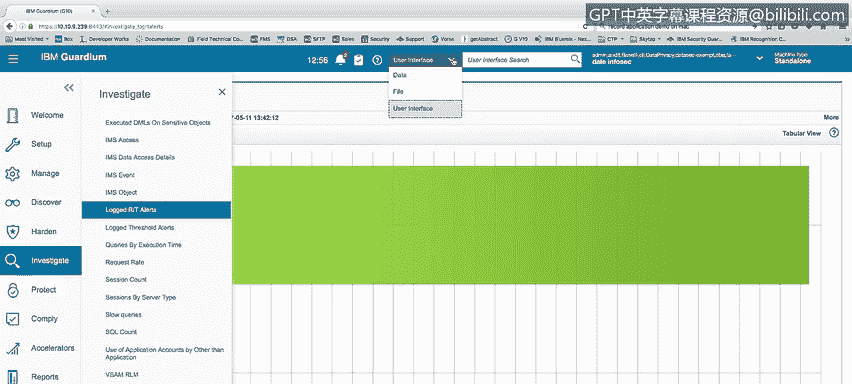
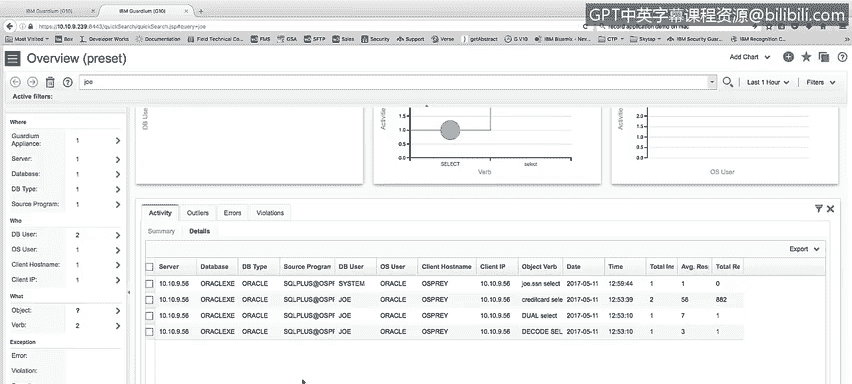
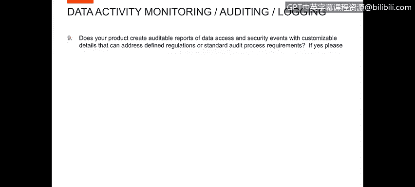
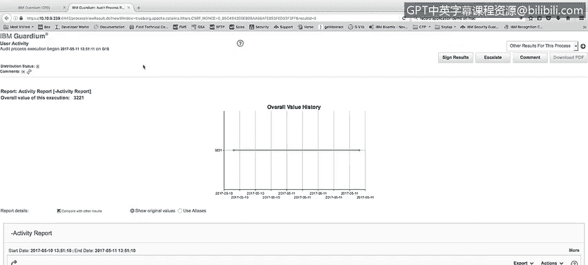
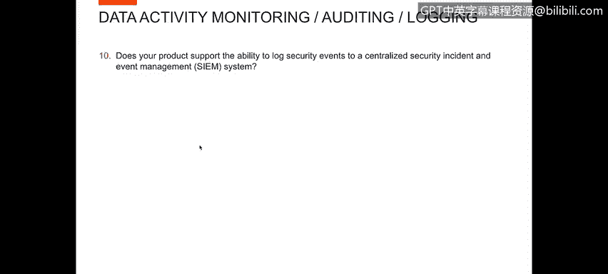
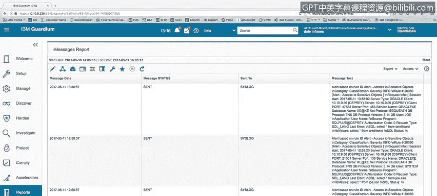
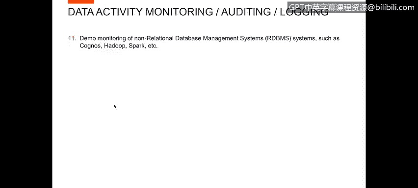
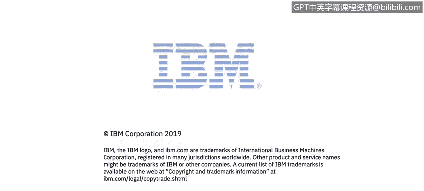

# 课程4：《网络安全与数据库漏洞》：104：数据活动报告与监控

在本节课中，我们将学习如何为日志记录和审计报告生成度量指标，以及如何将日志事件记录到集中式的安全事件管理系统中。

## 报告与度量指标功能演示

上一节我们介绍了报告的基本概念，本节中我们来看看如何使用记录的信息进行报告和度量。

Guardian产品内置了许多标准报告，可通过其调查面板查看。例如，在“数据库活动”下，可以查看诸如访问敏感对象、CL活动、数据库服务器、DV服务器、吞吐量等报告。你可以看到不同时间段内不同服务器的总访问量等度量指标。此外，还可以查看实时警报日志及其图表等。

以下是Guardian产品提供的一些标准报告和搜索能力：
*   **标准报告**：包括访问敏感对象、CL活动、数据库服务器性能、吞吐量等。
*   **搜索功能**：例如，可以在搜索下拉菜单中点击“数据”，搜索特定用户（如“Joe”）的活动。运行快速搜索后，系统会以图表形式展示该用户的活动，例如按数据库和数据库用户划分的活动、每小时活动等，最后还会列出详细的活动清单。

由此可见，Guardian产品提供了多样化的报告和研究能力。

## 可定制的审计报告

现在，我们来看产品是否能生成关于数据访问和安全事件的可审计报告，这些报告需包含可定制的细节，以满足特定法规或标准审计流程的要求。

为了演示此功能，我将展示“审计流程构建器”。这是Guardian报告能力的自动化工具。在审计流程构建器中，你可以定义用户活动和审计任务。例如，我定义了一个需要运行的活动报告。接着，可以确定谁应该查看此任务以及他们需要做什么。我已定义了一个动作，要求Dale和Edmin在此审计任务上签字确认。最后，你可以安排报告按计划自动运行，或者通过“立即运行一次”按钮交互式地执行报告。

运行报告后，我们可以查看结果。在查看结果时，我可以看到报告运行了活动报告，并查看了在一天内生成的所有活动。我可以审阅报告，并对其采取行动。例如，如果我被要求签署该报告，我可以签署结果、升级报告、将其发送给其他人要求他们签署，或者向报告添加评论。这些评论对于任何其他报告查看者都是可见的。

## 与集中式安全事件管理系统的集成

接下来，我们探讨产品是否支持将安全事件记录到集中式的安全事件管理系统中。

答案是肯定的。我们与QRadar双向集成，这是一个优秀的SIEM系统选择，可用于协调与数据库活动相关的信息。此外，我们也可以将信息发送到任何SIEM环境。我们通过将信息以条目形式发送到该SIEM能够读取的远程CIS日志来实现此功能。

为了演示此能力，我将运行一个查询：`SELECT * FROM credit_card;`。这个操作将在系统中生成一个警报。我关注两个远程CIS日志：顶部的是我的Osprey系统上的远程CIS日志，底部屏幕是我的Guardian收集器上的CIS日志。一旦警报生成，你会看到它出现在我的Guardian收集器的CIS日志中（基于规则ID“访问敏感对象”的警报）。同时，相同的警报也被发送到了我的远程CIS日志中，我的SIEM产品（无论是QRadar还是其他SIEM）将能够获取该警报并进行报告。

此外，我们可以进入Guardian系统，查看“消息报告”。由于启用了远程CIS日志记录，所有发送到CIS日志的消息都已发送到我们的SIEM设备。消息文本的格式是可变的，你可以自行设置格式。例如，我们有QRadar接受的标准格式，也有其他SIEM（如Splunk）接受的格式。你可以为它们设置特定格式，也可以构建自定义格式等。因此，这是一个非常灵活的接口，可以将信息发送到任何SIEM系统，解决了向SIEM发送项目的问题。

## 非关系型数据库监控演示

最后，我们来看看对非关系型数据库管理系统的监控演示，例如Cassandra、Hadoop、Spark等。

为了进行此演示，我将展示我们为Hadoop环境提供的各种报告机制。例如，我们有来自BigInsights的MapReduce报告、Hoop异常报告、Hoop完整消息详情报告、HBase报告。我们监控HBase和Hadoop HDFS文件系统报告、Q和Bs Flax异常报告、标准的MapReduce报告（与BigInsights的MapReduce不同）、未经授权的MapReduce作业报告，以及另一个视图“最后报告”。可以看到，我们为Hadoop环境提供了多种不同的报告。

虽然我没有一个可以运行活动来展示实际操作的Hadoop数据库，但你可以看到我们确实有针对Hadoop活动的各种报告。此外，在管理环境下的活动监控中，我想展示在我们的ScapAP控制模块中，我们确实有针对其他非关系型数据库的检查引擎。例如，如果我们有Cassandra数据库，可以展示其活动；CouchDB是另一个NoSQL数据库；MongoDB也是一个NoSQL数据库。我们同样会从所有这些数据库中收集信息。

## 总结

本节课中，我们一起学习了Guardian产品在数据活动报告与监控方面的核心功能。我们了解了如何利用内置报告和搜索功能生成度量指标，如何使用审计流程构建器创建可定制的自动化审计报告以满足合规要求，以及如何将安全事件无缝集成到集中式的SIEM系统中进行统一管理。最后，我们还看到了产品对包括Hadoop生态在内的多种非关系型数据库的监控支持。这些功能共同构成了一个全面的数据库安全活动监控与报告解决方案。