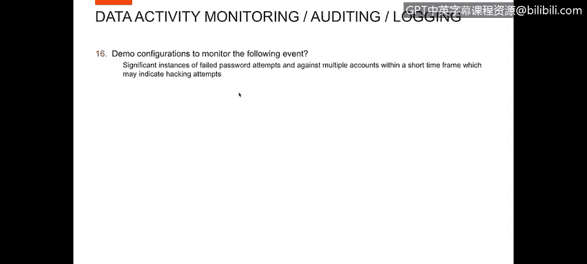
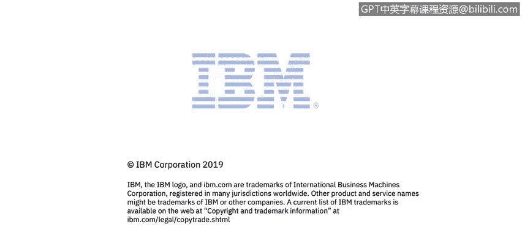

# 课程4：《网络安全与数据库漏洞》：106：47_05_失败访问监控配置教程 🔐

在本节课程中，我们将学习如何配置系统以监控失败的密码尝试和未经授权的访问行为。通过监控这些活动，我们可以及时发现潜在的入侵尝试，从而加强数据库的安全防护。

上一节我们介绍了监控的重要性，本节中我们来看看具体的配置方法。

## 监控失败的密码尝试 🔑

以下是配置监控失败登录尝试的步骤。

*   **创建失败登录报告**：可以创建一个报告，用于显示失败登录的用户、数据库地址、使用的协议以及失败次数。例如，报告可能显示用户“Dale”在短时间内有5次失败登录。
*   **设置警报策略**：在警报策略中，可以编辑规则来监控失败的登录尝试。例如，可以设置一个规则：如果在5分钟内连续发生3次失败登录，则触发警报。
*   **配置警报条件**：警报的异常类型可以设置为“失败登录”。当满足预设条件（如上述的“5分钟内3次失败”）时，系统会自动发送警报，这通常是有人试图入侵系统的迹象。

## 监控未经授权的数据库访问 🚫

接下来，我们演示如何监控对数据库的未经授权访问尝试，这些尝试并非针对特定账户ID。

以下是监控未经授权访问的步骤。

*   **查看未经授权访问报告**：可以查看一个专门报告未经授权访问的报告。例如，报告可能显示用户“Larry”因权限不足（Oracle错误代码1031）而尝试执行某项操作，并且该尝试发生了6次。
*   **分析失败的SQL语句**：还可以创建一个报告，显示所有执行失败的SQL语句。通过将此报告与显示访问失败的报告信息进行关联分析，可以更清楚地了解用户（如“Larry”）具体尝试了哪些操作。

本节课中我们一起学习了如何配置系统来监控失败的登录尝试和未经授权的数据库访问。通过创建特定报告和设置智能警报策略，我们可以有效识别潜在的恶意行为，为数据库安全建立起一道重要的预警防线。