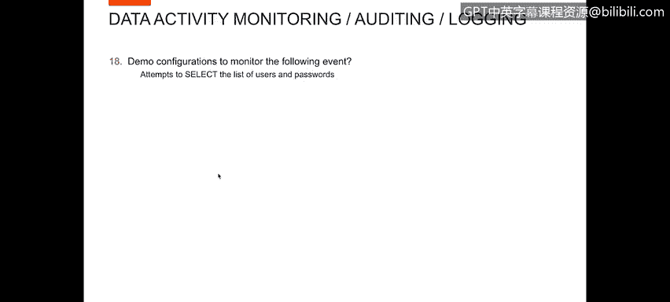
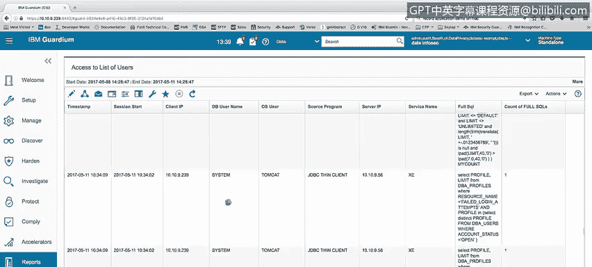
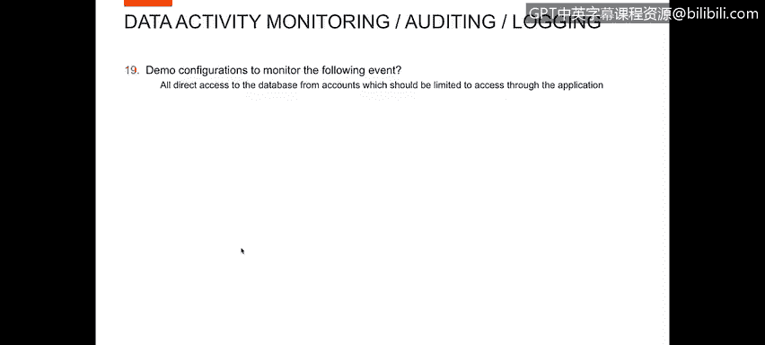
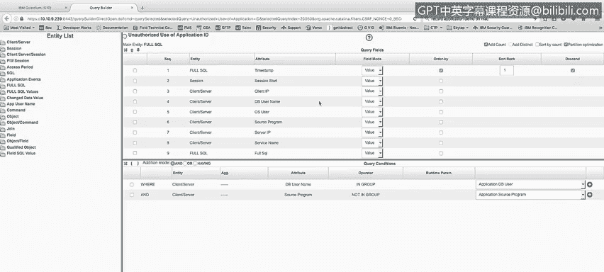
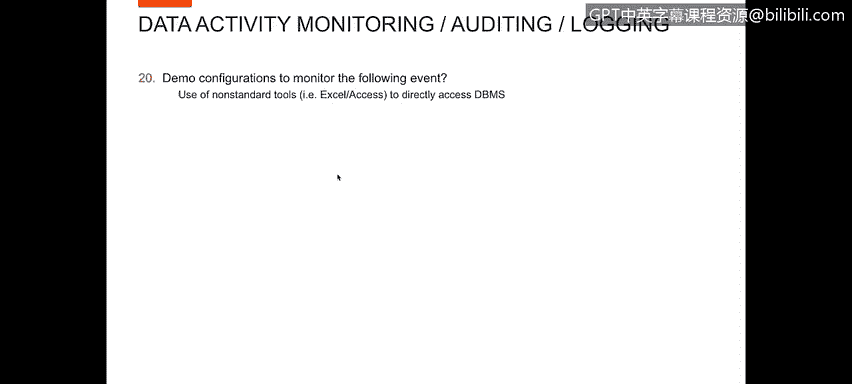
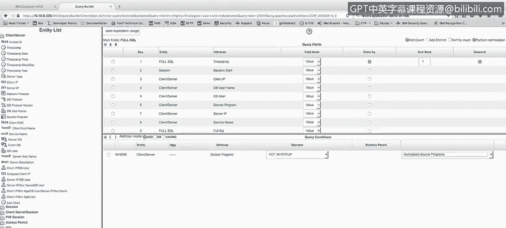
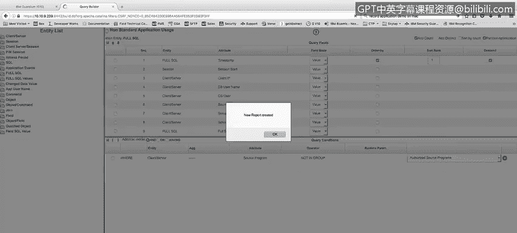
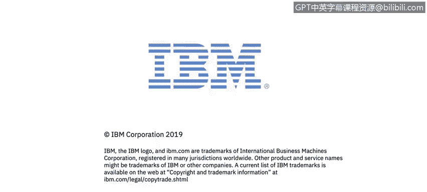

# 课程4：《网络安全与数据库漏洞》：107：可疑访问事件分析（第一部分）


在本节课程中，我们将学习如何配置监控策略，以检测三种可疑的数据库访问行为：尝试获取用户和密码列表、未经授权的直接数据库访问，以及使用非标准工具访问数据库。这些监控措施对于识别潜在的安全威胁至关重要。



## 监控尝试获取用户和密码列表

首先，我们来看如何监控尝试从数据库中获取用户和密码列表的行为。这种行为通常是攻击者进行信息收集的第一步。

为了监控此类行为，我创建了一个报告。该报告会捕获任何从`DBA_USERS`等用户相关表中查询信息的操作。



以下是报告的核心逻辑：



```sql
SELECT * FROM DBA_USERS;
```

报告会显示执行查询的用户（例如 `SYSTEM`）、操作系统用户、访问的服务名以及完整的SQL语句。这样，无论是应用程序还是个人用户，只要尝试查询用户列表，都会在此报告中留下记录。

## 监控未经授权的直接数据库访问

上一节我们介绍了如何监控敏感信息查询。接下来，我们关注如何监控那些本应通过应用程序访问数据库的账户，却进行了直接登录访问的行为。

对于这个演示，我创建了另一个名为“未经授权的应用程序ID使用”的报告。假设我的应用程序专用数据库用户是 `APP_USER`。

报告的逻辑是：每当 `APP_USER` 这个账户运行的源程序，不在已授权的应用程序源程序列表中时，该活动就会出现在报告中。例如，`APP_USER` 直接通过 `SQL*Plus` 登录并执行了创建表等操作。

以下是配置该报告的关键条件：



```
数据库用户名 属于 [应用程序数据库用户组]
且
源程序 不属于 [授权的源程序组]
```

通过这个设置，我可以报告所有来自应用程序账户、但未使用规定应用程序程序的直接数据库访问。



## 监控使用非标准工具访问数据库

最后，我们来学习如何监控使用非标准工具（如Microsoft Excel或Access）直接访问数据库管理系统的行为。

我将演示如何创建这样一个报告。首先，我找到一个包含所需信息列（如用户、源程序、SQL语句）的现有报告作为模板。

然后，我通过“克隆”功能复制这份报告，并将其重命名为“非标准应用程序使用报告”。我不改变报告显示的列，但会修改其筛选条件。

在条件设置中，我关注“客户端/源程序”字段。我设置的条件是：**源程序不属于“授权的源程序组”**。

保存并创建报告后，我将其添加到我的仪表板中。现在，只要有任何未被列入授权列表的源程序访问了数据库，它就会出现在这份报告里，帮助我快速发现异常工具的使用。



## 课程总结



在本节课中，我们一起学习了三种关键数据库安全监控策略的配置方法：
1.  监控尝试获取用户和密码列表的查询行为。
2.  监控应用程序账户未经授权的直接数据库访问。
3.  监控使用非标准工具进行的数据库访问。



通过实施这些监控措施，您可以有效增强数据库的安全态势，并及时发现潜在的可疑活动。