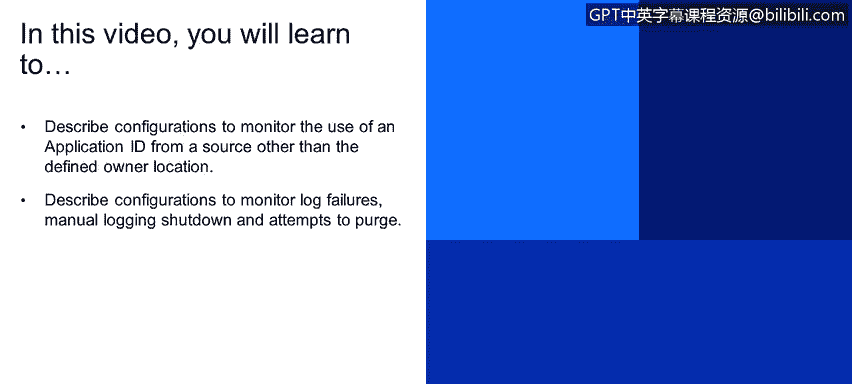
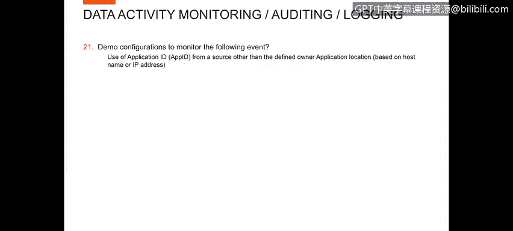
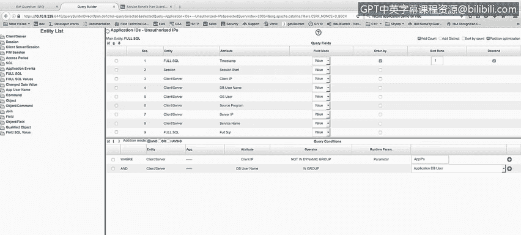
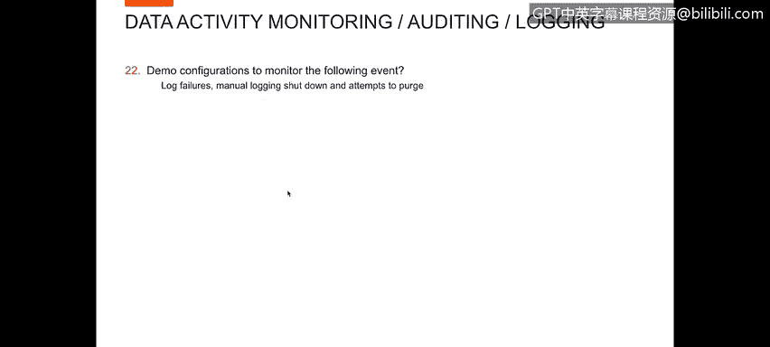
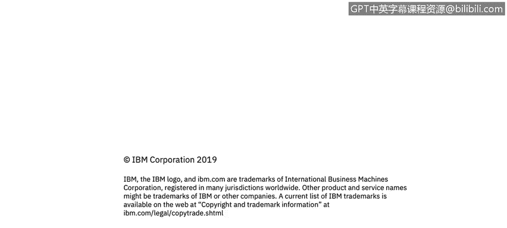

# 课程4：《网络安全与数据库漏洞》：108：49_07_可疑访问事件（第二部分）




在本节课程中，我们将学习如何配置监控，以检测应用程序ID从非定义所有者位置发起的访问。同时，我们还将描述用于监控日志失败、手动日志关闭以及尝试清除日志等活动的配置。



## 🔍 监控来自非授权IP的应用程序ID访问

上一节我们讨论了监控应用程序用户行为，本节中我们来看看如何监控应用程序ID本身是否从非预期的网络位置被使用。

为了演示这一点，我创建了一个名为“应用程序ID来自未授权IP”的报告。此报告与我们之前展示的“应用程序用户未使用应用程序源程序”报告非常相似。

以下是报告的核心逻辑条件：



```sql
WHERE client_id NOT IN (application_id_group) 
AND database_user IN (application_user_id_group)
```

这个条件与“应用程序用户未使用应用程序源程序”的报告定义基本相同，但关键区别在于其过滤条件是基于**IP地址**而非程序源。它检查的是应用程序ID是否从其注册的、允许的IP地址范围之外发起连接。



## ⚙️ 演示：监控配置（日志失败、关闭与清除）

接下来，我们重点回顾用于监控日志失败、手动日志关闭及清除尝试的演示配置。这些功能主要包含在Guardium系统的自我监控能力中。

### 监控代理状态

首先，我们可以查看S-Control面板。在这里，我们可以看到各个配置用于监控活动的代理状态。

*   **红色状态**：表示代理不活跃。例如，服务器 `10109128` 显示为红色，这可能意味着通信中断或服务器宕机，导致我们无法从该服务器监控数据。
*   **绿色状态**：表示代理活跃且正在监控。例如，服务器 `1010956` 显示为绿色，表明我们正在成功接收来自该服务器的活动日志。

此外，我们还可以检查“检查引擎”的状态，以确认我们配置了监控哪些数据库的活动（如Cassandra、CouchDB、DB2、MongoDB、Oracle等）。对于本课程，我们主要关注的是Oracle数据库活动。

这是查看日志失败的一种方式：任何代理宕机都意味着日志记录中断，即发生了日志失败。

### 系统运行报告

在报告环境中，我们设有专门的运行报告来展示Guardium系统自身的状态。

*   **缓冲使用监控**：显示CPU使用率百分比、缓冲空间状态以及数据库存储使用情况。这有助于了解Guardium环境的资源消耗。
*   **SAP状态报告**：此报告类似于之前看到的代理状态报告，但更详细。它包含最后响应时间、主机名、每个Guardium代理上安装的组件列表以及被标记监控的数据库。它清晰地展示了哪些组件处于活跃监控状态，哪些处于非活跃状态。

### 实时活动审计

我们还可以利用实时Guardium运行报告。

*   **连接画像列表**：通过配置此报告，我们可以回溯查看（例如过去三天）所有用户的连接画像。例如，可以看到应用程序用户`app_user`从IP `1956`登录到Oracle数据库并使用SQL*Plus等工具的全部信息。
*   **监控Guardium系统活动**：更重要的是，我们可以审计用户对Guardium系统本身的操作。在“用户活动审计”中，可以查看用户（例如用户`bill`）何时登录Guardium管理界面、执行了何种操作（如删除操作）。通过查看记录详情，可以精确追踪到**删除了哪个组定义**。这为所有针对Guardium系统的管理操作提供了完整的审计追踪。

### 告警与关联

最后，我们设有事件关联和监控告警规则。以下是一些已定义或可激活的告警示例：

*   **S-TAP配置变更**：当任何S-TAP代理的配置被更改时触发告警。
*   **数据源变更**：当监控的数据源配置发生变化时触发告警。
*   **磁盘空间不足**：当系统磁盘空间即将耗尽时触发告警。
*   **企业内无流量**：当监控的网络中长时间没有流量时触发告警。
*   **向Guardium发送日志失败**：当数据源无法向Guardium发送日志时触发告警。
*   **受管单元交互中断**：当某个数据收集器变为非活跃状态时触发告警。

这些告警机制覆盖了为确保数据库日志记录和监控持续有效、防止管理失误所需监控的所有关键方面。

## 📝 本节总结

本节课中我们一起学习了数据库活动监控的关键配置。我们首先探讨了如何监控应用程序ID从非授权IP地址的访问行为。接着，我们深入了解了Guardium系统内置的自我监控能力，包括如何检查代理状态、查看系统运行报告、审计管理操作以及设置关键事件告警。通过这些配置，可以确保日志记录的完整性，并及时发现潜在的日志失败、异常关闭或恶意清除企图。

至此，我们完成了数据活动监控、策略和日志记录部分的演示，为进入下一个学习模块做好了准备。



