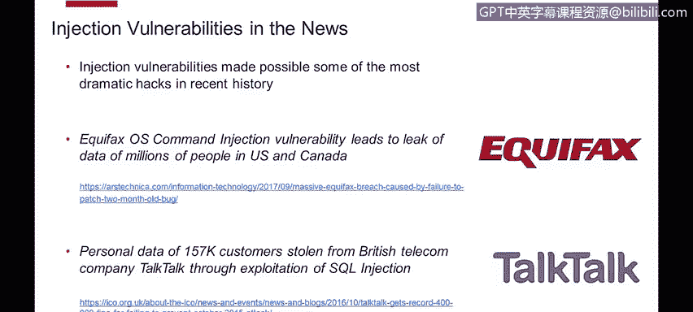
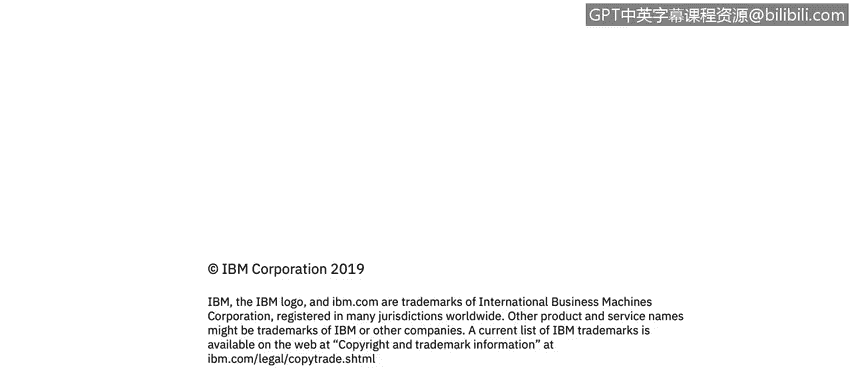

# 课程4：《网络安全与数据库漏洞》：110：注入漏洞简介

在本节课程中，我们将学习描述各种注入攻击的本质及其在威胁环境中的普遍性。

我是Dimitri Boza，是Ex Force道德黑客团队的成员。

关于我们的工作，我们负责对安全产品进行渗透测试，这些测试在产品发布给客户之前进行。对于不了解的听众，渗透测试是一种安全测试类型，测试人员或质量保证人员扮演攻击者或黑客的角色。我们使用与外部恶意攻击者相同的技术和工具来攻击客户和产品，这帮助我们发现安全漏洞。我们将这些漏洞报告给开发团队，并在产品发布前修复它们。

在这些演示中，我们将展示许多我们在真实案例场景中遇到的例子。希望通过我们给出的建议，您将能够解决并预防软件中的安全漏洞。现在让我们开始。

上一节我们介绍了课程概述，本节中我们来看看注入漏洞的具体定义。如果给注入漏洞一个定义，它们通常允许攻击者通过易受攻击的应用程序将恶意代码“注入”到另一个系统中。这个系统可能是操作系统、数据库服务器、LDAP服务器，或者任何接受脚本作为输入的组件。

从这张图表可以看出，注入漏洞相当普遍。但它们的特殊之处在于，它们通常被评定为高级别问题，是顶级安全问题，并且极其危险。在最坏的情况下，它们可能允许攻击者完全控制易受攻击的系统。

您可能熟悉OWASP Top 10列表。OWASP是开放Web应用程序安全项目，它列出了影响Web应用程序的最常见安全漏洞。从2013年的旧版本到2017年的当前版本，注入漏洞一直位居该列表的榜首，被认为是目前最危险的漏洞类型。

还有CWE/SANS Top 25列表，您可能也熟悉。在这里可以看到同样的情况，第一名和第二名分别是SQL注入和操作系统命令注入。整个行业基本达成共识，认为这些是最危险的漏洞类型。

注入漏洞在新闻中不断出现，它们促成了近期历史上一些最引人注目的黑客攻击。您去年可能听说的Equifax黑客攻击事件，攻击者就利用了这类漏洞泄露了大约1.5亿美国和加拿大公民的数据，规模非常巨大。另一个例子是英国电信公司TalkTalk的黑客攻击，通过SQL注入暴露了15.7万名客户的记录。如果您阅读新闻，会经常看到这类漏洞，其最终结果是大量客户数据和个人用户信息被泄露，它们确实非常危险。

本节课中我们一起学习了注入漏洞的基本概念、其在行业安全列表中的重要地位，以及通过真实案例了解了其严重危害性。注入漏洞允许攻击者传递恶意代码，是极高危的安全威胁。