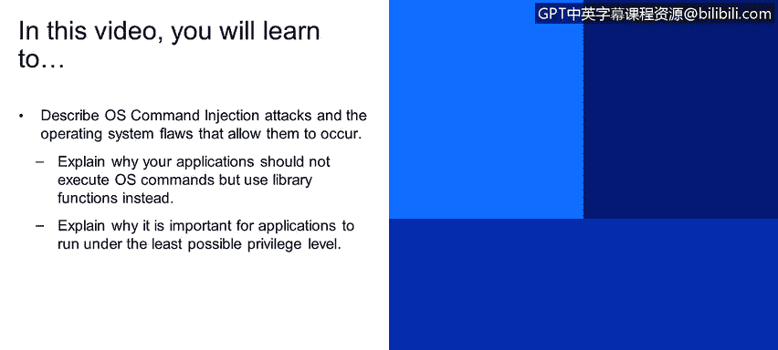

# 课程4：《网络安全与数据库漏洞》：111：操作系统命令注入（第一部分）🔍


在本节课程中，我们将学习操作系统命令注入攻击，了解允许此类攻击发生的操作系统缺陷，并探讨如何通过最佳实践来防范它们。



## 概述

操作系统命令注入是一种严重的安全漏洞。当应用程序不安全地执行用户输入构造的操作系统命令时，攻击者就能利用这一点，在服务器上执行任意命令。本节我们将深入探讨其原理、危害及防御策略。

## 操作系统命令注入攻击

操作系统命令注入是指攻击者滥用应用程序的脆弱功能，导致执行由攻击者指定的操作系统命令。没有任何一个操作系统能对此免疫，它可能发生在Linux、Windows或Mac上。因为漏洞本质上不在于操作系统本身，而在于存在缺陷的应用程序。这类漏洞通常是由于缺乏输入验证，以及开发者执行操作系统命令的方式不安全所导致的。

## 一个具体案例

让我们看一个具体例子。假设你有一个应用程序，其功能之一是管理日志文件。这些日志文件作为真实文件存储在操作系统上。我们有一个界面可以列出日志文件，并允许用户点击查看或删除（每个文件旁边有一个删除图标）。这是一个相当常见的场景。

我们假设点击删除图标时，会发送一个POST请求，其中包含必要的参数。在这个案例中，我们发送`action=delete`和`filename`。如果后端使用Java实现，很可能会执行`Runtime`类的`exec`函数。服务器将用户指定的文件名（包含完整路径）传递给shell解释器来执行`rm`（删除）命令。

最终，操作系统执行的是这样一行命令：
```bash
/bin/sh -c "rm /path/to/logs/user_specified_file"
```

## 潜在的攻击场景

那么，在这种场景下最坏的情况是什么？因为用户本质上可以指定文件名，如果我们假设应用程序没有防御性代码来验证文件参数的正确性，攻击者就可以传递任何内容作为该参数。

**示例1：路径遍历攻击**
攻击者可以指定一个系统库文件，例如使用`../../../lib/system_library.so`这样的路径。这将导致原本用于删除日志文件的命令，删除了一个重要的操作系统库，从而造成拒绝服务，服务器将无法运行。

**示例2：命令注入攻击**
更糟糕的是，攻击者可以利用Linux命令语法注入另一个操作系统命令。例如，攻击者提交的文件名参数可能是：
```
x; rm -rf /
```
在这个例子中，分号`;`在Linux中用于分隔或链接多个命令。这意味着在执行完`rm x`命令后，系统会继续执行`rm -rf /`命令，这可能导致整个文件系统被删除。

## 命令注入的危害

操作系统命令注入可能导致各种严重后果：
*   **完全系统接管**：攻击者获得对服务器的控制权。
*   **拒绝服务**：使服务器或服务不可用。
*   **信息泄露**：窃取密码、加密密钥、用户个人信息或商业机密数据。
*   **横向移动**：攻击者可以利用被攻陷的系统作为跳板，攻击网络中的其他计算机。
*   **恶意活动**：被用于组建僵尸网络或进行加密货币挖矿等滥用行为。

一旦攻击者获得了执行操作系统命令的途径，他们几乎可以在那台机器上为所欲为。这是一个“游戏结束”级别的事件。

## 如何防范命令注入攻击

上一节我们看到了命令注入的巨大危害，本节我们来看看如何构建有效的防御。

### 建议一：避免执行操作系统命令

这听起来可能有些奇怪，但并非玩笑。在大多数情况下，执行操作系统命令是一种过于“笨重”的工具，存在更轻量级的实现方式。将操作系统命令执行引入应用程序，会极大地增加攻击面，如果不加注意，很容易被滥用。

操作系统命令的引入常常是作为“快速修复”方案。例如，开发者想删除一个文件，但不想费心研究如何用当前编程语言正确实现，于是认为“直接运行一个命令又快又简单”。这本质上是让操作系统来完成繁重的工作。但正如之前的例子所示，如果不小心，一个破坏性的操作系统命令就可能潜入并造成巨大损害。

因此，我们建议在面对此类情况时，最好抵制运行操作系统命令的诱惑，转而使用你所使用语言的内置功能或第三方库。

**以下是一些例子：**
*   **删除文件**：在Java中，可以使用`Files.delete(Path)`方法。
*   **复制文件**：在Java中，可以使用`Files.copy(Path, Path)`方法。

在大多数情况下，你都可以通过使用库函数来避免运行操作系统命令。这样做的主要好处是能显著减少攻击面。如果你运行一个操作系统命令，攻击者可以指定任何他们想要的命令。但如果你使用库函数来删除文件，攻击面就急剧缩小，攻击最多只能被滥用来删除系统其他位置的单个文件。我们稍后会展示如何防范这种情况，但你可以看到，这已经远没有那么危险了。

### 建议二：以最低必要权限运行

我们经常看到应用程序以超级用户（如root）身份运行，但在绝大多数情况下，这是没有必要的。这样做的问题是，如果攻击者滥用了你的应用程序功能，而该应用程序又以非常高的权限级别运行，攻击者就能造成巨大破坏。

例如，如果你允许应用程序删除某个特定文件：
*   如果应用程序以root用户身份运行，它可以删除各种重要的操作系统文件。
*   如果它以`tomcat`或`www-data`这类受限用户身份运行，它可以删除的文件范围就大大缩小，能造成的损害也有限得多。

实际上，这条“以最低必要权限运行”的建议，有助于防范许多其他类型的漏洞，而不仅仅是命令注入。

## 总结


在本节课中，我们一起学习了操作系统命令注入攻击。我们了解到，这种攻击源于应用程序不安全地将用户输入拼接为操作系统命令并执行。其危害极大，可能导致系统完全被控制。为了有效防御，我们应遵循两个核心原则：第一，尽可能使用编程语言的内置库函数来替代直接执行操作系统命令，以缩小攻击面；第二，确保应用程序进程以完成其功能所需的最低权限运行，从而在漏洞被利用时限制潜在的损害范围。