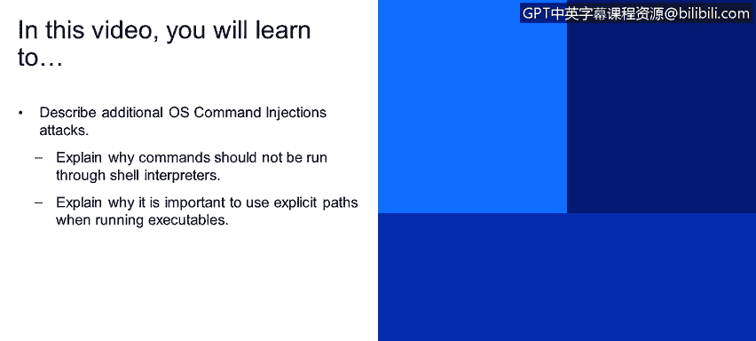
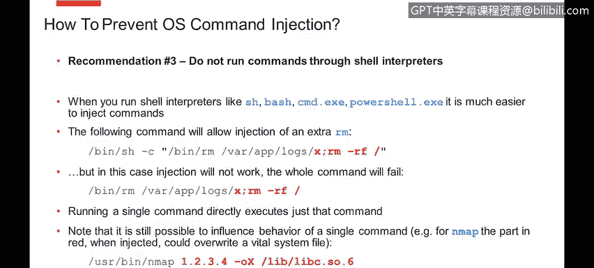
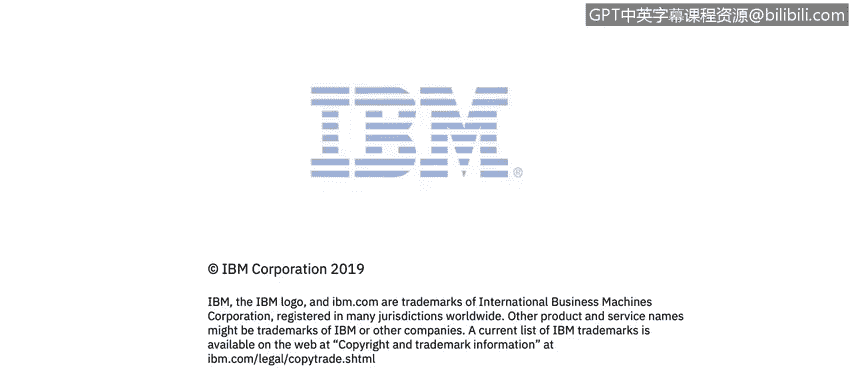

# 课程4：《网络安全与数据库漏洞》：112：操作系统命令注入（第二部分）




## 概述
在本节课程中，我们将继续深入探讨操作系统命令注入攻击。我们将学习为什么不应通过Shell解释器运行命令，以及为什么在执行可执行文件时使用显式路径至关重要。这些知识将帮助你更好地理解和防御此类安全威胁。

## 避免通过Shell解释器运行命令
上一节我们介绍了操作系统命令注入的基本原理。本节中，我们来看看如何通过改进编程实践来减少攻击面。一个关键建议是避免通过Shell解释器运行命令。

你可能熟悉诸如Unix上的SH、Bash，或Windows上的CMD和PowerShell等Shell解释器。当你的业务逻辑要求必须运行操作系统命令时，如果你将命令作为参数提供给Shell解释器执行，这会给攻击者额外的操作空间。例如，攻击者可以利用分号等Shell语法串联多个命令，从而下载恶意代码、删除文件或创建Web Shell，造成各种破坏。

然而，如果你直接运行命令，而不将其传递给Shell解释器，那么一整套由Shell解释器引入和理解的语法（如分号、管道符、反引号、美元符号等）将不再有效。因为你只是在运行单个命令。

例如，考虑以下命令：
```bash
rm /tmp/important_file; malicious_command
```
如果通过Shell（如`sh -c "rm /tmp/important_file; malicious_command"`）执行，分号后的恶意命令也会运行。但如果直接调用`rm`程序并传递参数`/tmp/important_file; malicious_command`，这个命令会失败，因为分号对`rm`命令本身没有意义。

但请注意，即使直接运行命令，仍然存在造成额外损害的危险。攻击者不仅可以操纵单个参数，还可能为你正在运行的命令添加额外的参数。

以下是另一个需要警惕的场景：
即使你直接运行某个命令（例如一个Shell脚本），在该脚本内部，对传入参数的操作仍有可能触发意外的操作系统命令执行。因此，你必须仔细审查如何处理用户提供的输入，确保不会间接执行恶意命令。

## 使用显式路径执行程序
接下来，我们讨论另一个重要建议：使用显式路径运行可执行文件。



操作系统根据系统路径设置来查找和运行应用程序。存在一种攻击类型：如果系统上存在一个文件夹，该文件夹对普通用户可写，并且有多个用户使用该机器，同时，这个文件夹在系统路径中的位置，排在包含你试图运行的可执行文件的文件夹之前。

在这种情况下，攻击者如果拥有系统上的低权限账户，他们可以登录并在其控制的文件夹中放置一个恶意版本的应用程序（例如`nmap`）。当程序通过非完整路径（例如只输入`nmap`）执行时，系统将运行攻击者放置的恶意可执行文件，而不是我们预期的那个。

为了防止这种攻击，最佳做法是通过完整路径引用所有要运行的可执行文件。这样可以消除歧义，确保加载正确的可执行文件。

顺便提一下，同样的建议也适用于另一种称为**DLL劫持**的攻击。因为同样的原理适用于DLL和共享库：攻击者可以将恶意版本的共享库或DLL放入他们控制的、且位于搜索路径中的文件夹，导致系统在加载合法版本之前先加载了恶意版本。



## 总结
本节课中，我们一起学习了防御操作系统命令注入攻击的另外两个关键实践。我们解释了为什么应避免通过Shell解释器运行命令，以限制攻击者利用Shell语法的能力。我们也阐述了使用显式完整路径执行程序的重要性，以防止路径劫持攻击。结合之前课程的内容，这些实践能有效提升应用程序的安全性。