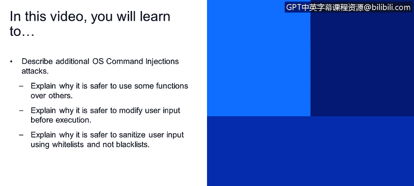

# 课程4：《网络安全与数据库漏洞》：113：操作系统命令注入攻击（第三部分）🔐




在本节课中，我们将学习描述更多类型的操作系统命令注入攻击，并深入探讨如何通过更安全的编程实践来防御这些攻击。我们将重点分析为何某些函数比其他函数更安全，以及如何通过修改和净化用户输入来增强安全性。

上一节我们介绍了命令注入的基本概念和风险，本节中我们来看看更具体的防御策略和攻击者的绕过技巧。

## 使用更安全的函数执行系统命令 💻

如果业务逻辑确实需要执行系统命令，那么选择正确的编程函数至关重要。不同的函数对注入攻击的抵抗力不同。

例如，在Java中，有两种常见方式执行命令：

1.  **不安全的方式**：将可执行文件及其参数构建成一个完整的字符串然后执行。
    ```java
    // 示例：容易受到注入攻击
    String command = "ping " + userInput;
    Runtime.getRuntime().exec(command);
    ```

2.  **更安全的方式**：使用将命令和参数作为独立字符串数组传递的函数。
    ```java
    // 示例：更安全，参数被预解析
    String[] cmdArray = {"ping", userInput};
    Runtime.getRuntime().exec(cmdArray);
    ```

第二种方式更安全，因为它将命令（`ping`）和参数（`userInput`）作为独立的元素传递给操作系统。这样，即使攻击者试图在`userInput`参数中注入额外的命令（例如`127.0.0.1 && rm -rf /`），这些内容也会被整体视为`ping`命令的**一个参数**，而不会被解析为新的独立命令执行。因此，在编写代码时，应优先选择这类更安全的函数变体。

## 避免用户输入直接到达命令执行点 🔄

一个有效的防御策略是避免让原始的用户输入直接用于构造系统命令。可以通过引入间接层来实现。

以下是具体做法：
*   在用户界面（UI）中，使用**符号化ID**来代表操作系统命令将要操作的对象（如文件、记录）。
*   在后台代码中，维护一个**映射表**，将这些ID转换为实际的系统资源标识符（如真实文件名）。

例如，一个文件删除功能不应让用户直接输入`/path/to/important.txt`，而应让用户从列表中选择一个代表该文件的ID（如`file_id=103`）。后端代码收到`file_id=103`后，通过内部查询映射表得到真实路径，再执行删除操作。这样，攻击者无法通过输入恶意路径或命令来影响系统，因为任何不在映射表中的ID都会被直接拒绝。

## 使用白名单而非黑名单进行输入净化 ✅

对用户输入进行净化是通用的安全建议。关键在于采用**白名单**策略，而非**黑名单**策略。

*   **黑名单**：定义一个已知危险输入的列表（如包含`;`、`&`、`|`的输入），如果用户输入匹配列表中的任何一项，则拒绝。这种方法的问题在于难以穷举所有可能的攻击变体，容易被有创造力的攻击者绕过。
*   **白名单**：定义一个严格、受控的允许输入的模式（如只允许字母、数字和点号）。任何不符合该模式的输入都会被拒绝。这种方法更安全，因为你只需要定义和维护“什么是好的”。

以下是一些攻击者绕过黑名单的真实案例：

假设应用程序的黑名单拒绝包含分号`;`、与符号`&`和管道符`|`的输入。
*   攻击者可以使用反引号 `` ` `` 来执行命令，例如 `` ping `whoami` ``，这在Linux语法中是有效的。
*   如果将反引号也加入黑名单，攻击者可能使用`$(command)`的语法，例如 `ping $(whoami)`。
*   如果黑名单拒绝空格，攻击者可以使用`${IFS}`（一个包含空格的环境变量）来代替空格。
*   即使程序试图用双引号包裹用户输入并转义其中的双引号，攻击者仍可能通过输入转义字符本身来构造突破，例如输入`\"`可能导致复杂的解析错误，最终执行注入的命令。

相比之下，一个简单的白名单正则表达式可以轻松防御所有这些情况：
```regex
^[a-zA-Z0-9\.]+$
```
这个表达式只允许由字母、数字和点号组成的字符串，上述所有复杂的攻击输入都无法通过验证。

## 核心要点总结 📝

本节课中我们一起学习了防御操作系统命令注入攻击的关键策略：

1.  **尽量避免使用系统命令**：优先寻找更安全的编程替代方案。
2.  **遵循最小权限原则**：运行代码时使用尽可能低的系统权限。
3.  **避免通过Shell解释器执行**：直接调用系统命令，而非通过Shell（如`bash`、`cmd`）。
4.  **使用显式路径**：调用应用程序和共享库时使用完整路径。
5.  **选择安全的库函数**：使用那些能将命令与参数分开传递的函数。
6.  **隔离用户输入**：使用符号ID等间接方式，防止原始用户输入直接用于命令构造。
7.  **采用白名单净化**：严格定义并只接受符合预期格式的输入，拒绝其他所有内容。


通过实施这些措施，可以显著降低应用程序遭受操作系统命令注入攻击的风险。