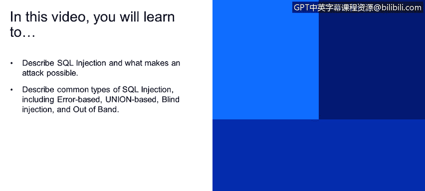
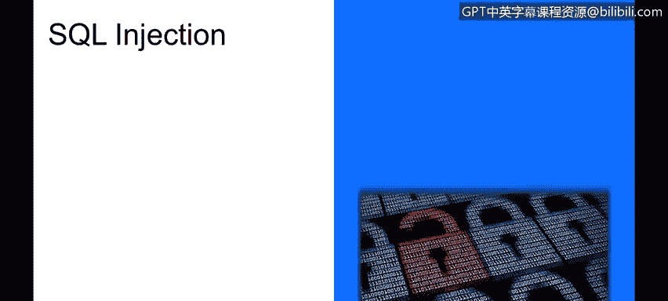
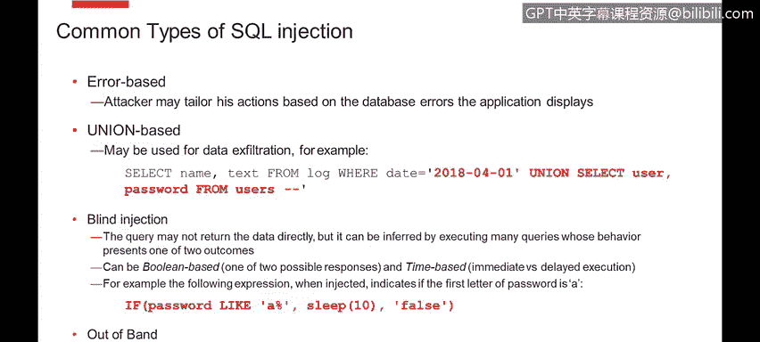
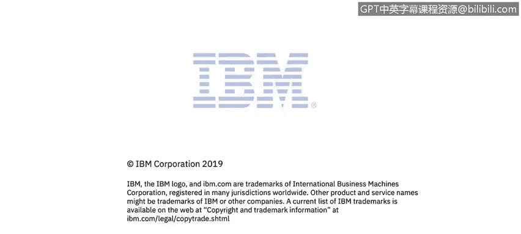

# 课程4：《网络安全与数据库漏洞》：114：SQL注入攻击详解（第一部分）🔍




在本节课中，我们将要学习SQL注入攻击的基本概念、工作原理以及几种常见的攻击类型。SQL注入是一种利用应用程序漏洞来执行恶意SQL查询的攻击手段，对数据库安全构成严重威胁。



## SQL注入概述

SQL注入与命令注入类似，都是通过滥用存在漏洞的应用程序功能，来执行本不该被执行的SQL查询语句。这些查询最终由数据库系统执行。

这种攻击几乎可能发生在任何SQL数据库上。其主要缓解措施同样是**输入净化**。

## SQL注入示例分析

为了更好地理解，让我们来看一个具体的例子。假设我们有一个登录对话框，这在您开发的应用程序中可能很常见。

在代码中，我们经常看到类似以下的Java语句，它直接将用户名和密码拼接到SQL命令中：

```sql
SELECT * FROM users WHERE username='[username]' AND password='[password]';
```

当在数据库中找到匹配该用户名和密码的用户时，系统会允许用户登录。如果输入是良性的，一切运行正常。

然而，让我们看看如果攻击者注入了恶意内容会发生什么。请看最底部的语句，它没有指定任何密码（密码留空），但用户名部分很有趣：

```
' OR 1=1; --
```

我们来分解一下这个注入语句：
*   **`'`**： 在SQL语法中，值通常由单引号包围。这里的第一个单引号用于**闭合**用户名的值。
*   **`OR 1=1`**： 攻击者添加了一个布尔子句。`1=1` 这个表达式的结果**永远为真**。根据布尔逻辑，如果某个条件“或”上真值，整个表达式的结果就为真。
*   **`;`**： 分号用于分隔不同的SQL查询。
*   **`--`**： 在许多SQL方言中，双横线表示**注释**，它会注释掉该行后面的所有内容。

因此，原本的 `' AND password=''` 部分被忽略了。本质上，攻击者将我们的SQL查询变成了一个查找**任意用户**的查询，它既不检查用户名，也不检查密码，就盲目地允许登录。

通过这样一段简单的文本，攻击者就可以绕过存在漏洞系统的登录对话框。现实中我们已经见过许多这样的例子。

## SQL注入的危害

SQL注入攻击可能带来多种严重后果：

以下是SQL注入可能导致的几种主要危害：
*   **绕过认证机制**： 正如示例所示，攻击者可以无需有效凭证即可登录系统。
*   **数据窃取**： 攻击者可以窃取数据。新闻中报道的许多黑客事件，如客户数据被盗，通常就是通过SQL注入完成的。
*   **执行操作系统命令**： 在某些SQL变体中，可以指定运行OS命令。如果能够注入包含 `xp_cmdshell` 等扩展存储过程的SQL语句，就可能执行操作系统命令。
*   **破坏或拒绝服务攻击**： 例如，攻击者可以命令SQL服务器删除数据表，这几乎会立刻导致系统瘫痪。通过一个包含SQL注入命令的简单请求，就可能摧毁整个系统。下面的例子展示了使用分号分隔语句来实现此目的：

```sql
'; DROP TABLE users; --
```

不要假设攻击者如果能在您的查询中注入恶意内容，就无法执行其他查询。存在多种方法可以将查询链接在一起，并执行嵌套查询。

## 常见的SQL注入类型

上一节我们介绍了SQL注入的基本原理和危害，本节中我们来看看几种常见的SQL注入类型。

以下是四种主要的SQL注入类型：

*   **基于错误的注入**： 攻击者通过观察系统返回的错误消息来推断后端数据库的结构和信息。如果应用程序将数据库的详细错误信息直接返回给用户，就会泄露大量关于后端的信息，使攻击者能够调整他们的攻击命令。

*   **联合查询注入**： 这是数据被窃取出系统的典型方式。例如，有一个查询根据用户控制的日期参数从日志文件中获取名称和文本。如果没有输入净化，攻击者可以注入一个 `UNION` 子句，从完全不同的表（如用户表）中选择用户名和密码，并将这些数据附加到原始查询的输出结果中。

*   **盲注**： 有时开发者认为“虽然执行了SQL查询，但没有数据返回给用户，所以问题不大”。但实际上，存在许多方法可以进行盲注，仅通过系统的行为来猜测数据。主要有两种类型：
    *   **基于布尔的盲注**： 通过微调查询参数，系统可能返回两种不同的响应（真/假），攻击者根据响应差异逐步推断数据内容。
    *   **基于时间的盲注**： 攻击者可以在查询中注入一个延迟。例如，使用类似 `IF(condition, SLEEP(10), false)` 的语句。如果条件为真，响应会延迟返回；如果为假，则立即返回。通过尝试所有可能的字符并观察响应时间，攻击者可以逐个字符地推断出密码等敏感信息，而无需数据库直接输出数据。

*   **带外注入**： 攻击者可以触发向其他站点的请求，通过应用程序之外的渠道（例如DNS查询、HTTP请求到攻击者控制的服务器）来窃取数据。

## 总结





本节课中我们一起学习了SQL注入攻击。我们了解到，SQL注入是通过操纵应用程序的输入来执行恶意数据库查询的攻击方式。它可能导致认证绕过、数据泄露、命令执行乃至系统瘫痪。我们详细分析了基于错误、联合查询、盲注以及带外注入这几种常见类型。理解这些攻击的原理是构建安全应用程序、实施有效输入验证和净化的第一步。在后续课程中，我们将探讨如何防御这些攻击。