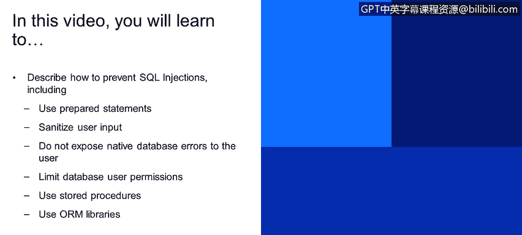
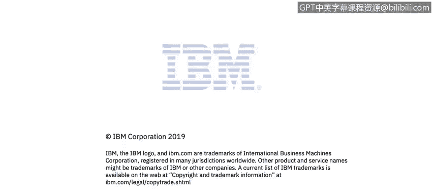

# 课程4：《网络安全与数据库漏洞》：115：SQL注入攻击的防御 🛡️


在本节课中，我们将学习如何有效预防SQL注入攻击。我们将探讨几种核心的防御策略，包括使用预编译语句、净化用户输入、限制错误信息暴露等，并通过具体的代码示例来理解其原理。



## 概述

SQL注入是一种严重的安全威胁，攻击者通过操纵数据库查询来窃取或破坏数据。上一节我们介绍了SQL注入的攻击原理，本节中我们来看看如何构建坚固的防线来抵御此类攻击。核心的防御思想是：**永远不要信任用户输入**，并**最小化攻击面**。

## 防御策略详解

以下是预防SQL注入的关键方法。

### 1. 使用预编译语句（首选方法）

预编译语句是防止SQL注入最有效、最推荐的方法。它的原理是将SQL语句的逻辑结构与传入的参数数据分离。

在易受攻击的原始代码中，查询字符串是动态拼接的：
```sql
SELECT * FROM users WHERE username = ‘“ + username + ”’;
```
攻击者可以通过`username`参数注入恶意代码。

而使用预编译语句后，查询结构被固定，参数用占位符（如`?`）表示：
```java
String query = “SELECT * FROM users WHERE username = ?”;
PreparedStatement pstmt = connection.prepareStatement(query);
pstmt.setString(1, username);
```
在这个例子中，无论`username`参数传入什么内容，数据库引擎都只会将其视为纯粹的**数据值**，而不会将其解释为SQL**代码**的一部分。因为语句在准备阶段就已经被编译，其结构“凝固”了，无法被后续传入的参数修改。

**重要提醒**：必须确保整个预编译语句本身是常量，不包含任何用户输入。避免出现以下错误模式：
```java
// 错误示例：将用户输入拼接到准备阶段
String query = “SELECT * FROM users WHERE username = ‘“ + username + ”’”;
PreparedStatement pstmt = connection.prepareStatement(query); // 此时恶意输入已被“烘焙”进语句
```
在这种情况下，预编译语句失去了保护作用。

### 2. 净化用户输入

对所有用户输入进行净化处理是安全开发的基本准则。应假设所有输入都是恶意的。

*   **使用白名单，而非黑名单**：定义明确允许的字符或模式（白名单），比试图列出并过滤所有恶意字符（黑名单）要可靠得多。黑名单很容易被绕过。
*   **进行输入验证和转义**：对输入进行严格的格式验证（如邮箱格式、数字范围）。必要时，对特殊字符进行转义。
*   **使用映射表**：对于某些输入（如状态码、类型），可以不直接将用户输入传递到数据库，而是先映射到预定义的内部值。这增加了额外的保护层。

### 3. 避免向用户暴露详细的数据库错误信息

详细的数据库错误信息是攻击者的“宝藏图”。它们会泄露后端数据库的类型（如MySQL、Oracle）、表结构甚至部分查询逻辑，极大地帮助攻击者构造精准的注入载荷。

**错误做法**：将类似下面的原生错误直接显示给用户：
```
ERROR 1064 (42000): You have an error in your SQL syntax; check the manual that corresponds to your MySQL server version...
```
**正确做法**：向最终用户返回通用的、友好的错误信息（如“系统处理您的请求时出错”）。将详细的错误信息记录在**内部日志文件**中，仅供开发人员和运维人员排查问题使用。不要给攻击者提供便利。

### 4. 限制数据库用户权限

遵循**最小权限原则**。为Web应用程序连接数据库所使用的账户分配尽可能低的权限。

*   如果业务逻辑只需要读取数据，就分配**只读**权限。
*   将账户的访问范围限制在特定的、必要的表和视图上。
*   避免使用具有管理员权限（如`root`、`sa`）的账户运行应用程序。这样即使发生注入，攻击者能造成的破坏也有限。

### 5. 使用存储过程

存储过程是预编译并存储在数据库中的SQL语句集。与预编译语句类似，它们将代码与数据分离，使得通过注入来修改其核心逻辑变得非常困难。调用存储过程时，参数也是作为值传递的。
```sql
-- 定义存储过程
CREATE PROCEDURE GetUser (IN userID INT)
BEGIN
 SELECT * FROM users WHERE id = userID;
END;

-- 应用程序中调用
CallableStatement cstmt = connection.prepareCall(“{call GetUser(?)}”);
cstmt.setInt(1, userId);
```

### 6. 使用对象关系映射（ORM）库

ORM库（如Java的Hibernate、Python的SQLAlchemy、.NET的Entity Framework）在应用程序代码和数据库之间增加了一个抽象层。开发者通常通过操作对象和方法来间接生成SQL，这减少了自己手动拼接SQL字符串的需要，从而降低了SQL注入的风险。

**示例（Hibernate）**：
```java
// 使用Hibernate查询语言（HQL），参数是安全的
Query query = session.createQuery(“FROM User WHERE username = :username”);
query.setParameter(“username”, username);
```
**重要提醒**：ORM工具并非绝对安全。如果开发者不当使用其提供的“原生SQL”或“SQL拼接”功能，仍然可能引入漏洞。关键在于**正确且一致地使用ORM的安全特性**。

## 总结

本节课中我们一起学习了防御SQL注入攻击的多种策略。核心要点总结如下：
1.  **首选预编译语句**，并确保正确使用。
2.  **严格净化所有用户输入**，采用白名单策略。
3.  **切勿向最终用户暴露原生数据库错误信息**。
4.  **遵循最小权限原则**，限制应用程序所用数据库账户的权限。
5.  考虑使用**存储过程**作为额外的防御层。
6.  使用**ORM库**可以降低风险，但必须确保安全配置。



将这些措施结合使用，可以构建一个深度防御体系，显著提升应用程序抵御SQL注入攻击的能力。