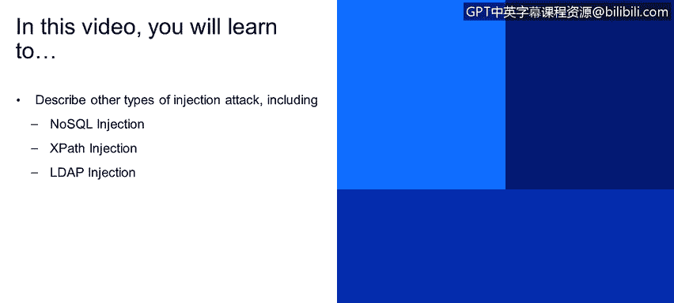
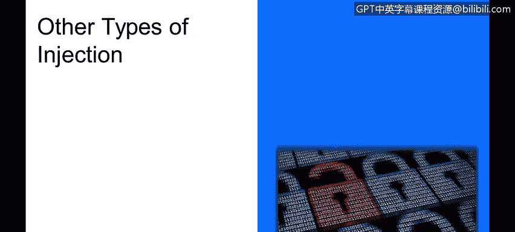
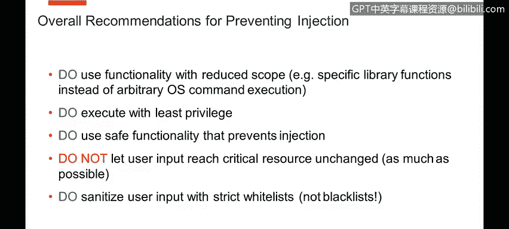
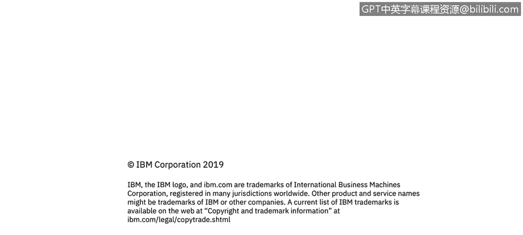

# 课程4：《网络安全与数据库漏洞》：116：其他类型的注入攻击






## 📚 概述
在本节课程中，我们将学习除SQL注入之外的其他几种常见注入攻击类型。我们将探讨NoSQL注入、XPath注入和LDAP注入的基本原理、潜在风险以及防御策略。理解这些攻击方式对于构建全面的应用程序安全防护至关重要。

## 🔍 NoSQL注入攻击
上一节我们介绍了SQL注入，本节中我们来看看NoSQL注入。许多现代应用程序使用NoSQL数据库技术，开发者可能认为这降低了注入攻击的风险。虽然风险确实有所降低，但如果未经验证的用户输入能够触及到执行表达式或脚本的功能，注入攻击仍然可能发生。

例如，在MongoDB中，可能存在如下表达式：
```javascript
{ userType: 3 }
```
在实际应用中，开发者可能将此表达式作为从用户界面提交的参数。但这给了攻击者控制表达式的机会。攻击者可以注入更危险的代码，例如一段用于发起拒绝服务攻击的JavaScript循环：
```javascript
{ userType: { $ne: 1 }, $where: "function() { while(true) {} }" }
```
这段代码会导致查询执行被无限期延迟，从而使应用程序挂起。因此，不能简单地认为使用NoSQL技术就绝对安全。

以下是防范NoSQL注入的关键点：
*   审查应用程序使用的所有功能，思考其可能被滥用的方式。
*   对所有用户输入进行严格的验证和清理。

## 📄 XPath注入攻击
XPath是一种用于在XML文档树中查询信息的流行技术。如果处理不当，XPath查询也可能成为注入攻击的入口。

考虑一个用于验证登录凭证的XPath查询示例：
```
//user[username/text()='$username' and password/text()='$password']
```
如果`$username`和`$password`是正常的用户输入，查询将正常工作。然而，攻击者可以注入熟悉的攻击模式（类似于SQL注入），例如将用户名输入设置为：
```
' or 1=1 or 'a'='a
```
这可能导致查询被篡改为寻找任何用户和任何密码的组合，从而绕过身份验证。因此，必须对输入进行净化处理，以防止此类情况发生。

## 🔐 LDAP注入攻击
LDAP广泛应用于许多产品的目录服务中。与SQL和XPath类似，LDAP也有自己的语法，任何允许指定表达式的地方都可能被滥用。

一个典型的LDAP查询可能如下所示，用于查找匹配的用户名和密码：
```
(&(user=$username)(password=$password))
```
当输入正常时，查询无误。但如果攻击者注入恶意语法，例如将用户名输入设置为：
```
*)(uid=*))(|(uid=*
```
这可能会篡改查询逻辑，使得密码验证条件失效。如果应用程序依赖此表达式进行用户登录且未对输入进行保护，攻击者可能无需有效凭证即可登录。

## 🛡️ 通用防御策略与总结
除了上述类型，应用程序使用的各种模板引擎或其他技术也可能存在注入漏洞。防御各类注入攻击的总体建议是相似的。

本节课中我们一起学习了NoSQL、XPath和LDAP注入攻击。以下是通用的核心防御原则：
*   **使用功能范围受限的接口**：选择攻击面更小的API或方法。
*   **为任务选择最合适的工具**：使用设计上能防止注入的库或框架。
*   **以最小权限执行**：确保执行查询的账户仅拥有必要的最低权限。
*   **使用安全的功能**：优先使用参数化查询、预编译语句等安全机制。
*   **严格控制用户输入**：尽可能避免未经处理的用户输入直接到达关键资源。
*   **采用白名单进行输入净化**：定义合法的输入模式（白名单），而非仅仅过滤已知的恶意模式（黑名单）。





通过遵循这些原则，可以显著降低应用程序遭受各种注入攻击的风险。