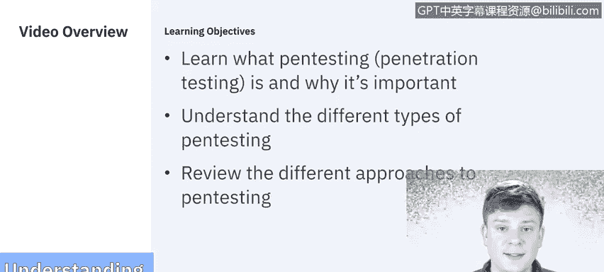

# 课程5：《渗透测试、事件响应与取证》：2：什么是渗透测试 🔍

在本节课中，我们将要学习渗透测试的基础知识。我们将探讨其定义、重要性、可测试的操作系统类型以及执行测试的不同方法。

---

## 什么是渗透测试？

美国国家标准与技术研究院将渗透测试定义为一种安全测试，其中评估人员模拟真实世界的攻击，以识别绕过应用程序、系统或网络安全特性的方法。它通常涉及使用黑客常用的工具和技术，对真实的系统和数据发起真实的攻击。

随着网络攻击成为常态，定期进行漏洞扫描和渗透测试以识别漏洞并确保现有网络安全控制措施有效，变得比以往任何时候都更加重要。由于这是对真实系统的真实攻击，此类测试通常不会每月或每季度进行。许多公司选择每年进行一次，以确保控制措施到位，同时将对业务的影响降至最低。

---

## 渗透测试的目标操作系统

随着渗透测试的重要性日益增加，了解其可针对的操作系统也变得同样重要。

以下是主要的操作系统类型：

*   **桌面/服务器操作系统**：**Windows OS** 是目前最流行的操作系统，其次是 **Unix**、**Linux** 和 **Mac OS**。一些系统运行在 Chrome OS 和 Ubuntu 上，但远不如前三种常见。
*   **移动操作系统**：**Android** 是目前最流行的移动操作系统，其次是 **iOS** 和 **Blackberry OS**。Windows Mobile 已不常见，在非常古老的手机上，你仍可能发现 Web OS 和 Symbian OS。

---

## 渗透测试的不同方法

上一节我们介绍了渗透测试的定义和目标系统，本节中我们来看看执行测试的不同方法。没有两次测试是完全相同的，因为每家公司使用的工具、系统和应用程序都不同，因此我们需要灵活地采取多种方法。

以下是几种主要的渗透测试方法：

*   **内部员工 vs. 外部黑客**：80% 的攻击发生在公司内部。因此，以员工或前员工的身份（假设已拥有部分访问权限）进行测试非常重要，这比仅使用外部黑客常用工具的外部测试能走得更远。
*   **Web 或移动应用程序测试**：这两种评估非常相似，通常包括确保代码安全、符合安全策略，并进行大量身份验证和密码破解尝试以测试漏洞。
*   **社会工程学**：这是一种在许多方法中都会用到的策略。社会工程学旨在制造焦虑感或心态，以获取通常无法访问的信息。历史上，我们通过钓鱼邮件了解社会工程学，但它也可以通过电话、当面交流进行，通常涉及威胁、最后通牒、错误信息、制造紧迫感、升级事态等手段，以诱使他人泄露信息或获取非常规访问权限。
*   **无线网络测试**：大多数公司都有供员工使用的内部无线网络。测试其是否符合安全策略至关重要。由于每位员工都连接到该网络，并可能使用自己的设备（如手机或电脑），这些都成为我们需要测试的潜在漏洞区域。
*   **物联网设备测试**：如今，不仅是人，万物也常连接到互联网，无论是网络摄像头、恒温器，甚至是咖啡机。因此，网络本身、连接到网络的可能不安全的设备、以及连接到网络的物理设备，都是我们可以采取的不同测试途径。
*   **工业控制系统测试**：工业控制系统的密码和操作系统通常非常过时，并且由于经常使用默认密码和配置，极易受到社会工程学攻击。工业控制系统并非无处不在，主要存在于石油、天然气和电力行业。可以想象，这些行业一旦被攻破，影响范围极广，因此测试它们变得日益重要。

---

## 渗透测试的通用阶段

以上我们探讨了渗透测试的各种方法，现在让我们退一步，看看一次渗透测试本身通常包含哪些阶段。

正如在最初的定义中提到的，渗透测试可以针对应用程序、网络以及移动设备或不同操作系统等系统进行。虽然这些不同方法的侧重点可能有所不同，但我们使用的方法论大体相同。

一个典型的渗透测试通常包含以下阶段：

1.  **规划阶段**：与公司商定合同或协议，明确攻击的范围。由于是对真实系统进行攻击，设定严格的边界并明确可能发生和不应发生的事情至关重要。
2.  **侦察/发现阶段**：通过主动和被动方式，尽可能多地收集目标信息。
3.  **攻击/利用阶段**：在认为信息足够后，开始实际的渗透测试攻击或利用漏洞。
4.  **报告阶段**：攻击完成后或达成规划阶段设定的目标后，撰写报告对公司至关重要。报告需说明哪些攻击成功、哪些未成功、存在漏洞的领域以及公司面临的风险，以便公司采取行动。

---

## 总结与预告

本节课中，我们一起学习了渗透测试的核心概念。我们明确了其定义是模拟真实攻击以评估安全性的过程，了解了其主要针对的桌面和移动操作系统，并探讨了从内部测试到社会工程学、无线网络测试等多种方法。最后，我们梳理了一次标准渗透测试通常包含的四个阶段：规划、侦察、攻击和报告。

在接下来的系列视频中，我们将详细分解渗透攻击的每一个阶段，以便您能更深入地理解成功执行一次渗透测试所需考虑的因素和使用的方法论。