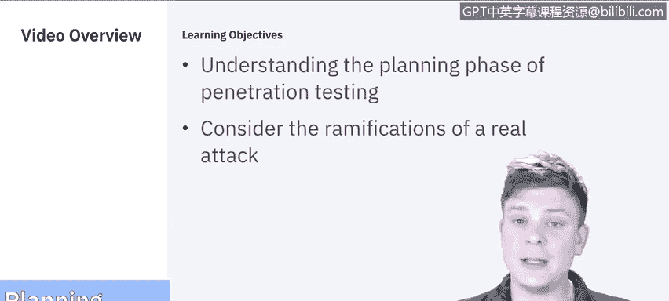

# 课程5：《渗透测试、事件响应与取证》：3：2_渗透测试计划

在本节课中，我们将要学习渗透测试的第一个阶段：规划。我们将详细分解规划阶段的各个组成部分，并探讨对真实系统进行实际攻击可能带来的后果。

## 规划阶段概述

上一节我们介绍了渗透测试的整体框架，本节中我们来看看其首要阶段——规划。规划是渗透测试的起点，其核心在于明确目标、设定边界并考虑所有法律与伦理因素。

## 设定目标与范围

规划的第一步是与客户会面，共同确定渗透测试的具体目标。这些目标可能包括：
*   针对特定数据。
*   针对特定个人或群体。
*   针对网络、应用程序或系统（如我们在之前模块中讨论过的）。

这里至关重要的一点是，所有商定的内容都必须写入合同。因为合同将界定你被允许或禁止执行的操作范围。

## 确立边界与法律考量

在确立边界时，必须考虑到对真实系统、产品或服务进行实际攻击可能带来的法律和伦理后果。你的行为很可能会影响这些产品和服务的可用性。

因此，你需要仔细权衡以下问题：
*   我们是否在工作日进行测试？
*   我们是否在周末进行测试？
*   测试的深度如何？是进行到底，还是仅仅获取访问权限为止？

所有这些边界都需要以书面形式明确，因为如果超出了设定的范围，很可能会面临法律后果。

## 通知相关方

最后需要考虑的是，是否需要通知“需要知情”的相关人员。渗透测试的整个目的是模拟真实世界的攻击，但你肯定也不希望因为在测试过程中尝试进行社会工程学攻击，或试图进入无权进入的物理空间而被逮捕。所有这些因素都必须在规划阶段仔细权衡并明确列出。

## 总结

本节课中我们一起学习了渗透测试规划阶段的核心内容。规划阶段主要涉及设定明确目标、通过合同确立法律与操作边界，并权衡通知相关人员的必要性。这为整个测试奠定了安全和合规的基础。接下来，我们将进入下一个阶段：信息收集（发现阶段）。