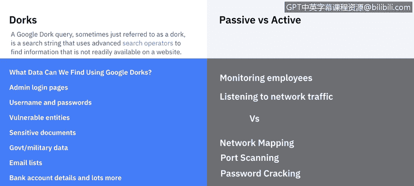
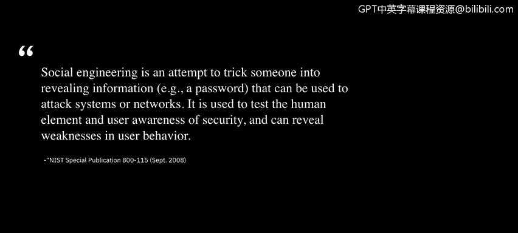

# 课程5：《渗透测试、事件响应与取证》：4：渗透测试发现

在本节课中，我们将要学习渗透测试的“发现”阶段。我们将了解漏洞分析的概念及其在渗透测试中的作用，并介绍用于信息发现的各种方法和工具。

## 漏洞分析的作用

上一节我们介绍了渗透测试的各个阶段，本节中我们来看看“发现”阶段的核心准备工作——漏洞分析。

在运行渗透测试之前，进行漏洞扫描有助于识别过时的软件版本、缺失的补丁以及错误的配置。这可以验证系统是否符合安全策略或发现其偏差。

这一点非常重要，因为我们希望行动有明确的目标，而不是盲目地进入发现阶段。因此，我们会使用特定的工具进行漏洞扫描，市面上有很多此类工具可供选择。

其工作原理是：扫描工具识别主机上使用的操作系统和主要应用程序，然后将其与工具漏洞数据库中的已知漏洞进行匹配。扫描完成后，它会报告系统上存在的所有组件以及所有已知的漏洞，这为我们开始发现阶段提供了一个起点。

## 信息收集的方法与工具

为了开始我们的发现阶段，接下来我们将讨论收集信息的不同工具和方法。信息收集，或称侦察，涉及从目标公司或其特定服务器获取信息的各种途径。

以下是几种主要的信息收集方法：

*   **谷歌黑客**：指在谷歌搜索中使用特殊命令来获取关于目标的更多信息。例如，可以搜索公司网站内部，尝试查找其可能存在的互联网存档或开放服务器。有些公司甚至使用谷歌作为内部搜索引擎，我们可以通过一些谷歌命令进行数据分析。
*   **被动侦察**：这种方法主要是观察。例如，观察公司员工的行为，或者检查建筑物或物理设施的安防漏洞。也可以在网络外部使用监听器，检查数据包如何发送给其他人。
*   **主动侦察**：这种方法涉及直接与网络交互。例如，检查开放的端口，或使用大量工具尝试对网页进行暴力破解攻击，主动寻找漏洞。需要注意的是，主动侦察是一种“动静很大”的方式，相当于在告诉对方“我正在监视你”，除非以非常隐蔽的方式进行，否则不推荐轻易使用。
*   **社会工程学**：这种方法针对的是员工。有时，通过社会工程学手段可以从员工那里获取大量信息。攻击者可以伪装成重要人物或客户来套取信息。在更激进的情况下，有些人甚至会跟踪员工以获取信息。

## 常用的侦察工具

在侦察阶段，我们会使用多种工具。以下是一些常见的工具类型及其示例：

*   **网络扫描器**：例如 **Nmap**，这是一个免费的网络映射器。当然，如果你有更好的工具，也可以使用。
*   **网络分析器**：如果我们在网络内部捕获到一些数据包，可以使用 **Wireshark** 或任何其他可用的分析器工具来分析它们。
*   **密码破解器**：如果你有幸能够获取密码文件的副本，可以使用密码破解工具来破解它。一个例子是 **John the Ripper**，这是最古老的工具之一。
*   **渗透测试框架**：目前，你可以访问 **OWASP** 来获取最新的工具。我个人使用 **Metasploit** 作为一个黑客工具和漏洞利用数据库的仓库。

## 总结

本节课中我们一起学习了渗透测试“发现”阶段的关键内容。我们首先了解了漏洞分析的作用，它通过扫描为后续测试提供了明确的目标和起点。接着，我们探讨了多种信息收集方法，包括谷歌黑客、被动/主动侦察和社会工程学。最后，我们介绍了几类在侦察阶段常用的工具，如网络扫描器、分析器和密码破解器。掌握这些方法和工具是有效进行渗透测试发现阶段的基础。