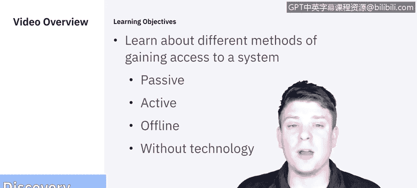
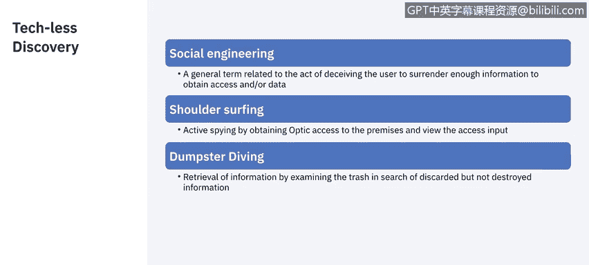

# 课程5：《渗透测试、事件响应与取证》：5：4_渗透测试其他发现详细信息

在本节课程中，我们将学习渗透测试中获取系统访问权限的不同方法。我们将探讨被动、主动、离线以及非技术性的攻击途径，帮助你理解攻击者可能如何尝试入侵系统。

## 在线攻击方法

上一节我们介绍了渗透测试的基本阶段，本节中我们来看看攻击者如何在线获取访问权限。在线攻击是指攻击者在与目标系统存在网络连接时进行的攻击。

以下是几种主要的在线攻击类型：

*   **网络嗅探**：这种方法通过捕获流经公司网络的所有数据包来进行后期分析。其特点是**不留痕迹**。
*   **中间人攻击**：如果攻击者能够劫持一个用户会话，那么他就能获取该用户的尽可能多的信息，甚至访问其权限级别。
*   **重放攻击**：当攻击者识别出用户用于身份验证的会话和信息时，可能会复制这些信息来尝试自行建立认证会话。这是一种非常有效的获取访问权限的方式。

## 主动在线攻击

了解了被动获取信息的方法后，我们来看看更具侵略性的主动在线攻击。这类攻击会主动向目标系统发送数据或尝试建立连接。

以下是几种常见的主动在线攻击：

*   **密码猜测**：通常借助字典辅助，不断尝试密码直到找到正确的为止，这也被称为**暴力破解攻击**。
*   **木马与间谍软件**：通过使用木马、间谍软件或键盘记录器，攻击者试图感染受害者，从而获取其输入的任何内容，甚至远程访问其计算机。
*   **哈希注入**：这种方法主要是从目标服务器获取密码文件，并尝试对其进行解码。
*   **钓鱼攻击**：这是当前非常流行的一种攻击方式。攻击者复制或仿造一个受害者信任的页面（如银行登录页），并利用它来获取受害者访问真实页面的密码。这类攻击通常在需要访问银行或特殊数据库时发生。

## 离线攻击

在线攻击需要与目标保持连接，而离线攻击则可以在获取必要数据后独立进行。

以下是几种离线攻击方法：

*   **预计算哈希攻击**：这与哈希注入的原理基本相同。
*   **彩虹表攻击**：这本质上是一种**预计算攻击**，利用预先计算好的哈希值与明文密码的对应关系来快速破解哈希值。

## 非电子技术攻击

并非所有攻击都依赖于复杂的代码或工具。有时，最简单的方法是利用人的因素。

以下是几种非技术性的攻击手段：

*   **社会工程学**：攻击者通过与人互动，诱使员工泄露信息或执行某些操作，例如冒充老板要求帮助。
*   **肩窥**：攻击者通过物理方式观察员工输入密码时按下的按键。
*   **垃圾搜寻**：在某些地区，翻查公司的垃圾桶并不违法。攻击者可能从中找到未被妥善处理的文件，并获取密码、账号等信息用于后续调查。

## 总结

本节课中我们一起学习了渗透测试中获取系统访问权限的多种方法。我们涵盖了从被动的网络嗅探到主动的密码破解，从离线的哈希破解到利用人性弱点的社会工程学攻击。理解这些攻击途径对于制定有效的防御策略至关重要。