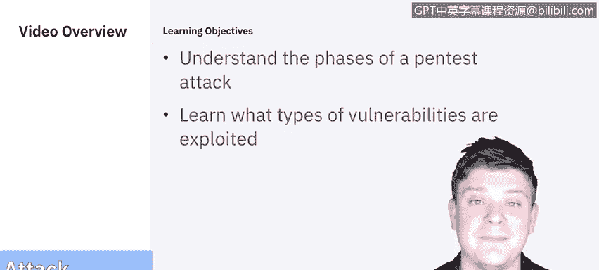
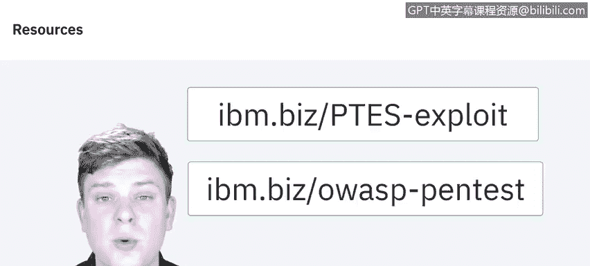

# 课程5：《渗透测试、事件响应与取证》：6：渗透测试攻击阶段 🎯

## 概述
在本节课中，我们将学习渗透测试的核心环节——攻击阶段。我们将探讨攻击阶段的不同组成部分，并了解通常被利用的漏洞类型。




## 攻击阶段概述
漏洞扫描器仅检查漏洞存在的可能性，而渗透测试的攻击阶段则通过实际利用漏洞来确认其存在。


上一节我们介绍了攻击阶段的目标，本节中我们来详细拆解其具体组成部分。

## 攻击阶段的组成部分
以下是攻击阶段的关键步骤，它们并非完全独立，而是相互关联、循环往复的过程。


**第一步：获取访问权限**
攻击阶段的第一步是确保能够访问目标系统。在上一视频中，Raoul带领我们通过发现阶段收集信息，并介绍了用于获取访问权限的工具和方法。根据美国国家标准与技术研究院提供的图表，发现阶段、获取访问权限和攻击阶段并非完全割裂，这些步骤相互交织，并在整个过程中反复进行。

**第二步：权限提升**
一旦进入系统或获得访问权限，我们需要确定所获得的权限级别。如果只是标准用户，则需要将权限提升，直到获得完全控制权或至少是能够进行更改的管理员访问权限。

**第三步：系统浏览与信息收集**
获得足够权限后，便可以开始浏览和收集信息，识别可以控制的机制以及其他系统。请注意，图表中的系统浏览实际上会循环回到发现阶段。这意味着每次发现新系统或可以进入的新工具时，都可以进行另一个发现阶段，以探索如何访问它、它连接到什么、它需要什么工具，然后再次开始这个过程，直到根据我们的目标确定“这就是我们需要的位置”。

**第四步：安装工具与持续循环**
随后，我们可以安装监控或利用工具，以收集更多信息或执行所需操作。这就是我们经历的典型生命周期：发现 -> 获取访问权限 -> 提升权限 -> 浏览系统/工具。当我们对此满意后，可以继续尽可能多地发现，或者直接安装所需的工具。

## 常见漏洞类型
虽然上述流程在理论上很清晰，但并未详细说明我们具体在利用什么漏洞。接下来，我们来分解这些常见的漏洞类型。


根据美国国家标准与技术研究院的分类，大多数漏洞可以归纳为以下几类。以下是我们将要介绍的八种主要类型：

**1. 配置错误**
配置错误是指通过安全设置（尤其是不安全的默认设置）引入的漏洞，这些漏洞通常很容易被利用。

**2. 内核缺陷**
内核代码是操作系统的核心，它强制执行系统的整体安全模型。因此，内核中的任何安全缺陷都会危及整个系统。

**3. 输入验证不足**
许多应用程序未能充分验证从用户那里接收的输入。例如，一个将用户输入的值嵌入数据库查询的Web应用程序。如果用户输入了SQL命令（而不是或附加于请求的值），并且Web应用程序没有过滤这些SQL命令，查询可能会按照用户请求的恶意更改运行，从而导致所谓的**SQL注入攻击**。示例代码片段如下：
```sql
-- 恶意输入示例
' OR '1'='1
```

**4. 符号链接**
符号链接（或软链接）是指向另一个文件的文件。操作系统包含可以更改文件权限的程序。如果这些程序以特权权限运行，用户可能会策略性地创建符号链接，诱骗这些程序修改或列出关键的系统文件。

**5. 文件描述符攻击**
文件描述符是系统用于跟踪文件的数字（代替文件名）。特定类型的文件描述符有隐含的用途。当一个特权程序分配了不适当的文件描述符时，就会暴露该文件使其面临被破坏的风险。

**6. 竞争条件**
竞争条件可能发生在程序或进程进入特权模式期间。用户可以对攻击进行计时，以在程序或进程仍处于该特权模式时利用其提升的权限。

**7. 缓冲区溢出**
当程序没有充分检查输入的长度时，就可能发生缓冲区溢出。发生这种情况时，可以将任意代码引入系统并以运行程序（通常是管理员级别）的权限执行。

**8. 不正确的文件和目录权限**
文件和目录权限控制分配给用户和进程的访问权限。权限设置不当可能允许多种类型的攻击，包括读取或写入密码文件，或添加到受信任的远程主机列表中。

## 深入学习资源
用于深入研究渗透测试攻击阶段的额外资源包括：
*   OWASP的Web应用程序渗透测试检查表。
*   渗透测试执行标准（PTES）。该标准提供了一份出色的文档，概述了整个渗透测试过程。如果特别关注利用部分，可以找到一些非常有价值的信息。

## 从理论到实践
我们已经讨论了很多关于渗透测试应该是什么样子或它可以包含哪些不同过程的理论。


现在是时候开始加入一些具体示例了。因此，在下一个视频中，我们将再次交给Raoul，他将讨论我们用于执行这些测试的工具。





## 总结
本节课中，我们一起学习了渗透测试攻击阶段的完整流程，包括获取访问、权限提升、系统浏览和工具安装的循环步骤。我们还详细了解了八种主要的漏洞类型：配置错误、内核缺陷、输入验证不足、符号链接、文件描述符攻击、竞争条件、缓冲区溢出以及不正确的文件权限。理解这些是执行有效渗透测试的基础。